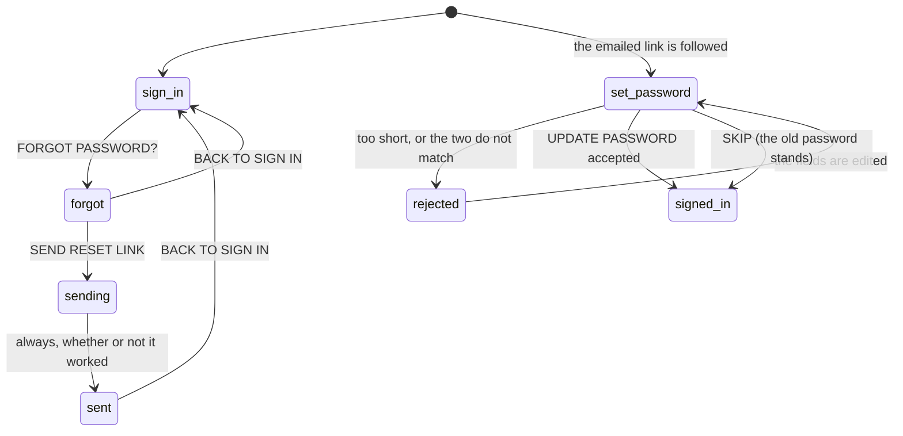

# Resetting a password

## Summary

A forgotten password is repaired in two sittings with an email in between. On [the sign-in screen](signing-in.md), **FORGOT PASSWORD?** replaces the form with a single email field and **SEND RESET LINK**. The email that arrives carries a link back to Crate, and following it puts up a screen headed **SET NEW PASSWORD** with two password fields.

This only concerns accounts created with an email address. A Spotify account has no password in Crate, so there is nothing to reset — though nothing on the request half of the flow knows or says which kind of account an address belongs to.

Two things are worth knowing before reading further. The request half **always reports success**, even when sending failed, so `CHECK YOUR EMAIL FOR A RESET LINK` means only that the button was pressed. And following the link signs the user in immediately, before any new password is set, so the **SKIP** button on the reset screen drops them into the app with the old password still in force.

## The simple case

The user cannot remember their password. On the sign-in screen they tap FORGOT PASSWORD?. The two fields are replaced by one, already holding the email address they had started typing. They tap SEND RESET LINK, the button reads `...` for a moment, and a green box appears: `CHECK YOUR EMAIL FOR A RESET LINK`. Under it, BACK TO SIGN IN.

A minute later the email arrives. They follow its link, the tab opens Crate, and after the usual spinner the screen reads CRATES over SET NEW PASSWORD with NEW PASSWORD and CONFIRM PASSWORD. They type the same thing twice and tap UPDATE PASSWORD.

The crate wall appears. Nothing says the password was changed.

## The interaction, event by event

The two halves never meet in one sitting: the left branch happens on the sign-in screen and the right branch on a later page load, from a link.

### Arrive

**The request half** is arrived at only by tapping FORGOT PASSWORD?, which appears under the sign-in form and only on the SIGN IN half of the toggle — a user on CREATE ACCOUNT cannot see it. It clears any error on screen and swaps the two fields for one. That field shares its value with the sign-in form's email field, so it arrives holding whatever was typed there, which is usually the right address.

**The reset half** is arrived at from the emailed link, which points at Crate's root address. The authentication service consumes the link, creates a session, and announces a password recovery; Crate responds by putting up the SET NEW PASSWORD screen **in place of the entire app**, outside the router. So the address bar says `/` while the crate wall is not what is showing, and there is no route for this screen.

Both fields start empty and neither is focused. There is nothing about which account is being reset — no email address on screen — so a user with two accounts cannot tell from this screen which one the link was for.

> Technical note: the recovery link is single-use and is consumed by the page load that handles it. The recovery announcement is what puts the screen up, and it is not persisted anywhere, so a reload of this screen never brings it back: the reload finds an ordinary session and renders the crate wall. Reaching the screen again needs a fresh email.

### Leave untouched

The request half can be left with **BACK TO SIGN IN**, which restores the two-field form and clears the sent message. Nothing was written unless SEND RESET LINK was pressed, and pressing it cannot be undone — the email is sent and stays valid until it is used or expires.

The reset half can be left with **SKIP**, a small dim line under the button. It dismisses the screen and renders the app. Nothing is written: the old password still works, the session created by the link stands, and the user is signed in. Nothing warns that the password was not changed, and nothing offers the screen again.

There is no other way off the reset screen. It has no navigation, no sign-out, and no back link.

### First change

On the request half the first change is a keystroke in the email field, or none at all if it arrived prefilled. On the reset half it is a keystroke in either password field. Neither commits anything.

### While working

Both submit buttons dim to half opacity and read `...` while the request is in flight, and both are disabled meanwhile. The fields stay editable.

The reset screen checks two things in the browser before sending anything:

| Check | Message |
| --- | --- |
| Fewer than six characters | `Password must be at least 6 characters.` |
| The two fields differ | `Passwords do not match.` |

Both appear in a red box between the fields and the button, and neither counts as a submission — nothing is sent and the button never enters its `...` state. Both fields are also `required`, so the browser refuses an empty one in its own words.

A rejection from the server appears in the same red box in **the authentication service's own wording**, most usefully `New password should be different from the old password.` — which is how a user discovers that Crate will not accept the password they were trying to remember.

The request half checks nothing. It accepts any well-formed email address and sends it.

### Commit

**SEND RESET LINK** asks the authentication service to email the address, and then shows the green `CHECK YOUR EMAIL FOR A RESET LINK` box **regardless of the answer**. A rejected request — an address the service rate-limited, an unreachable mail service, a malformed configuration — produces exactly the same green box. The user waits for an email that is not coming.

Whether an address with no account gets an email at all is the service's decision, not Crate's, and the screen's uniform success message means it does not leak either way. That much is deliberate-looking; the silence on real failures is not.

**UPDATE PASSWORD** sets the password on the account and, on success, immediately dismisses the reset screen and renders the app. The screen's own success state — a green `PASSWORD UPDATED SUCCESSFULLY` box with a CONTINUE button — is **never seen**, because dismissing the screen happens in the same beat as showing it. The only evidence a user gets that anything worked is that the crate wall appeared, which is also what SKIP does.

No other session is disturbed. Changing the password does not sign the user out anywhere, and there is no confirmation email and no notification.

## Modifiers

| Modifier | Set on arrival | Changed while working |
| --- | --- | --- |
| Spotify account state | The flow only makes sense for an email account, and nothing enforces that. A user who signed in with Spotify has an email address the service knows, so requesting a reset for it may well succeed and give that account a password — a second way in, alongside Spotify. Nothing on either half mentions Spotify. See [account and session](../foundations/account-and-session.md). | The reset screen's session carries whatever Spotify link the account already had; the recovery sign-in does not touch the stored Spotify tokens, because no provider token comes with it. |
| Playback state | Nothing can be playing on either screen: both replace the whole app, including the [player bar](../player/the-player-bar.md). | Finishing or skipping renders the app with nothing playing. |
| Library state | No effect and not read. Neither screen makes a request about the account's contents. | No effect. |
| Viewport | A centered column capped at 320 px at every width, identical on a phone and a desktop. The reset screen's wordmark is 64 px against the sign-in screen's 112 px, and it carries two faint vinyl discs in the corners that the sign-in screen does not. | No effect. |
| Crate and config settings | No effect and unreadable. | No effect. |

## Cancel and interrupt

| Event | Before the first change | While working |
| --- | --- | --- |
| Escape, Cancel, Close, or a tap on the backdrop | Neither screen is a modal and neither has a backdrop. **Escape does nothing.** BACK TO SIGN IN and SKIP are the only ways out. | The same. A request in flight cannot be cancelled. Once an email is sent it cannot be recalled. |
| Navigating inside the app: the bottom nav, another route, or a second panel or modal | There is nothing to navigate on either screen; the bottom navigation is not rendered. | Typing another Crate address while on the reset screen loads that address, sees a signed-in session with no recovery announcement, and renders that screen — so navigating away **abandons the reset permanently** and looks like an ordinary sign-in. |
| Browser back or forward | On the request half, back leaves Crate. On the reset screen, back leaves the page the link came from and cannot return to it. | The same, and anything typed is lost. |
| Reload, or the tab is closed | On the request half, a reload returns to the plain sign-in form; the sent message is lost, which matters only cosmetically. On the reset screen, **a reload loses the screen for good** — the link has already been consumed, so the reload finds an ordinary session and renders the crate wall with the old password still in force. | The same. An UPDATE PASSWORD already sent lands even if the tab is closed straight after. |
| Network lost, or the request fails or times out | Both screens render fine offline and both buttons fail. | SEND RESET LINK offline still shows the green success box, because the answer is discarded — this is the worst version of the flaw. UPDATE PASSWORD offline shows the service's own network error in the red box and stays on the screen, which is recoverable. See [failed requests and offline](../cross-cutting/failed-requests-and-offline.md). |
| The session expires, or Spotify rejects the token | The request half needs no session. An expired recovery link — followed too late, or already used — produces no recovery announcement, so the reset screen never appears and the user lands on the sign-in screen or the crate wall with nothing explaining why. | The recovery session is a normal session and lasts as long as one; a very slow user could in principle have it expire under them, which would surface as a rejection in the red box. |
| The same account in a second tab, or the library changed elsewhere | No effect. | Changing the password does not disturb the other tab's session — it stays signed in and working. Requesting a second link invalidates the first, so two tabs each holding a link means only the newer one works. See [stale data and second tabs](../cross-cutting/stale-data-and-second-tabs.md). |
| The album in hand is deleted, or Spotify no longer returns it | Not applicable; there is no album on either screen. | Not applicable. |
| Playback moves to another device, or the tab is backgrounded | Nothing is playing. | A backgrounded tab's request completes normally. |

## Interactions with other systems

**Authentication and account state.** This is the only place a password can be changed, and it can only be reached from a signed-out screen or an email. There is no change-password screen inside the app, no account screen, and nothing that shows which email address is signed in. [Account and session](../foundations/account-and-session.md) owns what the two account states mean. Following a recovery link re-syncs the account row on Crate's server, exactly as an ordinary sign-in does.

**The session cache and freshness.** Neither screen reads or writes the [session cache](../foundations/navigation-and-loading.md). The app that appears after UPDATE PASSWORD or SKIP is a fresh page load, so everything loads from the server.

**Pick history.** Untouched.

**Playback.** Untouched. Neither screen can play anything, and the reset screen replaces the player bar along with the rest of the app.

**Configuration and crate definitions.** Untouched. A reset does not seed, change, or read a crate definition.

**Offline and failed requests.** The request half is the one place in Crate that reports success on a failure it was told about. The reset half reports failures properly.

**Multiple tabs and the Spotify app.** Neither is involved. A password change does not sign other devices out.

**Toasts, badges, and empty states.** No toasts and no badges. Two green boxes, one of which is a lie when the send failed and the other of which is unreachable, and one red box per screen.

**Viewport and accessibility.** Real inputs with real types, so password managers offer to store the new password, and both forms submit on Return. The placeholders are the only labels: `EMAIL`, `NEW PASSWORD`, `CONFIRM PASSWORD` are greyed placeholder text that disappears as soon as anything is typed. The error box is not announced, and SKIP is 9 px dim text at the very bottom, which is easy to miss and easy to hit by accident.

## Edge cases

- **`CHECK YOUR EMAIL FOR A RESET LINK` is shown even when sending failed.** The answer from the authentication service is discarded, so a rate limit, a mail misconfiguration, or being offline all look like success.
- **`PASSWORD UPDATED SUCCESSFULLY` and its CONTINUE button are unreachable.** A successful update dismisses the screen in the same beat as it would show that box, so the user is dropped into the app with no confirmation at all — indistinguishable from having pressed SKIP.
- **SKIP leaves the old password in force,** and drops the user into the app signed in. Nothing warns, and there is no way to get the screen back.
- **A reload of the reset screen loses it permanently.** The link has already been consumed, so the reload lands on the crate wall, signed in, with the password unchanged.
- **The reset screen has no route,** so it cannot be linked to, bookmarked, or returned to, and the address bar reads `/` throughout.
- **Following the link signs the user in before any password is set.** Anyone who obtains the email gets a full session, whether or not they set a password — the SKIP button makes that explicit.
- **Nothing on the reset screen says which account it is for.** No email address is shown anywhere.
- **A Spotify-only account may be able to acquire a password this way,** giving a second way into the account, with nothing on either screen indicating that is what happened.
- **FORGOT PASSWORD? is invisible on the CREATE ACCOUNT half** of the toggle, so a user who lands there first has to switch back to find it.
- **The email field is shared with the sign-in form,** which is convenient — it arrives prefilled — and also means BACK TO SIGN IN keeps whatever was typed.
- **The six-character minimum is only enforced here,** on the reset screen; sign-up does not check it in the browser and relies on the service rejecting it.
- **Changing the password signs nobody out.** Other tabs and devices keep working, which is not what a user resetting a forgotten password would usually expect.
- **There is no confirmation email and no notification** after a successful change.
- **The two screens do not look like one flow.** Different wordmark sizes, different decoration, and nothing on the reset screen referring back to the request.

## Open questions and verification

- The unreachable success box is read from the ordering of two state changes — the account's recovery flag is cleared inside the update call, before the screen sets its own `done` flag — and has not been observed. It is worth watching for, because it decides whether a successful reset gives any feedback at all.
- Whether the reset link actually arrives, and how long it takes, has not been tested against this deployment's mail configuration.
- Whether requesting a reset for a Spotify account's email address succeeds, and what the resulting account can then do, is the most important open question here and needs a real account to answer.
- Whether the authentication service silently ignores an unknown address or returns an error for it is unverified; either way the screen shows the same green box.
- How long a recovery link stays valid, and what following an expired one looks like, has not been observed. The expectation is the sign-in screen or the crate wall with no explanation.
- Whether a reload of the reset screen really loses it, rather than re-announcing the recovery, should be confirmed by hand. It follows from the link being single-use.
- The exact wording of the server's rejection when the new password matches the old one has not been seen; it comes from the authentication service.

Verified against Crate commit `8301127`.
