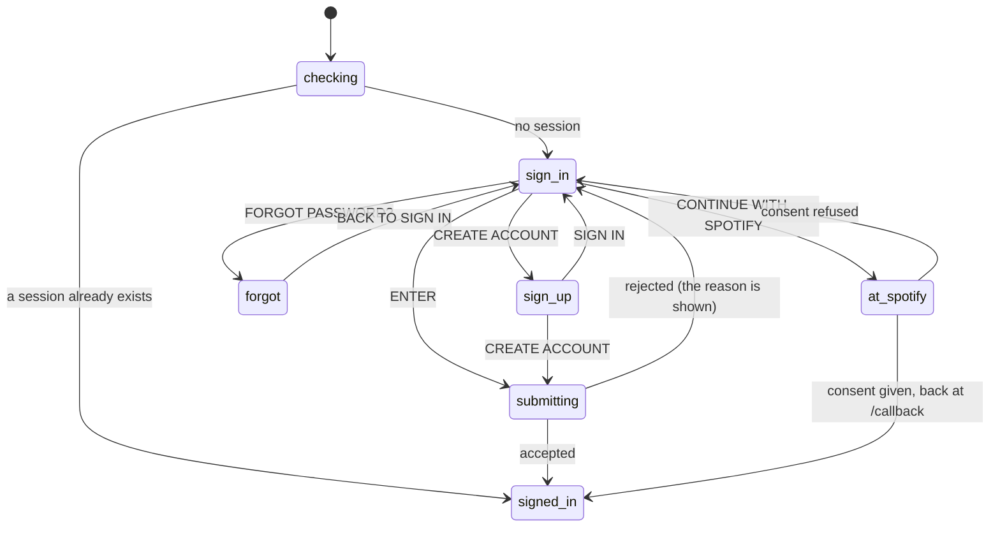

# Signing in

## Summary

The sign-in screen is the first thing anyone sees. A giant CRATES wordmark, the line INTENTIONAL ALBUM PICKING, three promises, and then two ways in: an email address and password, or **CONTINUE WITH SPOTIFY**.

Which one the user chooses decides what the product can do for them for the life of the account. Both give a **signed-in** account, which is enough for the crate wall, the library, the album search, the crate editor and the listening log. Only Spotify gives an account **linked to Spotify**, which is what the two import tabs and all playback need — and there is no way to add the link later, because linking is not a separate act in Crate. The two are different accounts. See [account and session](../foundations/account-and-session.md), which owns that distinction and the token handling behind it.

The screen is not a route. It is what the app renders whenever there is no session, whatever the address bar says, so it cannot be linked to, cannot be reached deliberately while signed in, and does not change the URL when it is dismissed.

## The simple case

The user opens the app. A full-page orange spinner for a moment, then the sign-in screen.

They tap CONTINUE WITH SPOTIFY. The tab leaves for Spotify's own page, which asks whether Crate may see their library and control their playback. They agree. The tab comes back to `/callback`, the spinner shows again briefly, and the crate wall appears with thirteen crates already in it. The address bar still says `/callback`.

A different user types their email address and password and presses ENTER. The button becomes `...` for a moment and the crate wall appears in place of the screen, at whatever address they were already on.

## The interaction, event by event

`checking` is the full-page spinner and is the only full-page loading state in the product.

### Arrive

Every visit begins with the session check. The app asks for the stored session and shows a centered spinning ring with nothing else on screen while it waits. Then:

- **A session exists.** The account row is re-synced on the server and the requested screen renders. The sign-in screen is never seen.
- **No session.** The sign-in screen renders, in place of whatever route was asked for. A user who bookmarked `/library` and comes back a month later sees the sign-in screen at `/library`, and lands on the library once they are in — the address is preserved because the screen is not a route.
- **The check cannot be answered** — offline, or the auth service is unreachable — is treated as "no session", so the sign-in screen appears and both buttons on it will fail.

The screen opens on the SIGN IN half of the toggle, with both fields empty and neither focused. Nothing is remembered between visits except the session itself: not the email address, not which half of the toggle was last used.

> Technical note: the session check runs once, on mount, and the app then listens for sign-in, token-refresh, sign-out, and password-recovery events for the life of the tab. The re-sync that follows a session check is a request to Crate's own server, and it is awaited before the app decides it has finished loading — with no error handling. If that one request fails outright, for instance because the network dropped between the session check and the sync, the app **stays on the full-page spinner indefinitely**, with no error and no way forward but a reload.

### Leave untouched

There is nothing to leave and nowhere to go. The sign-in screen has no navigation, no bottom bar, and no link off it; the only ways out are signing in or closing the tab. Reloading returns to the same screen.

Nothing typed is stored anywhere. Reloading clears both fields.

### First change

The first change is a keystroke in either field, or a tap on the toggle. Neither commits anything.

The **SIGN IN / CREATE ACCOUNT** toggle changes what the submit button says — `ENTER` or `CREATE ACCOUNT` — and what pressing it does. It also clears any error on screen and leaves the forgot-password state. The two fields keep what has been typed across the switch, so a failed sign-in can be turned into a sign-up without retyping.

**FORGOT PASSWORD?** appears only on the SIGN IN half and replaces the form with the reset request. See [resetting a password](resetting-a-password.md).

### While working

Both fields are required and the email field is a real email field, so the browser refuses to submit an empty or malformed one with its own message rather than Crate's. There is no other validation on this screen: no password length check, no confirmation field, and no indication of what a password needs to be.

Pressing the submit button dims it to half opacity and changes its label to `...`. Both fields stay editable while the request is in flight, and pressing Return again submits again.

A rejection appears as a red box between the fields and the button, carrying **the authentication service's own wording** rather than anything Crate wrote: `Invalid login credentials`, `User already registered`, `Password should be at least 6 characters`. It is cleared by the next submission or by touching the toggle.

**CONTINUE WITH SPOTIFY** does not submit anything. It navigates the tab away to Spotify, so everything typed is gone; there is no in-flight state and no way to cancel once tapped. Crate always asks Spotify to show the consent screen, so a returning user is asked to approve the same permissions every time — which are: read the saved albums, read private and collaborative playlists, read and modify playback, and stream.

### Commit

Signing in successfully does three things at once: the session is stored by the browser, the account row on Crate's server is created or updated, and the app replaces the sign-in screen with the requested route.

For a Spotify sign-in there is a fourth: the Spotify access and refresh tokens that come back with the consent are handed to Crate's server and stored on the account. **This is the only moment Crate ever receives them.** From then on the server refreshes the access token by itself, and if the refresh token is ever lost or revoked the only repair is to sign in through Spotify again. The stored expiry is assumed to be an hour from now rather than read from Spotify's answer.

For an email sign-up the commit is quieter than it looks. Whether the new account is usable immediately depends on a setting in the authentication service, not on anything in Crate: with email confirmations off — which Crate's own setup notes require — the account is created and signed in at once, and the crate wall appears. With them on, the sign-up succeeds, no session is created, and **the screen simply sits there with the fields still filled and no message of any kind**. Nothing tells the user to check their email.

Nothing on this screen is undoable. There is no account deletion anywhere in Crate.

## Modifiers

| Modifier | Set on arrival | Changed while working |
| --- | --- | --- |
| Spotify account state | Decides which button matters, and is what this screen sets. Signing in with Spotify gives a linked account; signing in with an email gives one that can never be linked. Premium is not checked here and not mentioned; a free Spotify account signs in identically and discovers the difference only when the in-tab player never appears. | The only change possible is completing a sign-in, which ends the screen. |
| Playback state | Nothing can be playing: the player only exists inside the signed-in app, and the sign-in screen replaces all of it. | Signing out from inside the app stops nothing that was already handed to Spotify — the music keeps playing on the device that got it, with no bar and no controls anywhere in Crate. |
| Library state | No effect and not known. The screen makes no requests before a sign-in and cannot tell a new account from a full one. A brand-new Spotify sign-in lands on a crate wall that seeds thirteen crates on the spot. | No effect. |
| Viewport | A single centered column capped at 320 px at every width, so the screen is identical on a phone and a desktop and looks small on the latter. The wordmark is a fixed 112 px and does not scale down; on a very narrow screen it can be wider than the column. | No effect. |
| Crate and config settings | No effect and unreadable — nothing on this screen fetches anything about the account. | No effect. |

## Cancel and interrupt

| Event | Before the first change | While working |
| --- | --- | --- |
| Escape, Cancel, Close, or a tap on the backdrop | Nothing to cancel; there is no modal and no backdrop. **Escape does nothing.** | The same. A submission in flight cannot be cancelled, and a Spotify sign-in cannot be cancelled from Crate — only by refusing consent on Spotify's own screen, which returns to the sign-in screen with nothing said. |
| Navigating inside the app: the bottom nav, another route, or a second panel or modal | There is nothing to navigate. The bottom navigation belongs to the signed-in app and is not rendered. Typing a different Crate address gives the same sign-in screen. | The same. Changing the address mid-submission abandons it. |
| Browser back or forward | Leaves Crate, because the sign-in screen is not a route and has no history of its own. | Back during a Spotify sign-in returns from Spotify's consent page to the sign-in screen with nothing filled in. Back after signing in does **not** sign the user out; it navigates within the app or leaves it. |
| Reload, or the tab is closed | Nothing is lost. | Everything typed is lost. A sign-in already accepted survives, because the session is stored by the browser, so a reload lands in the app. A Spotify sign-in interrupted by closing the tab simply did not happen. |
| Network lost, or the request fails or times out | The session check treats an unanswerable question as "not signed in", so the screen appears normally. | An email sign-in shows the service's own network error in the red box. A Spotify sign-in fails as a browser navigation, outside Crate entirely, with the browser's own error page. The re-sync that follows a successful check has no error handling at all and can leave the app stuck on the spinner. |
| The session expires, or Spotify rejects the token | This is the screen that appears when a session cannot be renewed, with no explanation of why the user is suddenly here. | A Spotify token rejected later is refreshed on the server invisibly and never brings the user back here; only losing the Supabase session does. |
| The same account in a second tab, or the library changed elsewhere | No effect. | Signing in here does not sign the other tab in, and signing out anywhere signs out everywhere — sign-out is global — so a second tab that was signed in stops working and shows this screen the next time it is reloaded. See [stale data and second tabs](../cross-cutting/stale-data-and-second-tabs.md). |
| The album in hand is deleted, or Spotify no longer returns it | Not applicable; there is no album on this screen. | Not applicable. |
| Playback moves to another device, or the tab is backgrounded | Nothing is playing. | A backgrounded tab's sign-in completes normally. A Spotify sign-in in a backgrounded tab is a navigation and is unaffected. |

## Interactions with other systems

**Authentication and account state.** This screen is where account state is created. [Account and session](../foundations/account-and-session.md) owns what the two states mean, how the tokens are refreshed, and why an email account can never be linked; this document owns only the screen. Worth repeating here: there is no account screen anywhere in the product, no display of who is signed in, and no way to change an email address or a password from inside the app.

**The session cache and freshness.** Nothing is cached before a sign-in, and signing in starts a fresh session, so the first screen after it always loads from the server. Signing out does not clear the [session cache](../foundations/navigation-and-loading.md) in memory; it does not need to, because the whole signed-in app is unmounted with it.

**Pick history.** Not touched. A new account has none, which the [selection engine](../foundations/selection-engine.md) treats as everything being equally overdue.

**Playback.** Nothing can play on this screen. A Spotify sign-in is what makes playback possible at all, and it is the only place the streaming permission is granted. See [playback](../foundations/playback.md).

**Configuration and crate definitions.** Untouched here. A brand-new account's thirteen crate definitions are seeded on the first crate wall load, not at sign-up, so an account that signs up and never opens the wall has no crates.

**Offline and failed requests.** Offline, the screen renders and neither way in works. There is no offline indicator, and the sign-in failure is reported in the authentication service's words. See [failed requests and offline](../cross-cutting/failed-requests-and-offline.md).

**Multiple tabs and the Spotify app.** Sign-out is global across every tab and device. Sign-in is not: each tab keeps its own session state until it is reloaded.

**Toasts, badges, and empty states.** No toasts and no badges. The red error box is the only feedback, and its wording comes from the authentication service. A sign-up that needs email confirmation produces no feedback at all.

**Viewport and accessibility.** Both fields are real inputs with real types, so browsers and password managers handle them correctly, and the form submits on Return. The placeholders are the only labels — there is no `EMAIL` or `PASSWORD` text besides the greyed placeholder inside each box, so the fields lose their labels as soon as they are filled. The error box is not announced. The toggle is two buttons distinguished by an orange underline and colour. The screen is otherwise fully keyboard-operable, which makes it one of the better ones in the product.

## Edge cases

- **A failed re-sync can hang the app on the spinner forever.** The request that follows the session check is awaited with no error handling, so a network failure at that exact moment leaves the full-page spinner up with no error and no recovery but a reload.
- **The sign-in screen appears at whatever address was asked for,** so the URL and the screen disagree — `/library` showing a sign-in form — and the address is used again once the sign-in succeeds.
- **A Spotify sign-in lands on `/callback` and stays there.** The crate wall is served at both `/` and `/callback`, so nothing looks wrong, but the address bar keeps a URL the user never typed for the rest of the session.
- **Spotify's consent screen is shown on every sign-in,** because Crate asks for it explicitly. A user signing in for the tenth time is asked to approve the same permissions again.
- **An email sign-up with email confirmation enabled looks like nothing happened.** The account is created, no session appears, and the screen gives no message. Crate's setup notes require that setting to be off, which means the screen's correctness depends on a configuration it never checks.
- **There is no password guidance until it is rejected.** The service's six-character minimum is discovered by failing.
- **The two ways in are two accounts.** Signing up with the same email address the user's Spotify account uses does not merge them; it creates a second account with its own library, and nothing warns.
- **An email account can never gain Spotify access.** Pressing CONNECT SPOTIFY on an import tab later signs them into the other account rather than linking this one. See [importing from your Spotify library](../add/importing-from-your-spotify-library.md).
- **A free Spotify account signs in identically to Premium** and is told nothing. The difference only shows up as the in-tab player never appearing. See [playback](../foundations/playback.md).
- **The wordmark is a fixed 112 px** in a 320 px column, so on a narrow phone it comes close to the edges and does not reduce.
- **Nothing shows who is signed in.** The profile menu holds View History and Sign Out and no identity at all, so the only way to tell which account a browser is in is to look at the library.
- **Refusing consent on Spotify's screen returns to the sign-in screen with nothing said,** indistinguishable from having never pressed the button.
- **There is no sign-out confirmation and no account deletion.** Sign-out is one tap in the profile menu and it applies to every device.

## Open questions and verification

- The stuck-spinner failure has been read from the code — the re-sync is awaited with no `catch`, and `setLoading(false)` is inside the same handler — but not reproduced. Provoking it needs the network dropped between the session check and the sync, which is fiddly but worth attempting, because the outcome is a completely dead app.
- What a sign-up with an already-registered email address actually shows depends on the authentication service's settings and has not been observed.
- Whether a Spotify account's email address can be used to request a password reset, and thereby gain a second way into a linked account, is unverified and would be worth knowing. See [resetting a password](resetting-a-password.md).
- The exact wording of every rejection comes from the authentication service and has not been catalogued; the three quoted above are the expected ones.
- Whether the address bar's `/callback` causes any trouble on a later reload has not been tested. The route renders the crate wall, so it should not.
- Whether a session that expires while the app is open really lands the user on this screen, rather than leaving a broken signed-in app, has not been observed. The sign-out event is handled; a refresh failure that produces no event may not be.
- Whether the browser's own validation message for a malformed email address is legible against this screen's styling has not been checked.

Verified against Crate commit `8301127`.
