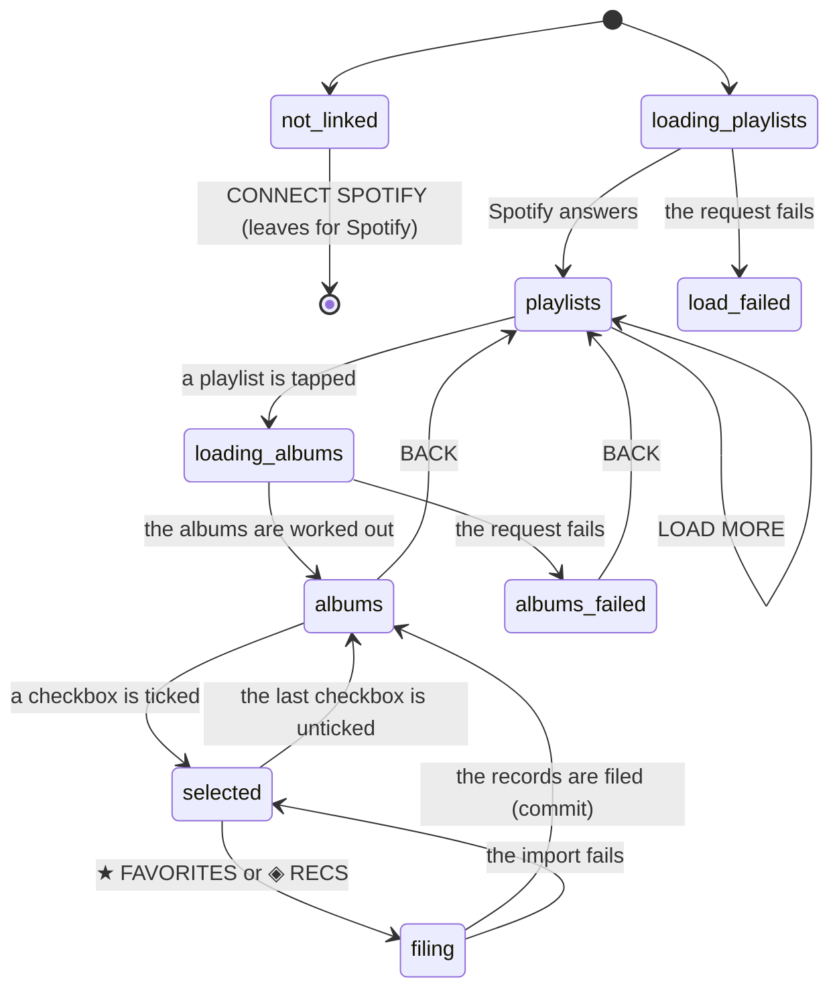

# Importing from a playlist

## Summary

The **PLAYLISTS** tab on the add screen lists the playlists in the user's Spotify account, and opening one turns it into a list of albums: every album any track on the playlist belongs to, each one once. From there it works exactly like [importing from the Spotify library](importing-from-your-spotify-library.md) — checkboxes, a selection bar, **★ FAVORITES** or **◈ RECS**, one write.

It is the tab that turns a listening habit into a library. A playlist is a list of tracks, and Crate holds albums, so the interesting work happens on the way: singles are dropped, the same album appearing on twelve tracks becomes one row, and only the first five hundred tracks are looked at.

Like the LIBRARY tab it needs a **[linked Spotify account](../foundations/account-and-session.md)**, shows the same connect prompt without one, and files records with no genres — see [the data model](../foundations/data-model.md). It differs from that tab in one visible way that matters: albums already in Crate are **not shown at all** here, rather than shown dimmed. The count in the header is what is left to file, not what the playlist holds.

## The simple case

The user taps PLAYLISTS. A spinner, then `24/24 PLAYLISTS` and a list: sleeve, name, `142 TRACKS · Derek`, and a chevron. They tap **late night driving**.

The list is replaced by a BACK link, the playlist's sleeve and name in large letters with `142 TRACKS` under it, and a spinner. A few seconds later: `31 AVAILABLE`, SELECT ALL, and thirty-one album rows. The playlist has a hundred and forty-two tracks; thirty-one albums are left after singles are dropped, duplicates collapsed, and the nine albums already in Crate removed.

They tap SELECT ALL, then ◈ RECS on the bar at the bottom. ADDING…, then a green `FILED 31 RECORDS` line — and the list under it is empty, with `0 AVAILABLE` where the count was. Every row they filed has disappeared.

They tap BACK, pick another playlist, and do it again.

## The interaction, event by event

### Arrive

The tab is reached by tapping PLAYLISTS on the add screen, and mounts fresh every time — the tabs are unmounted rather than hidden, so a previous visit leaves nothing, not the playlists, not the open playlist, not the selection.

**Not linked to Spotify** shows the same connect prompt as the other import tab: a vinyl disc, SPOTIFY IMPORT, CONNECT TO IMPORT YOUR LIBRARY, a green CONNECT SPOTIFY button, and READ-ONLY ACCESS. Nothing is requested. Pressing the button leaves for Spotify's consent screen and comes back at the crate wall rather than here.

**Linked** requests the first fifty playlists at once, with a spinner where the list will be. The list includes everything Spotify considers the user's — playlists they made and playlists they follow — with no distinction beyond the owner's name in each row, and in the order Spotify returns them, which is roughly most-recent first and is not stated anywhere.

Opening a playlist is a second, slower request. The server walks the playlist's tracks a hundred at a time and reduces them to albums:

- Anything that is not a track — a podcast episode, a local file with no Spotify album, a removed track — is skipped.
- Everything Spotify labels a **single** is skipped, so a playlist of singles yields nothing.
- The same album is kept **once**, however many of its tracks are on the playlist.
- Only the first **five hundred tracks** are looked at. A longer playlist is silently truncated, and nothing says so.

Then Crate's own database is asked which of those albums are already filed, and the tab shows only the ones that are not.

### Leave untouched

Reading a playlist and going BACK writes nothing. BACK clears the albums, the selection, and any message, and returns to the list of playlists — which is still loaded, including any extra pages, and at its previous scroll position.

Leaving the tab or the screen entirely discards everything, silently and with nothing to lose.

### First change

The first change is ticking a checkbox, which commits to nothing. Every row shown is selectable, because the unselectable ones are not shown, so there are no dimmed rows and no ★ or ◈ marks anywhere in this list.

**SELECT ALL** ticks every row and reads DESELECT ALL once as many are selected as there are rows. Unlike the LIBRARY tab, this really does mean everything available, because a playlist's albums all arrive in one request — there is no paging inside a playlist.

### While working

The selection bar rises from the bottom at one tick, reads `N SELECTED`, and holds the two file buttons. It disappears at zero. It sits above the bottom navigation and, when music is playing, very likely on top of the [player bar](../player/the-player-bar.md).

On the list of playlists, **LOAD MORE (N LEFT)** appends the next fifty and reads LOADING… while it works. There is no such button inside a playlist.

Nothing is live. A playlist edited in the Spotify app while it is open here is not re-read, and a record filed elsewhere in Crate does not change what is shown.

While an import runs both buttons read ADDING… and are disabled; the rows stay tickable, and what was sent is what was selected when the button was tapped.

### Commit

Tapping ★ FAVORITES or ◈ RECS sends one request with every selected album and the chosen list. The server fetches release dates and track counts from Spotify twenty albums at a time, writes them all in one go, and answers with how many were written.

On success:

- A green line appears above the list reading `FILED 31 RECORDS`. Unlike the LIBRARY tab's version it does **not** name the list, so nothing on screen confirms whether they went to favorites or recommendations. It removes itself after three seconds.
- The rows that were filed **disappear**, because the list only shows what is not yet in Crate. Filing everything leaves `0 AVAILABLE`, no SELECT ALL, and an empty space under the header.
- The selection is cleared and the bar disappears.

On failure `Failed. Try again.` appears in red above the list, the selection is untouched, and nothing was written. The import is all-or-nothing.

Metadata is best-effort and **genres are never fetched on this path**. A record imported from a playlist has a release date and a track count, or nothing at all if Spotify did not answer, and no genres for as long as it exists.

> Technical note: the write is an upsert keyed on the user and the Spotify id, so an album already in the library — reachable only through a stale list — is overwritten rather than skipped, losing any genres it had, and is still counted in `FILED N RECORDS`.

## Modifiers

| Modifier | Set on arrival | Changed while working |
| --- | --- | --- |
| Spotify account state | Decides the whole tab. Not linked shows the connect prompt and requests nothing. Premium is irrelevant — importing needs only read access, and the permissions cover private and collaborative playlists as well as public ones. An email-only account can never be linked, so this tab is permanently the connect prompt for them. See [account and session](../foundations/account-and-session.md). | Cannot change without leaving. CONNECT SPOTIFY navigates away and returns at the crate wall. |
| Playback state | The page's bottom padding grows when the player bar is showing. The selection bar is 80 px from the bottom of the window and the player bar 70 px, so the two are very likely to overlap while both are showing. | Starting playback elsewhere makes the player bar appear under the selection bar. Nothing about the import is affected. |
| Library state | Decides how many rows a playlist shows, and can hide the difference between "the playlist has nothing importable" and "you already have all of it". A playlist whose albums are all in Crate shows `0 AVAILABLE` and an empty list; a playlist of singles shows NO ALBUMS IN THIS PLAYLIST. Those are two different situations with two different messages, and neither explains itself. | Filing makes rows vanish. Records added or removed anywhere else are not noticed until the playlist is re-opened. |
| Viewport | A single column at any width, centered and capped. The playlist header's name is truncated to one line. | No effect. |
| Crate and config settings | No effect. Nothing here reads a crate definition or a weighting. | No effect. |

## Cancel and interrupt

| Event | Before the first change | While working |
| --- | --- | --- |
| Escape, Cancel, Close, or a tap on the backdrop | Nothing to cancel. There is no modal and no backdrop, and **Escape does nothing**. BACK is the only way out of an open playlist. | The same. An import in flight cannot be cancelled, and BACK does not stop it — the records are filed and the confirmation is never seen. |
| Navigating inside the app: the bottom nav, another route, or a second panel or modal | Nothing is lost. | Everything is lost: the playlists, the open playlist, the selection, the messages. Switching to SEARCH or LIBRARY is the same as leaving the screen. An import already sent completes. |
| Browser back or forward | Returns to the previous route. Note that browser back does **not** close an open playlist — neither the tab nor the open playlist is in the address bar, so back leaves the add screen entirely. | The tab is discarded. Coming forward again gives a fresh add screen on SEARCH. An import already sent still lands. |
| Reload, or the tab is closed | Nothing is lost. | The selection is lost. An import already sent lands; one not yet sent does not. Re-opening the playlist afterwards is the only way to see what was actually filed, since filed albums are simply absent. |
| Network lost, or the request fails or times out | The playlist load fails into a red message where the list would be, with no retry button — switching tabs and coming back is the only retry. | A playlist whose albums fail to load shows the red message **and** NO ALBUMS IN THIS PLAYLIST at the same time, which reads as an empty playlist rather than a failure. A failed import keeps the selection and shows `Failed. Try again.`. Neither message clears on its own. See [failed requests and offline](../cross-cutting/failed-requests-and-offline.md). |
| The session expires, or Spotify rejects the token | The load fails into the same raw error text; the user is not signed out and not told why. | Every request fails the same way. A Spotify token that has merely expired is refreshed on the server invisibly; a link the user revoked from Spotify's side cannot be, and gives the same raw failure with no suggestion to reconnect. |
| The same account in a second tab, or the library changed elsewhere | Which albums are hidden was decided when the playlist was opened. | Goes stale silently. A record deleted in another tab does not reappear in an open playlist, so re-importing it needs the playlist closed and re-opened. Records filed here are invisible to the other tab until it reloads. See [stale data and second tabs](../cross-cutting/stale-data-and-second-tabs.md). |
| The album in hand is deleted, or Spotify no longer returns it | No effect. | A track removed from the playlist in the Spotify app does not remove its album from an open list, and the album can still be filed — the write does not re-check anything. An album Spotify has withdrawn is filed with no release date and no track count. |
| Playback moves to another device, or the tab is backgrounded | No effect. | No effect on the import. A backgrounded tab's request completes; the green message's three-second timer may be slowed, which only makes it linger. |

## Interactions with other systems

**Authentication and account state.** Needs both states: signed in for Crate's requests, linked for the playlists. The connect prompt is the only place the difference is named. See [account and session](../foundations/account-and-session.md).

**The session cache and freshness.** The add screen neither reads nor writes the [session cache](../foundations/navigation-and-loading.md). An import of a whole playlist leaves the crate wall and the library screen showing what they showed before, for the rest of the session, and the imported records appear only after a reload. Combined with the rows vanishing as they are filed, this is the least confirmable action in the product: the evidence disappears and the destination does not update.

**Pick history.** Not read and not written. Every imported record has never been picked, which the [selection engine](../foundations/selection-engine.md) treats as a reason to favor it, so a large playlist import dominates the next crate wall load.

**Playback.** Nothing here plays. There is no play button on a playlist row or an album row, and the playlist's own sleeve is not a link, so there is no way to hear a playlist from inside Crate.

**Configuration and crate definitions.** Untouched. Imported records have no genres, so they cannot match a genre rule, and the nine seeded context crates stay empty however much is imported.

**Offline and failed requests.** Offline, every request on the tab fails into one of two messages, and nothing is queued or retried. The two loads — the playlists and a playlist's albums — show the request layer's error text **raw**, status code and JSON body included; only the import has a written message of its own, `Failed. Try again.`. See [failed requests and offline](../cross-cutting/failed-requests-and-offline.md).

**Multiple tabs and the Spotify app.** The Spotify app owns the playlists; edits there are seen only on the next open. Two Crate tabs importing at once are safe, because the writes are upserts.

**Toasts, badges, and empty states.** The green `FILED N RECORDS` line is self-dismissing after three seconds and is the only confirmation. There are no badges anywhere on this tab — already-filed albums are hidden rather than marked, which is the one place in the product where a record's list is deliberately not shown. Four empty states: the connect prompt, a large `EMPTY` for an account with no playlists, `NO ALBUMS IN THIS PLAYLIST`, and a header reading `0 AVAILABLE` above nothing, which is what a fully-imported playlist looks like.

**Viewport and accessibility.** A single column at any width. The playlist rows are real buttons and reachable by keyboard; the album checkboxes are real checkboxes, unlabelled, followed by the title text. BACK is a real button but is not a browser-history back, and nothing tells a screen reader that opening a playlist replaced the page's contents.

## Edge cases

- **Nothing imported here has genres,** because the bulk path never asks Spotify about the artists and nothing backfills them. This silently empties every genre rule, including the nine seeded context crates.
- **Records filed here do not appear anywhere else in the app until a reload.** The add screen does not write to the session cache.
- **Filed rows disappear rather than being marked,** so after importing there is no on-screen record of what was just filed except a count that vanishes after three seconds.
- **`FILED N RECORDS` does not say which list they went to,** unlike the LIBRARY tab's version of the same message. With both buttons on screen and no other feedback, a mis-tap is unrecoverable without going to the library screen to check.
- **Only the first five hundred tracks of a playlist are read.** A longer playlist is silently truncated and nothing indicates that albums are missing — the header shows the playlist's real track count, so `2,300 TRACKS` above `61 AVAILABLE` looks like ordinary de-duplication.
- **Singles are dropped.** A playlist made of singles yields NO ALBUMS IN THIS PLAYLIST, which is true and misleading.
- **`N AVAILABLE` is not the number of albums in the playlist.** It is what is left after singles, duplicates, and everything already in Crate. Nothing shows the other three numbers.
- **A playlist whose albums are all already in Crate** shows `0 AVAILABLE` and empty space, not a message.
- **A failed album load shows the error and NO ALBUMS IN THIS PLAYLIST together,** so a network failure looks like an empty playlist.
- **Local files and podcast episodes are skipped silently,** so a playlist of local files behaves like an empty one.
- **The playlist list includes playlists the user follows but does not own,** distinguished only by the owner name in small type, so importing from someone else's playlist is as easy as importing from your own and looks identical.
- **BACK is not the browser's back.** The browser's back leaves the add screen entirely from inside an open playlist, which is a surprise for anyone treating the drill-down as navigation.
- **An album already in the library that does get imported is overwritten,** losing any genres it had, and is still counted in the total.
- **The import is all-or-nothing.** One failure means none of the albums were filed, and nothing says which one caused it.
- **The selection bar and the player bar are almost certainly on top of each other,** at 80 px and 70 px from the bottom of the window, both above the bottom navigation and at the same stacking level.
- **READ-ONLY ACCESS on the connect prompt is inaccurate** — the permissions requested include controlling playback and streaming.
- **CONNECT SPOTIFY returns to the crate wall,** not to this tab.

## Open questions and verification

- How long opening a large playlist takes has not been measured. The server walks up to five pages of a hundred tracks in sequence, and a playlist near the five-hundred cap could be slow enough to look broken; whether it can exceed the platform's function timeout is unverified.
- The five-hundred-track cap is read from the code and has not been exercised against a longer playlist to confirm what the user sees.
- Whether Spotify's playlist order is stable between the pages of the playlist *list* is unverified; a playlist created mid-browse could repeat or skip.
- The overlap between the selection bar and the player bar is inferred from their fixed offsets and has not been observed.
- Whether the double message on a failed album load really renders both lines at once has been read from the code but not seen.
- Whether an album that appears on a playlist only as a single-track "album" is correctly excluded depends on Spotify's own album type for it, which has not been checked against real data.
- The three-second life of the green message, and the fact that it omits the list name, are taken from the code and have not been watched.

Verified against Crate commit `8301127`.
