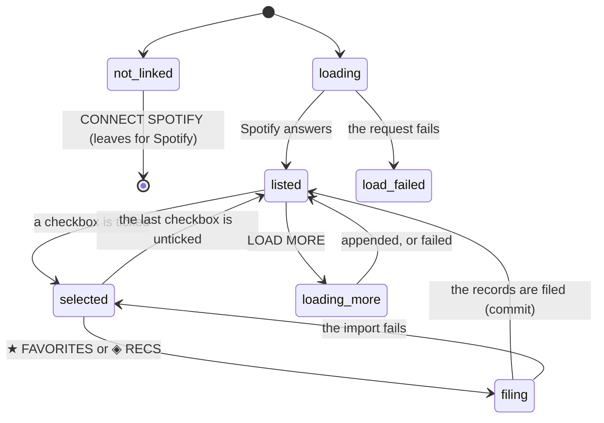

# Importing from your Spotify library

## Summary

The **LIBRARY** tab on the add screen lists the albums the user has saved in their own Spotify account and lets them file any number of those albums into Crate at once. Each row has a checkbox; a bar rises from the bottom of the screen as soon as anything is checked and offers **★ FAVORITES** or **◈ RECS**; one tap files everything selected.

It is the fastest way to fill a library, and the only place in Crate where a user files more than one record with one action. It is also the first of the two tabs that need a **[linked Spotify account](../foundations/account-and-session.md)** rather than merely a signed-in one, because the albums come from Spotify acting as the user. Without a link the tab shows a connect prompt and nothing else.

The albums come fifty at a time, with a LOAD MORE button underneath, and rows that are already in Crate are shown dimmed with their list's glyph and a checkbox that cannot be ticked. Everything the tab knows is thrown away when the user switches tabs.

One consequence deserves stating up front: **records filed in bulk get no genres.** The bulk path asks Spotify about the albums but never about their artists, and nothing backfills them afterwards — so a library built entirely by importing has no genre data at all, and every genre-based [filter rule](../glossary.md), including the nine seeded context crates, matches nothing. See [the data model](../foundations/data-model.md).

## The simple case

The user opens the add screen and taps LIBRARY. A spinner appears for a second, then a header line reading `50/312 RECORDS` with SELECT ALL beside it, and fifty rows: checkbox, sleeve, title, artist, track count. Four of the rows are dimmed with a ★ on the right — those are already in Crate.

They tick six boxes. A bar slides up above the bottom navigation reading `6 SELECTED` with two buttons. They tap ★ FAVORITES. Both buttons read ADDING… for a moment, the bar disappears, a green line appears at the top of the list reading `FILED 6 RECORDS → FAVORITES`, and the six rows they chose are now dimmed with a ★ of their own. Three seconds later the green line fades away.

They tap LOAD MORE (262 REMAINING), get fifty more rows appended to the list, and keep going. When they are done they tap LIBRARY in the bottom navigation — and the library screen shows exactly what it showed before, with none of the new records in it, until the page is reloaded.

## The interaction, event by event

### Arrive

The tab is reached only by tapping LIBRARY on the add screen; the add screen itself always opens on SEARCH. Switching to this tab mounts it fresh — the tabs are unmounted rather than hidden, so nothing from a previous visit survives, not the loaded pages, not the selection, not the success message.

What happens on arrival depends on one thing only:

- **Not linked to Spotify.** The tab shows a vinyl disc, the words SPOTIFY IMPORT and CONNECT TO IMPORT YOUR LIBRARY, a green **CONNECT SPOTIFY** button, and the line READ-ONLY ACCESS. Nothing is requested. This prompt is the only place in the product where the difference between being signed in and being linked to Spotify is named out loud.
- **Linked.** The first fifty saved albums are requested immediately and a spinner sits where the list will be. There is no skeleton and no partial list.

The request asks Spotify for the user's saved albums, newest save first, and then asks Crate's own database which of them are already filed, so every row arrives already knowing whether it is in the library and which list it is in.

> Technical note: fifty is both the default and the maximum the route will honour, because that is Spotify's own page size for saved albums. Asking for more silently gets fifty.

The READ-ONLY ACCESS line under the connect button is not quite true. The permissions Crate asks for include controlling playback, which is what makes the [player](../foundations/playback.md) work, so linking grants more than reading.

### Leave untouched

Reading the list and leaving writes nothing. There is no confirmation and nothing to lose. Switching to another tab, using the bottom navigation, or reloading all discard the loaded pages, and coming back re-requests the first fifty.

Ticking boxes and then leaving is the same: a selection is not a draft and is never stored anywhere. Nothing warns.

### First change

The first change is ticking a checkbox, which commits to nothing — the bar appears and the same box unticks it. A row that is already in Crate cannot be ticked at all: its checkbox is disabled and the whole row is dimmed to 45% with its list's glyph, ★ or ◈, at the right edge.

**SELECT ALL** ticks every selectable row — every row loaded so far that is not already in Crate — and reads DESELECT ALL once as many rows are selected as there are selectable ones. It operates on what has been loaded, not on the whole Spotify library, so on a library of three hundred albums SELECT ALL selects fifty.

### While working

Every tick and untick updates the bar at the bottom, which reads `N SELECTED` and holds the two file buttons. It is fixed above the bottom navigation and disappears entirely at zero.

**LOAD MORE (N REMAINING)** appends the next fifty to the end of the list, keeping the current selection and the scroll position, and reads LOADING… while it works. The count in the header line is `loaded/total`. A load-more that fails leaves the list as it was and the button unchanged, with a red message above the list.

Nothing on the tab is live. An album saved or unsaved in the Spotify app during this is not reflected, and a record filed from another tab of Crate is not either — the already-filed marks were decided when each page was fetched.

While an import is running both file buttons read ADDING… and are disabled. The rows stay tickable, so the selection can be changed under a running import; what was sent is what was selected when the button was tapped.

### Commit

Tapping ★ FAVORITES or ◈ RECS sends one request carrying every selected album and the chosen list. The server asks Spotify about the albums twenty at a time for their release dates and track counts, then writes them all in one go, and answers with how many were written.

On success:

- A green line appears above the list: `FILED 6 RECORDS → FAVORITES` or `FILED 1 RECORD → RECS`. It removes itself after three seconds. This is the only self-dismissing message in the product.
- Every row that was selected becomes dimmed and marked with the list it went into, so it cannot be selected again.
- The selection is cleared and the bar disappears.
- The header's `loaded/total` count does not change — it counts Spotify's saved albums, not Crate's records.

On failure the message `Failed. Try again.` appears in red above the list, the selection is left exactly as it was, and the buttons come back. Nothing was written; the import is all-or-nothing, and there is no partial success to reconcile.

The metadata step is best-effort in a way the user cannot see: if Spotify does not answer, the records are still filed, with no release date and no track count at all. **Genres are never fetched on this path even when Spotify answers.**

> Technical note: the write is an upsert keyed on the user and the Spotify id, and the count reported is the number of rows written. An album that was already in the library — possible if the already-filed mark was stale — is overwritten rather than skipped: its list flips to the chosen one, its filed-at time resets, and its metadata is replaced by the release date and track count alone, **erasing any genres it had**. The count still includes it, so `FILED 6 RECORDS` can mean four new records and two quietly rewritten ones.

## Modifiers

| Modifier | Set on arrival | Changed while working |
| --- | --- | --- |
| Spotify account state | Decides the whole tab. Not linked shows the connect prompt and requests nothing; linked loads the list. Premium is irrelevant here — importing needs only read access. An email-only account can never be linked, so for that account this tab is permanently the connect prompt, and pressing the button signs them into a different account. See [account and session](../foundations/account-and-session.md). | Cannot change without leaving. Pressing CONNECT SPOTIFY navigates away to Spotify's consent screen and comes back at the crate wall, not here. |
| Playback state | The page's bottom padding grows when the player bar is showing. The selection bar is positioned 80 px from the bottom of the window and the player bar 70 px, so the two are very likely to overlap while both are showing. | Starting playback from elsewhere makes the player bar appear underneath the selection bar. Nothing about the import is affected. |
| Library state | Decides which rows are selectable. A library that already holds everything the user has saved on Spotify shows every row dimmed, no SELECT ALL, and no way to select anything — which is correct and reads like the tab is broken. An empty Crate library shows every row selectable. | Filing dims the rows that were filed. Records added or removed anywhere else are not noticed; the marks are as stale as the page that fetched them. |
| Viewport | A single column of rows at any width, centered and capped. The bar is centered and capped with it. | No effect. |
| Crate and config settings | No effect. Nothing here reads a crate definition or a weighting. Which crates the new records will appear in is decided the next time the crate wall loads. | No effect. |

## Cancel and interrupt

| Event | Before the first change | While working |
| --- | --- | --- |
| Escape, Cancel, Close, or a tap on the backdrop | Nothing to cancel. There is no modal, no backdrop, and **Escape does nothing** anywhere on this tab. | The same. An import in flight cannot be cancelled; unticking every box while it runs empties the bar but does not stop the write. |
| Navigating inside the app: the bottom nav, another route, or a second panel or modal | Nothing is lost. | Everything on the tab is lost: the loaded pages, the selection, the success or error message. Switching to SEARCH or PLAYLISTS is exactly the same as leaving the screen, because the tabs are unmounted. An import already sent completes and the records are filed; the user never sees the confirmation. |
| Browser back or forward | Returns to the previous route. | The tab is discarded. Coming forward again gives a fresh tab on SEARCH, because the active tab is not in the address bar. An import already sent still lands. |
| Reload, or the tab is closed | Nothing is lost. | The selection is lost and the loaded pages with it. An import already sent lands; one that had not been sent does not. After a reload the already-filed marks are correct again, which is the only way to find out what actually happened. |
| Network lost, or the request fails or times out | The first load fails and the tab shows a red message where the list would be, with no retry button — the only way to retry is to switch tabs and come back. | A failed LOAD MORE keeps the list and shows a red line above it. A failed import keeps the selection, shows `Failed. Try again.`, and writes nothing. Neither message clears on its own; a successful import replaces the error with the green line. See [failed requests and offline](../cross-cutting/failed-requests-and-offline.md). |
| The session expires, or Spotify rejects the token | The load fails with the generic message and the user is not signed out and not told why. | Every request fails the same way. A rejected *Spotify* token is refreshed on the server invisibly and usually recovers; a Spotify link the user has revoked from Spotify's side cannot be, and produces the same generic failure with no suggestion to reconnect. |
| The same account in a second tab, or the library changed elsewhere | Whatever was already filed when the page was fetched is what the marks show. | Marks go stale silently. A record deleted in another tab still shows dimmed here and cannot be re-selected, so the only way to file it again from this tab is to reload. Records filed here are invisible to the other tab until it reloads. See [stale data and second tabs](../cross-cutting/stale-data-and-second-tabs.md). |
| The album in hand is deleted, or Spotify no longer returns it | No effect. | An album unsaved from the Spotify app stays in the list and can still be filed; the write does not re-check that Spotify still has it. An album Spotify has withdrawn is filed with no release date and no track count. |
| Playback moves to another device, or the tab is backgrounded | No effect. | No effect on the import. A backgrounded tab's request completes; the three-second timer on the green message may be slowed by the browser, which only means the message lingers. |

## Interactions with other systems

**Authentication and account state.** This tab needs both states: signed in, for Crate's own requests, and linked to Spotify, for the saved albums. It is the clearest place the two are distinguished, and the connect prompt is the only text in the product that explains the difference. See [account and session](../foundations/account-and-session.md).

**The session cache and freshness.** The add screen neither reads nor writes the [session cache](../foundations/navigation-and-loading.md). It loads nothing on arrival and tells nothing about what it filed, so an import of two hundred albums leaves the crate wall and the library screen showing what they showed before — for the rest of the session. This is the single most surprising thing about importing, and the reason a user's first reaction is often that the import did not work.

**Pick history.** Not read and not written. Every imported record has never been picked, which the [selection engine](../foundations/selection-engine.md) treats as a reason to favor it — so a large import makes the next crate wall load heavily favor the new arrivals.

**Playback.** Nothing here plays. The rows have no play button, unlike the search tab's, and the sleeve is not a link. The player bar keeps working above the selection bar, probably on top of it.

**Configuration and crate definitions.** Untouched. Imported records join whichever crates' rules they match, except that with no genres they cannot match a genre rule, so on a freshly imported library the nine seeded context crates are permanently empty and the seeded Favorites and Discover crates are the only ones with anything in them.

**Offline and failed requests.** Offline, the first load fails into a red message with no retry and the import fails with `Failed. Try again.`. Nothing is queued.

**Multiple tabs and the Spotify app.** The Spotify app is the source of the list, and changes made there are not seen until the page is re-fetched. Two Crate tabs importing at once are safe — the writes are upserts — but each shows the other's records as unfiled.

**Toasts, badges, and empty states.** The green `FILED N RECORDS` line is the product's only self-dismissing message; every other confirmation in Crate is either permanent or absent. The badges are the ★ and ◈ on already-filed rows and the dimming that goes with them. Three empty states: the connect prompt for an unlinked account, a large `EMPTY` for a Spotify account with no saved albums, and a red error line where the list would be when the load failed — the last two are easy to confuse, since both mean "no rows".

**Viewport and accessibility.** Rows are a single column at any width. The checkboxes are real checkboxes and are reachable and operable by keyboard, which makes this the most keyboard-usable screen in the product; they carry no label of their own, so a screen reader announces an unlabelled checkbox followed by the title text. SELECT ALL and the two file buttons are real buttons. Dimming to 45% is the only signal that a row is already filed apart from the glyph, and the disabled checkbox.

## Edge cases

- **Nothing imported here has genres,** because the bulk path never asks Spotify about the artists, and nothing backfills them. A library built by importing silently empties every genre rule and the nine seeded context crates. This is the most consequential difference between importing an album and adding it from [the search tab](search-and-add.md).
- **Records filed here do not appear anywhere else in the app until a reload.** The add screen does not write to the session cache.
- **SELECT ALL selects only what has been loaded,** so importing a three-hundred-album Spotify library takes six rounds of LOAD MORE and SELECT ALL, and there is no way to select everything at once.
- **The `N/M RECORDS` count never changes after an import,** because it counts Spotify's saved albums. Nothing on the screen shows how many records Crate now holds.
- **DESELECT ALL appears whenever the selected count happens to equal the selectable count,** which is compared by number rather than by identity — so hand-ticking as many rows as there are selectable ones flips the label even before every one of them is ticked. In practice the two sets coincide, but the label is not a reliable statement.
- **A Spotify library that is entirely in Crate already** shows fifty dimmed rows, no SELECT ALL, and no bar. Nothing says "you already have all of these".
- **A stale already-filed mark cannot be cleared without reloading.** A record deleted elsewhere stays dimmed and unselectable here for the life of the tab.
- **An album already in the library that does get imported is overwritten,** losing any genres it had, and is still counted in `FILED N RECORDS`.
- **The import is all-or-nothing.** One failure means none of the selected albums were filed, which is safe but means a single bad album in a selection of two hundred blocks all of them — and nothing says which.
- **The selection bar and the player bar are almost certainly on top of each other,** at 80 px and 70 px from the bottom of the window respectively, both above the bottom navigation and both at the same stacking level.
- **READ-ONLY ACCESS is inaccurate.** The permissions requested include modifying playback and streaming, which is what the in-app player needs.
- **CONNECT SPOTIFY does not come back here.** It returns to the crate wall, so a user who linked in order to import has to navigate back to `/add` and find the tab again.
- **An email-only account cannot use this tab at all,** and pressing CONNECT SPOTIFY signs them into a separate Spotify-based account rather than linking the one they have.
- **Spotify's consent screen is shown on every connect,** because Crate asks for it explicitly, so a user who is already linked and taps the button anywhere in the product sees the permissions again.
- **Singles are excluded from an album import** the same way they are from search, so a saved single does not appear in the list.

## Open questions and verification

- The overlap between the selection bar and the player bar is inferred from their fixed offsets, 80 px and 70 px, and has not been observed. It needs one look with music playing and a row selected.
- How long an import of a hundred or more albums takes has not been measured. The server fetches Spotify metadata twenty at a time in sequence before writing, so the time grows with the selection, and whether a large import exceeds the platform's function timeout is unverified. If it does, the user sees `Failed. Try again.` with no indication that a smaller selection would work.
- Whether the reported count can ever differ from the number selected has not been observed. It is the number of rows written, so it should match unless the database silently drops one.
- Whether Spotify's saved-albums order is stable between pages is unverified. If a save or unsave happens in the Spotify app mid-import, a paged list can repeat or skip an album; nothing guards against it.
- The three-second life of the green message and the exact wording of both messages are taken from the code and have not been watched.
- Whether the first-load failure state is really only escapable by switching tabs has not been tested. There is no retry control in the code.

Verified against Crate commit `8301127`.
