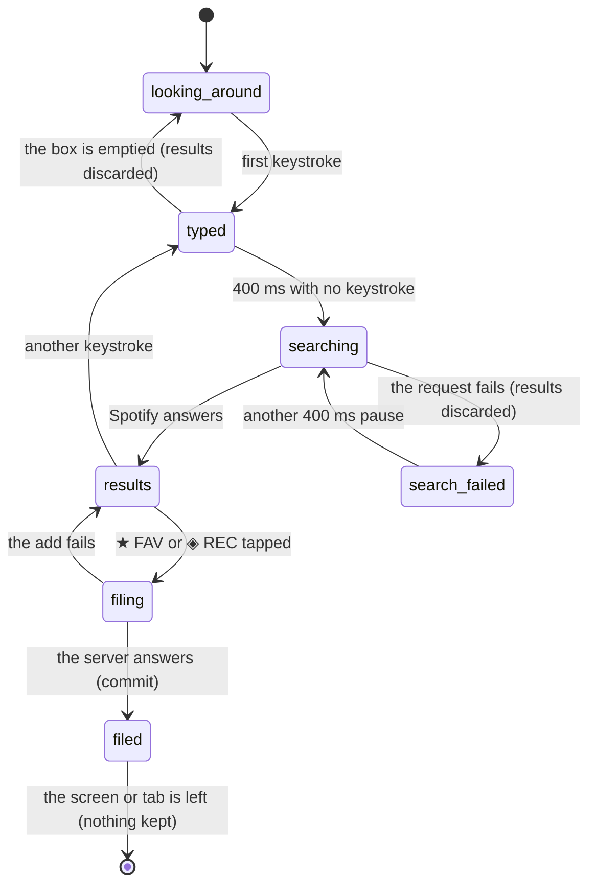

# The album search

## Summary

Searching is how a record first gets into the library. The user types an artist or an album name, Crate asks Spotify, and each result carries two buttons that file it into one of the two lists — favorites or recommendations — with a single tap. It is the only way to add an album that is not already saved in the user's Spotify account, and the only add path that works for a user who signed in with an email address and has never linked Spotify.

It lives on the add screen at `/add`, under the SEARCH tab, which is the tab that is open when the screen opens. The add screen is reached from the + button in the library's header or by typing the URL; it is not in the [bottom navigation](../foundations/navigation-and-loading.md). The screen's header reads DIG FOR RECORDS. There is nothing to switch on and nothing to configure: the search box is always there, focused or not, and a spinner in its right edge is the only sign that a request is in flight. Unlike the LIBRARY and PLAYLISTS tabs beside it, search is not gated on a linked Spotify account — the server searches with its own Spotify application credentials rather than the user's, so search works for every signed-in user.

## The simple case

The user opens the add screen and sees a search box with a vinyl disc below it and the words "Feel free to look around." They type `kind of blue`. Nothing happens for a moment — the results area says NO RECORDS FOUND while they are still typing — and then, four tenths of a second after the last keystroke, the spinner appears and a list of albums replaces it: sleeve art, title, artist, and track count, twenty at most.

Each row has three buttons: a green play triangle, an orange **★ FAV**, and a cyan **◈ REC**. The user taps ★ FAV on the Miles Davis row. Both add buttons on that row grey out and the tapped one becomes an ellipsis for as long as the request takes — a second or two, because the server fetches the album's genres and release date from Spotify while it files it. Then both buttons disappear and the row reads a flat **★ FAV** in orange. The record is in the library.

The user keeps typing and files two more records the same way. Nothing else on the screen changes: there is no running count, no toast, and no indication of how large the library now is. When they are done they tap CRATES or LIBRARY in the bottom bar. The search box, the results, and the record of which rows were filed are all thrown away; coming back to `/add` starts from "Feel free to look around" again.

## The interaction, event by event

`filing` and `filed` belong to one row, not to the screen: other rows stay live while one is being filed, and a screen can hold a mix of filed and unfiled rows.

### Arrive

The add screen always opens on the SEARCH tab, whichever tab was open last time. The three tabs read SEARCH, LIBRARY, PLAYLISTS, in that order. The search box is empty, shows the placeholder "Search for an album...", and is not focused — the user has to tap it. Below it is the idle state: a large vinyl disc and the line "Feel free to look around." No request is made on arrival; nothing about the add screen is loaded ahead of time, and nothing from the [session cache](../foundations/navigation-and-loading.md) is consulted, so arriving on the add screen is instant even on a cold session.

Nothing is remembered from a previous visit. Switching to the LIBRARY tab and back is the same as arriving fresh: the tabs are mounted and unmounted rather than hidden, so the query, the results, and the list of which rows were filed all go away and come back empty.

What is *not* decided on arrival is worth naming: whether the user is linked to Spotify has no effect here, and neither does whether their library is empty. Search behaves identically for a brand-new account and a full one.

### Leave untouched

Leaving without typing writes nothing and asks nothing. The bottom navigation, the browser's back button, and a reload all leave the screen the same way. There is no confirmation, because there is nothing to lose.

Tapping the play triangle on a result without ever touching an add button is the one way to leave a mark without adding a record: it starts playback, which is a real side effect visible on other devices, but it does not put the album in the library and does not record a [pick](../foundations/data-model.md) — search results have no record id to attach a pick to.

### First change

The first keystroke is the first change. It does three things at once: it stores what has been typed, it cancels any debounce already pending, and — if what remains after trimming whitespace is empty — it clears the results immediately without asking Spotify anything.

That last rule is why deleting a query back to nothing empties the list at once rather than after a delay, and why a query of only spaces never searches. It is also the reason for the screen's oddest moment: between the first keystroke and the search that follows it, the screen is not searching and has no results, and the rule for showing NO RECORDS FOUND is exactly "something is typed, nothing is searching, and there are no results." So NO RECORDS FOUND appears the instant the user starts typing and stays there for at least 400 ms before the spinner replaces it. Nothing has been searched at that point.

### While working

Four tenths of a second after the last keystroke, the search fires. The magnifying glass in the right edge of the box becomes a spinning ring, any error message from before is cleared, and the previous results stay on screen until the new ones arrive.

Typing again during that window cancels the pending search and starts the wait over, so a fast typist makes exactly one request. Typing again while a request is already in flight does not cancel it; a second request is queued behind the next 400 ms pause, and whichever answer arrives last wins. In practice the requests are fast enough that this is invisible, but out-of-order answers are possible and nothing guards against them.

Results are whole albums only. Spotify is asked for twenty and everything it calls a single is dropped from the answer, which is why a search can return fewer than twenty rows and why EPs and singles cannot be added by search at all. Rows show the sleeve, the title, the artist (all credited artists, joined with commas), and the track count. Nothing in a row says whether that album is already in the library — the search answer does not carry that fact, so an album the user filed last week looks exactly like one they have never seen.

While a row is being filed, both of that row's add buttons are disabled and the tapped one shows an ellipsis. The other rows are untouched, so the user can start filing a second record before the first finishes; the ellipsis then follows the second one and the first row's buttons come back to life for a moment before flipping to their filed label.

### Commit

Tapping ★ FAV or ◈ REC sends one request and the row waits for it. The server does three things: it asks Spotify for the album's genres, release date, and track count; it writes the record into the user's library with the chosen list; and it answers. The metadata step is best-effort — if Spotify does not answer, the record is filed anyway, without genres. Genres matter more than they look: they are what the nine seeded context crates filter on, so a record filed without them is invisible to those crates and nothing ever backfills them. See [the selection engine](../foundations/selection-engine.md).

On success the row's two buttons are replaced by a flat label — ★ FAV or ◈ REC — matching the list it went into. That label is final for the life of the screen: there is no way to move the record to the other list, or to undo the add, from search results. Both require the [library screen](../library/the-library-shelf.md).

The filed state is remembered by Spotify id for as long as the tab is mounted, so a record filed under one query still shows its label if a later query returns the same album.

If the add fails, the row's buttons come back and the message "Failed to add." appears above the results. It is the same slot the search error uses, and it is cleared only when the next search fires — so an add failure sits on screen through any amount of further clicking, and clearing the search box does not clear it.

> Technical note: filing an album is an upsert keyed on the user and the Spotify id, not an insert. Filing an album that is already in the library therefore overwrites the existing record rather than failing or duplicating: its list flips to whatever button was tapped, its filed-at time resets to now, and its metadata is replaced by whatever the fresh Spotify fetch returned — including being replaced by nothing if that fetch failed. The record keeps its own id, so its [pick history](../history/the-listening-log.md) and play count survive. From the user's side, re-filing an album from search is a silent way to move it between lists and to reset how recently it was added.

## Modifiers

| Modifier | Set on arrival | Changed while working |
| --- | --- | --- |
| Spotify account state | No effect on search or add. Both go through the server's own Spotify application credentials, so an email-only account searches and files exactly like a linked one. Premium is irrelevant. Only the play triangle behaves differently: without a linked account the server cannot hand playback to the user's devices, so the attempt ends by opening the album on Spotify's website. | Linking Spotify mid-way means signing out and back in through Spotify, which ends the session and the screen with it. Nothing on this screen re-reads the account state. |
| Playback state | No effect. The bottom padding of the page grows when the player bar is showing so the last row is not hidden behind it; nothing else changes. | Starting playback from a result's play triangle makes the player bar appear, which shifts the page's bottom padding. The results, the query, and the filed rows are unaffected. |
| Library state | No effect. Search results do not know what is in the library, so a full library and an empty one look the same, and an album already filed shows unmarked add buttons. | Filing a record changes the library but changes nothing else on the screen: no count, no toast, no re-check of the other rows. Two rows for the same album in one result set — Spotify does return near-duplicate editions — are tracked separately until one is filed, at which point both show the filed label, because the filed set is keyed by Spotify id. |
| Viewport | No effect on behavior. The rows are a single column at every width; the page is centered and capped at a comfortable reading width on wide screens. | No effect. |
| Crate and config settings | No effect. Nothing on this screen reads a crate definition, a weighting, or any other setting. Which crates a newly filed record will show up in is decided later, when the crate wall next loads. | No effect. |

Changing a variant mid-interaction never affects search or add. This is the least state-dependent screen in the product: the only thing it reads about the user is that they are signed in.

## Cancel and interrupt

| Event | Before the first change | While working |
| --- | --- | --- |
| Escape, Cancel, Close, or a tap on the backdrop | Nothing to cancel. Escape in the search box is handled by the browser: because the box is a search input, Escape or the browser's own × clears it, which is treated as a normal keystroke — the results empty immediately and no request is made. | Same. Escape clears the box and empties the results; it does not cancel an add that is already in flight, and the record is still filed. |
| Navigating inside the app: the bottom nav, another route, or a second panel or modal | Nothing is lost. | Everything on the screen is lost: the query, the results, and which rows were filed. Switching to the LIBRARY or PLAYLISTS tab has the same effect as leaving the screen, because the tabs are unmounted. A pending debounce is dropped. An add already in flight still completes on the server and the record is still filed; the user just never sees the confirmation. |
| Browser back or forward | Returns to the previous route. Nothing is written. | Same as navigating: everything on the screen is discarded, in-flight adds still land. Coming forward again gives a fresh, empty search screen — the query is not in the URL and is not restored. |
| Reload, or the tab is closed | Nothing is lost. | The same as navigating away, except that the session cache goes with it, so the next screen the user opens loads from the server again. Records already filed are on the server and survive. |
| Network lost, or the request fails or times out | Nothing to fail. | A failed search shows "Search failed. Try again." and empties the results; the query stays in the box, and the next keystroke followed by a 400 ms pause retries. A failed add shows "Failed to add.", restores the row's buttons, and leaves the record unfiled; there is no automatic retry. Both messages share one slot, and only a search clears it. See [failed requests and offline](../cross-cutting/failed-requests-and-offline.md). |
| The session expires, or Spotify rejects the token | Nothing to fail. | The session expiring turns every request on the screen into a failure with the generic messages above; the user is not signed out and is not told why, and typing again keeps failing. Spotify rejecting the *server's* application credentials shows the same "Search failed. Try again." The user's own Spotify token is not used here, so a stale user token cannot break search or add — only the play triangle. |
| The same account in a second tab, or the library changed elsewhere | No effect. | No effect on this screen, and this screen's changes are not seen by the other tab: a record filed here does not appear on the other tab's crate wall or library until that tab is reloaded. See [stale data and second tabs](../cross-cutting/stale-data-and-second-tabs.md). |
| The album in hand is deleted, or Spotify no longer returns it | No effect. | A record deleted from the library elsewhere still shows its filed label here, and the label is now wrong; filing it again with either button re-creates it. An album Spotify has withdrawn simply stops appearing in results; a row already on screen keeps working — filing it succeeds, because the add does not re-check that the album exists, and only the metadata fetch fails, silently. |
| Playback moves to another device, or the tab is backgrounded | No effect. | No effect on search or add. A backgrounded tab keeps its debounce timer and its in-flight requests; browsers may slow the timer, which only delays the search. Playback moving elsewhere is invisible here — the play triangle does not reflect what is playing and never changes appearance. |

After any of these, the user stays where they are. Nothing on this screen is a draft, so nothing is kept: the query and results are transient by design, and the one durable thing — a filed record — is written the instant its button is tapped and is never rolled back.

## Interactions with other systems

**Authentication and account state.** Every request from this screen carries the session's token and fails with an unauthorized error without it, which the screen reports as an ordinary failure. Whether the account is linked to Spotify makes no difference to searching or filing; it only changes what the play triangle can do. See [account and session](../foundations/account-and-session.md).

**The session cache and freshness.** This screen is not cached and does not read the cache — it is the one screen that loads nothing on arrival. It also does not *write* to the cache, which is the more consequential half: records filed here are not added to the cached library or the cached crate wall, so the library screen and the crate wall keep showing what they showed before until the tab is reloaded. See [navigation and loading](../foundations/navigation-and-loading.md).

**Pick history.** Nothing here records a pick, including playing an album from a result row. A newly filed record has never been picked, which the [selection engine](../foundations/selection-engine.md) treats as a reason to favor it.

**Playback.** The green triangle on a row plays the album. It takes the same route as everywhere else in the product — the in-app web player first if the browser can have one, then Spotify's own devices, then the album's page on Spotify's website — with one difference: on a phone or tablet it navigates the tab straight to the Spotify page instead, so the user leaves Crate entirely and loses the search. [Playback](../foundations/playback.md) owns the chain and its timing.

**Configuration and crate definitions.** Untouched. Nothing here reads or writes a setting, and a newly filed record joins whichever crates' rules it happens to match the next time the crate wall loads — which, because of the cache, means the next reload.

**Offline and failed requests.** Offline, search and add both fail with the two generic messages and nothing is queued or retried. There is no offline indicator anywhere in Crate. See [failed requests and offline](../cross-cutting/failed-requests-and-offline.md).

**Multiple tabs and the Spotify app.** Two tabs on the add screen do not conflict; filing the same album from both is harmless, because the second write overwrites the first. Playing from a result row takes over the user's Spotify playback wherever it is, which will interrupt whatever the Spotify app was doing.

**Toasts, badges, and empty states.** There is no toast on this screen — the bulk imports on the other two tabs have one, single adds do not. The two states that look like emptiness are distinct in cause and identical in appearance to a failure: "Feel free to look around." means nothing has been typed, and NO RECORDS FOUND means something has been typed and there are no results, including during the 400 ms before the search fires and after a search that failed.

**Viewport and accessibility.** The rows are a single column at every width. The play, ★ FAV, and ◈ REC buttons carry no text alternative beyond their visible label — the play triangle has a `Play on Spotify` tooltip, the other two are read as "★ FAV" and "◈ REC". The result list is a plain list of rows with no keyboard affordance beyond tab order, and there is no way to reach the add buttons other than tabbing through every row before them. Colour is the only thing distinguishing a favorite button from a recommendation button beyond the star and diamond glyphs.

## Edge cases

- **A query of only spaces** clears the results and never searches, but still counts as "something typed", so the screen shows NO RECORDS FOUND indefinitely.
- **NO RECORDS FOUND shows before any search happens** — from the first keystroke until the debounce fires, and again for the whole duration of a search that fails. In all three cases the wording claims a result that was never obtained.
- **Singles and EPs cannot be added by search.** Everything Spotify labels a single is stripped from the answer. An album that only exists as a single on Spotify is unreachable from this screen; it can still arrive through a Spotify library or playlist import, which do the same filtering, or not at all.
- **Fewer than twenty results is normal.** Twenty are requested and singles are removed afterwards, so the count varies with the query.
- **Re-filing an album already in the library** silently moves it between lists, resets its filed-at time, and replaces its metadata — see the technical note under [commit](#commit). Nothing on the row warns that this will happen.
- **Two editions of the same album** in one result set (a standard and a deluxe, with different Spotify ids) are separate rows and file as separate records. Both then show up in the library's [duplicates panel](../library/duplicates-and-gaps.md) as a possible duplicate.
- **Filing two records at once** works, but the ellipsis only tracks the most recent one, so the first row's buttons briefly come back enabled while its request is still in flight. Tapping again in that window files it a second time, which is harmless because of the upsert.
- **An add failure message never clears on its own.** It survives clearing the box, switching nothing, and any number of successful adds after it; only a search that actually fires clears it.
- **A result with no sleeve art** draws a vinyl disc in its place.
- **A very long album or artist name** is truncated to one line with an ellipsis; there is no tooltip, so the full name is not recoverable from this screen.
- **The play triangle on a phone leaves the app.** It replaces the current page with Spotify's, so the back button is the only way back and the search is gone.

## Open questions and verification

- The exact wall-clock cost of an add has not been measured. It includes a Spotify album fetch and an artist fetch on the server before the write, so it is noticeably slower than a bare write; how much slower, and whether it ever exceeds the platform's function timeout for an album with many credited artists, is unverified.
- Out-of-order search answers are possible in principle — a slow earlier request landing after a fast later one would show results for a query the user has moved on from — but this has not been reproduced. Nothing in the code guards against it.
- Whether the browser's own clear button on a search input reliably fires the change handler in every supported browser has not been checked; the behavior described assumes it does.
- Re-filing an album whose metadata fetch fails replaces its stored metadata with nothing, erasing any genres it had and dropping it out of every genre-filtered crate. This looks like a bug rather than a decision, and may be worth treating as one: the fix would be to merge the fresh metadata into the existing record rather than replace it.
- NO RECORDS FOUND appearing before any search has been performed, and after a search that failed, may be worth treating as a bug rather than documenting: the screen states a negative result it does not have.
- An add failure sharing the search error's slot, and only being cleared by a search, may be worth treating as a bug.
- Records filed here are invisible to the rest of the app until a reload, because nothing tells the session cache about them. This is the largest practical surprise on the screen and is almost certainly worth treating as a bug rather than documenting.

Verified against Crate commit `8301127`.
