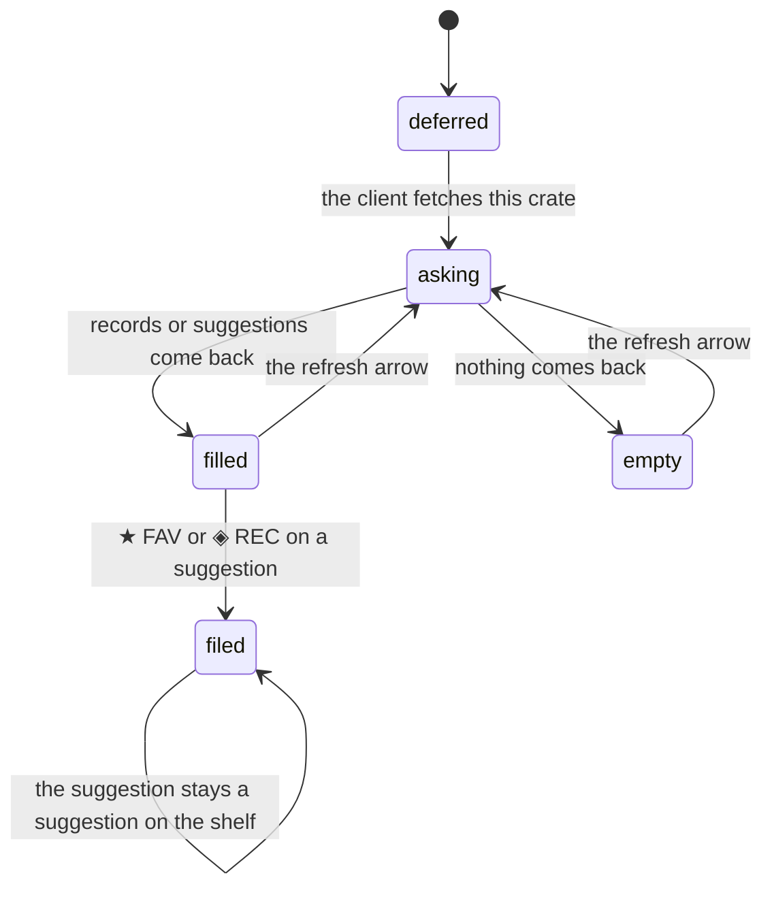

# AI crates

## Summary

Three of the five [strategies](../glossary.md) ask Claude to choose: **AI · LIBRARY** picks from the user's own records to fit a written vibe, **AI · NEW** suggests albums the user does not own at all, and **HYBRID** does both, a third of the shelf from Claude and the rest from the [selection engine](../foundations/selection-engine.md). Every new account gets exactly one of them by default — SURPRISE ME, which is AI · NEW with no vibe written.

Two things make these crates feel different from every other shelf on the wall. First, they are **slow**: they take a few seconds because they involve Claude and then Spotify, so the server leaves them out of the wall's first answer entirely and the client fetches each one separately afterwards. A user's first impression of the wall is that most of it appears at once and one or two shelves keep pulsing.

Second, an AI · NEW shelf holds records the user does not own — **[suggestions](../glossary.md)**. A suggestion looks almost exactly like a record and behaves almost nothing like one: it cannot be starred, removed, or promoted, playing it records no [pick](../glossary.md), and it is gone the next time the wall loads. The two buttons the panel offers instead, ★ FAV and ◈ REC, file it into the library — and the spine on the shelf goes on being a suggestion anyway.

This document owns the deferred load, what a suggestion is and what can be done with it, and every path an AI crate takes when Claude cannot help. What the shelf looks like belongs to [the crate wall](the-crate-wall.md); the prompt field and the strategy buttons belong to [the crate editor](the-crate-editor.md); the panel's contents belong to [the album detail panel](../library/the-album-detail-panel.md).

## The simple case

The user opens Crate. Twelve shelves fill in within a second or two. The third one down, SURPRISE ME, keeps its three pulsing grey bars.

A few seconds later it fills in with two spines they have never seen before, each with a small cyan ◈ in the top corner and a thin cyan bar along the bottom. They tap one: the panel opens with the sleeve, the track list, LAST PLAYED `—`, PLAYS `—`, and — where the star and REMOVE usually are — two buttons, ★ FAV and ◈ REC.

They press PLAY ON SPOTIFY and the album starts. They like it, so they press ◈ REC. The two buttons collapse into one that reads ◈ ADDED. The album is now in their library as a recommendation, and it will be on the DISCOVER shelf the next time the wall loads.

## The interaction, event by event

### Arrive

An AI crate arrives twice. The wall's first answer includes its name, its position, and **no records** — the server marks it as deferred rather than running it, because running every AI crate would add about five seconds to the load. The row therefore shows the ordinary three-bar skeleton, indistinguishable from a row that is merely still loading.

As soon as the wall's answer lands, the client fires one request per deferred crate, **all at once**, and each is fetched exactly once. A wall with one AI crate has one extra request in flight; a wall with five has five, concurrently, each asking Claude and then Spotify.

Which crates are deferred is decided by the strategy, not by the user: AI · NEW and HYBRID always, and AI · LIBRARY only when its vibe is not blank. An AI · LIBRARY crate with a blank vibe is not slow, arrives with everything else, and is not an AI crate in any observable sense — it is a weighted draw.

Nothing tells the user any of this. There is no "thinking" state, no label, and no distinction on the shelf between a crate that is waiting for Claude and one that is waiting for the network.

### Leave untouched

Leaving the wall while an AI crate is still loading does not cancel it: the answer still lands in the [session cache](../foundations/navigation-and-loading.md), so coming back finds the shelf filled. Leaving and coming back later never re-asks — the shelf holds the same suggestions for the whole session.

Nothing about an AI crate is written by looking at it. The suggestions are not saved anywhere: they exist in the browser and in nothing else, and the next full load produces a different set.

### First change

The first change is one of three things, and which are available depends on what is on the shelf.

For a **record** on an AI · LIBRARY or HYBRID shelf — one the user already owns — everything is normal: the ★ on the spine, the star and REMOVE in the panel, play. See [picking a record](picking-a-record.md).

For a **suggestion**, the panel offers **★ FAV** and **◈ REC** instead of the star and REMOVE, and filing it is one request: the two buttons collapse into a single ★ ADDED or ◈ ADDED, coloured orange or cyan.

On an **AI · NEW** shelf the spine offers nothing — the hover star is deliberately withheld from AI · NEW crates, because there is no record to star. On a **HYBRID** shelf it is not withheld, so hovering a suggestion there does show the ★, and pressing it fills the star in and achieves nothing at all: there is no record for it to promote. Nothing says so, and the star stays filled. This is a bug.

Playing a suggestion works exactly as it does for a record, and records nothing.

### While working

Filing a suggestion changes the panel and nothing else. **The spine stays a suggestion**: it keeps its cyan bar, it still has no id in the library as far as the shelf is concerned, and playing it still records no pick. Only a reload, or refreshing that crate, replaces it — and refreshing replaces the whole shelf, so the record the user just filed usually vanishes and the shelf fills with three albums they have not been offered before.

Refreshing an AI crate re-asks Claude from scratch. There is no memory between asks: the same album can be suggested again the next day, and often is, because the prompt is built the same way each time. The refresh arrow spins for six-tenths of a second regardless of how long the ask actually takes, so on an AI crate the animation always finishes long before the shelf changes.

### Commit

Nothing about an AI crate's *contents* is ever committed. The suggestions are not stored, the ask is not logged, and the crate's shelf is rebuilt from nothing on every load.

Filing a suggestion is the one write, and it files a whole record: title, artist, sleeve, Spotify id, the chosen list, and whatever metadata Spotify returns. From that moment it is an ordinary record and the [selection engine](../foundations/selection-engine.md) can draw it into any crate.

> Technical note: a suggestion filed this way is stamped with a filed-at time in milliseconds, while every other record in the library is stamped in seconds. The record is therefore dated about fifty thousand years in the future, which makes it permanently "recently added" for the purposes of that bonus and puts it first under the library's ADDED sort forever. See [the data model](../foundations/data-model.md).

## What happens when Claude cannot help

Every AI path has a fallback and none of them is announced. The user cannot tell an AI shelf that Claude filled from one it did not.

| Strategy | When it cannot ask, or the answer is unusable | What the shelf shows instead |
| --- | --- | --- |
| AI · LIBRARY, blank vibe | Not applicable — Claude is never asked. | An ordinary weighted draw from the crate's pool. |
| AI · LIBRARY, with a vibe | Claude fails, or names nothing that is in the pool. | A weighted draw from the pool — but **with the engine's default numbers, not the crate's own sliders**. A crate tuned to a long cooldown quietly falls back to three days. |
| AI · NEW | The user has no records at all; or Claude fails; or every album Claude names is one the user already owns; or Spotify finds no match for any of them. | A **random draw from the whole library, ignoring the crate's filter rules entirely** — so a crate meant to hold albums the user does not own shows albums they do, and a crate with rules shows records that break them. |
| HYBRID | Claude fails for its AI third. | The missing third is backfilled with more weighted picks from the pool, excluding the ones already drawn. The shelf is the right length and entirely from the library. |

Two of those are worth stating plainly as defects. The AI · NEW fallback discards the crate's own rules, which is the only place in the product where a filter rule is ignored. And the AI · LIBRARY fallback discards the crate's own weighting, which is the only place where a slider the user set is silently replaced by a default.

There is also one path that cannot be reached. AI · LIBRARY handles its own failures internally and always returns something, so the fallback the crate engine holds for it — a random draw — is dead code. The observable behavior is the weighted-with-default-numbers draw in the table above.

> Technical note: Claude is asked for exactly five albums for AI · NEW, whatever the crate's count, and given at most fifteen of the user's favorites to work from and at most two hundred titles to avoid. The five are shuffled, each is searched on Spotify (five results, singles excluded), and the first result that is not already in the library — by Spotify id *and* by a normalized title-and-artist key that strips "(Deluxe Edition)"-style parentheticals — is taken, until the count is filled. A crate with a count of 7 can therefore never have more than five suggestions, and a library over two hundred records can be offered something it already contains under a title the normalizer does not match.

## Modifiers

| Modifier | Set on arrival | Changed while working |
| --- | --- | --- |
| Spotify account state | No effect, which is surprising: both the Claude request and the Spotify searches behind it are made by the server with its own credentials, so **AI crates work fully on an account that is not linked to Spotify** — including the sleeve art and the track lists. Only playing the result needs a link. | Cannot change without signing in again. |
| Playback state | No effect. Nothing marks a suggestion that is playing except the panel's own green track highlight, and once the panel is closed there is no trace. | Playing a suggestion writes nothing, so an AI shelf never changes as a result of being listened to. |
| Library state | Decides everything. **An account with no favorites gets no suggestions at all**: Claude is seeded with the user's favorites, and with none it is not asked, so AI · NEW falls back to a random draw from the library — which, on a brand-new empty account, is nothing. So the SURPRISE ME shelf on a fresh account reads "crate empty — add some records" and nothing explains why. A library with recommendations but no favorites behaves the same way. | Filing records elsewhere does not re-ask. The next reload will, and its suggestions will reflect the larger library. |
| Viewport | No effect on the ask. A suggestion's spine is drawn exactly like a record's, at the same widths, with a cyan bar added along the bottom. | No effect. |
| Crate and config settings | The vibe field decides whether the crate is slow at all (for AI · LIBRARY) and what Claude is aiming for. The count caps how many suggestions are used, up to five. The sliders are used for HYBRID's library half and for AI · LIBRARY's fallback — except that the fallback ignores them. | Saving an AI crate re-runs it, so the vibe takes effect immediately, one ask later. |

## Cancel and interrupt

| Event | Before the first change | While working |
| --- | --- | --- |
| Escape, Cancel, Close, or a tap on the backdrop | An open panel on an AI shelf closes with its ✕ or by tapping the spine again; there is no backdrop, as on any wall panel. There is no way to cancel an ask in progress — the skeleton cannot be dismissed. | Filing a suggestion cannot be cancelled or undone from here. Undoing it means finding the record in the library and removing it. |
| Navigating inside the app: the bottom nav, another route, or a second panel or modal | Free. An ask in flight keeps going and its answer lands in the cache, so coming back finds the shelf filled even though the user was not watching. | Same. A file in flight also completes. |
| Browser back or forward | Nothing to lose. | The ask and the file both complete regardless. The panel is closed on return, and the ★ ADDED state is gone with it — the spine looks untouched. |
| Reload, or the tab is closed | Nothing to lose. | **Every suggestion is discarded and a new ask is made.** An album the user was reading about and had not yet filed is gone, with no way to get it back except by name. This is the least recoverable state in Crate: nothing anywhere records what was suggested. |
| Network lost, or the request fails or times out | The wall's load fails, so there is no shelf at all — see [the crate wall](the-crate-wall.md). | The ask fails, the skeleton clears, and the shelf shows **"crate empty — add some records"** — which is also what a successful ask that found nothing shows, and what an empty pool shows. Nothing retries: the client fetches each deferred crate exactly once per session, so a failed AI shelf stays empty until it is refreshed by hand or the page is reloaded. |
| The session expires, or Spotify rejects the token | No shelf. | The ask fails as above. Spotify rejecting the *user's* token has no effect, because the searches use the server's own credentials. |
| The same account in a second tab, or the library changed elsewhere | Two tabs get two different sets of suggestions, which is expected. | Filing a suggestion in one tab does not stop the other from offering it; filing it in both files it once and overwrites it the second time, keeping its id and resetting its list and its filed-at time. See [the data model](../foundations/data-model.md). |
| The album in hand is deleted, or Spotify no longer returns it | A suggestion cannot be deleted; it is not in the library. | An album Spotify has withdrawn between the search and the tap shows an empty track list and a play attempt that ends on a Spotify page saying it is unavailable. Filing it still succeeds — Crate files what the search returned. |
| Playback moves to another device, or the tab is backgrounded | No effect. | No effect on the ask. A backgrounded tab's ask completes and its shelf fills silently. |

## Interactions with other systems

**Authentication and account state.** AI crates need only a signed-in account, which makes them the most capable thing in Crate that does not need Spotify. Nothing says so; a user who never links Spotify gets suggestions they cannot play from inside Crate. See [account and session](../foundations/account-and-session.md).

**The session cache and freshness.** An AI shelf is fetched once per session and then frozen, like everything else, except that its contents were never on the server to begin with. A suggestion is the only thing in the cache with no durable counterpart anywhere, which is why a reload loses it. The refresh arrow is the only in-session way to change it. See [navigation and loading](../foundations/navigation-and-loading.md).

**Pick history.** Suggestions are invisible to it in both directions: playing one records nothing, and the engine's cooldown and bonuses cannot apply to a record that does not exist. The consequence is that **the same album can be suggested, played, and suggested again**, with nothing in the product remembering. Records on an AI · LIBRARY or HYBRID shelf are ordinary and do record picks.

**Playback.** Identical to any record: the same four-route [chain](../foundations/playback.md), the same silence at every step. A suggestion has a Spotify id, so every route works.

**Configuration and crate definitions.** The strategy and the vibe are part of the [crate definition](../glossary.md) and are written by [the crate editor](../crates/the-crate-editor.md). Nothing about an ask writes anything. On a brand-new account the seeding writes one AI crate, SURPRISE ME, with no vibe.

**Offline and failed requests.** An AI crate's failure is the hardest in the product to see, because the empty shelf it produces is the same shelf a successful-but-empty ask produces, and because the one automatic fetch per session means the failure is permanent until the user acts. The refresh arrow is a genuine retry and the only one short of a reload. See [failed requests and offline](../cross-cutting/failed-requests-and-offline.md).

**Multiple tabs and the Spotify app.** Two tabs ask independently and get different answers, which is correct. Nothing about AI crates writes a crate definition, so the [second-tab hazard](../cross-cutting/stale-data-and-second-tabs.md) does not apply to them unless the user opens the editor.

**Toasts, badges, and empty states.** The cyan bar along the bottom of a spine is the only badge that marks a suggestion, and it is 2 px tall and unlabelled. A suggestion also carries the ◈ recommendation badge, because it is filed as a recommendation before it is filed at all — so a suggestion and a record the user added to their recommendations list look identical apart from that 2 px bar. The ★ ADDED / ◈ ADDED text in the panel is the only confirmation of anything. There is no toast, no "asking Claude" state, and no distinct empty state — an AI crate that came back with nothing shows "crate empty — add some records", the same advice a filtered library crate gets, and the wrong advice for a crate whose whole purpose is albums the user does not have.

**Viewport and accessibility.** A suggestion's spine is a plain element with a click handler, like every other spine, so it cannot be reached by keyboard. The cyan bar carries no text, so nothing announces that a spine is a suggestion rather than a record; a screen reader is given the same "title — artist" tooltip for both. Nothing announces that a deferred shelf has finished loading.

## Edge cases

- **A brand-new account's SURPRISE ME shelf is empty and stays empty,** because Claude is seeded from the user's favorites and there are none. The shelf says "add some records", which is right by accident.
- **An account with recommendations but no favorites also gets nothing,** for the same reason. Filing one favorite is enough to switch it on, and nothing hints at that.
- **A crate with a count above five can never fill.** Claude is asked for five albums however many the crate wants.
- **The hover ★ on a HYBRID shelf's suggestion does nothing.** It is withheld from AI · NEW crates but not from HYBRID ones, so it appears, fills in when pressed, and promotes nothing — there is no record behind it. The failure goes to the browser console.
- **A suggestion wears the ◈ recommendation badge,** so it is indistinguishable from a record already in the recommendations list except for a 2 px cyan bar.
- **A filed suggestion stays a suggestion on the shelf** until that crate is refreshed or the page is reloaded — so it can be filed, and then played, and the play still records nothing.
- **Filing a suggestion dates it fifty thousand years in the future,** which makes it permanently "recently added" and pins it to the top of the library's ADDED sort. This is a unit bug.
- **AI · NEW's fallback ignores the crate's filter rules,** so a failed ask can put records on the shelf that the crate's own rules exclude.
- **AI · LIBRARY's fallback ignores the crate's sliders** and draws with the engine's defaults.
- **Two AI shelves on one wall collide.** Suggestions are numbered locally per shelf, from the same numbers, so selecting the first spine of one selects the first spine of the other and two panels open at once showing different albums. This is a bug; see [picking a record](picking-a-record.md).
- **A failed AI shelf never retries on its own,** not even by leaving the wall and coming back, because the deferred fetch is remembered as done for the life of the page. Every other failed load in the product retries on re-entry.
- **The refresh arrow's spin is unrelated to the ask,** which takes a few seconds. On an AI crate the animation is always finished before the shelf changes.
- **An AI · LIBRARY crate with a blank vibe is not an AI crate.** It is not deferred, Claude is never asked, and it behaves exactly like WEIGHTED — while the editor still shows it as AI · LIBRARY.
- **Suggestions exclude singles,** because the search that resolves them filters them out. An album Claude names that Spotify only has as a single is silently dropped.
- **Nothing anywhere records what was suggested.** There is no history of asks, so an album seen once and not filed cannot be found again except by remembering its name.

## Open questions and verification

- How long a deferred crate actually takes has not been measured. The server defers them because running them inline would add around five seconds to the whole response, which suggests a few seconds each.
- Whether several deferred crates fetched at once are noticeably slower than one has not been tested. They are concurrent by construction, and each involves a Claude call plus up to five Spotify searches.
- The empty-shelf-on-a-new-account behavior is read from Claude not being asked when there are no favorites. It is the most valuable item here to confirm by hand, because it is what every new user sees.
- The millisecond filed-at stamp on a filed suggestion is read from the code and is cheap to confirm: file one, then sort the library by ADDED and see whether it sits at the top.
- Whether the AI · NEW fallback is ever reached in practice is unknown. It needs Claude to fail or to name only albums the user already owns; on a large library the second is plausible.
- How often Claude repeats a suggestion across refreshes has not been observed. Nothing in the prompt discourages it beyond the list of albums already owned.
- That the singles filter drops otherwise-valid suggestions is read from the search; how often it happens is unknown.
- Nothing has been checked about what the shelf does if Claude answers with more albums than asked for, or with malformed JSON. Both are handled by treating the answer as empty, which lands in the fallback paths above.

Verified against Crate commit `8301127`.
