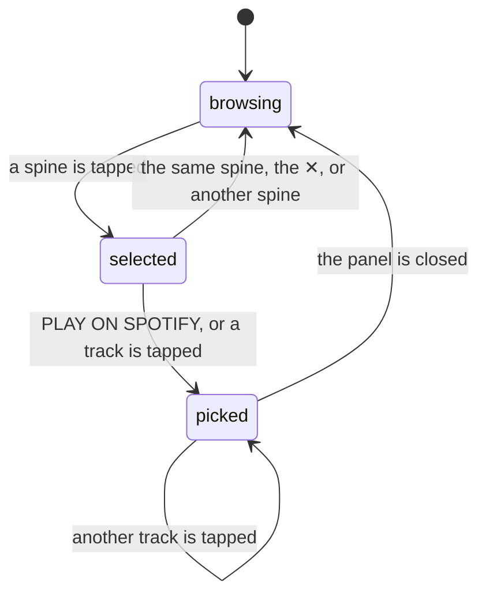

# Picking a record

## Summary

Picking a record is the act the whole product is built around: the user looks at a shelf, chooses one album, and starts listening to it. It is two taps. The first taps a spine, which lifts out of the row and opens the [album detail panel](../library/the-album-detail-panel.md) underneath the shelf. The second presses PLAY ON SPOTIFY, or taps a track in the list, which starts playback and writes a [pick](../glossary.md).

The distinction that matters here, and that nothing in the interface explains, is that **selecting a record is not picking it**. Tapping a spine writes nothing and has no effect on what any crate will show tomorrow. Only pressing play does. A user can open twenty spines, read twenty track lists, and leave without the [selection engine](../foundations/selection-engine.md) knowing anything happened.

This document owns the path from a spine being tapped to a pick being written: what the selection does, what the play controls do, what is recorded, and what is not. The panel's own contents — the track list, MORE BY, the favorite and remove buttons, the fetch behind them — belong to [the album detail panel](../library/the-album-detail-panel.md). The four routes a play attempt takes belong to [playback](../foundations/playback.md).

## The simple case

The user is on the crate wall. On the MORNING shelf there is a spine they want. They tap it. The spine rises out of the row with an orange ring around it and an orange bar across its top, and a panel opens directly below the shelf: sleeve art, the title in large letters, the artist, LAST PLAYED "2w ago", PLAYS "×3", a green PLAY ON SPOTIFY button, a star, a remove button, and a track list that fills in a moment later.

They press PLAY ON SPOTIFY. On their laptop, with Spotify Premium, the album starts in the tab and the [player bar](../player/the-player-bar.md) slides up over the bottom navigation. Nothing else on the screen changes — no message, no mark on the spine.

The pick has been written. Their [listening log](../history/the-listening-log.md) now has an entry for it, the record's PLAYS reads ×4 the next time the wall is loaded, and for the next three days the weighted crates will not draw it.

## The interaction, event by event

There is no state between `selected` and `picked` — no "about to pick", no confirmation. And `picked` is not a state the interface shows: the panel afterwards looks exactly as it did before.

### Arrive

The interaction arrives when a spine is tapped. Which spine is selected is one value for the whole screen, so tapping a spine deselects whatever was selected before, anywhere on the wall, and the previous panel closes as this one opens. The shelf the panel belongs to stays where it is; the panel opens **below the shelf**, pushing every crate under it down the page, which on a phone usually pushes the shelf the user was looking at up and out of view.

The spine itself lifts 24 px out of the row, gains a 2 px orange bar across the top and an orange ring, and does not widen — so the selected record's sleeve is not visible on the spine, only in the panel.

The panel opens with the two facts the wall already knows in place — LAST PLAYED and PLAYS, both read from the [session cache](../foundations/navigation-and-loading.md)'s copy of the log — and with the track list and MORE BY as pulsing skeletons while they are fetched. It is not focused, nothing is prefilled, and nothing is remembered from a previous opening of the same record except the fetched details, which are cached for the life of the page.

A record with no picks reads `—` under both LAST PLAYED and PLAYS. It does not read "never".

### Leave untouched

Closing the panel — by tapping the same spine again, tapping the ✕ in its top-right, or tapping a different spine — writes nothing and is the ordinary way to leave. The spine drops back into the row and the page closes back up.

This phase is genuinely clean here, which is worth saying because it is not clean in the panel's other actions: the star and REMOVE both commit the instant they are used, and those are described under [the album detail panel](../library/the-album-detail-panel.md).

### First change

The first change is the pick, and it is the same act as starting playback. Two controls make it:

| Control | What it plays | What it records |
| --- | --- | --- |
| PLAY ON SPOTIFY | The album from its first track. | One pick. |
| A track in the list | The album from that track onward. | One pick, identical to the button's — the track is not recorded anywhere. |

Both fire the pick **before** attempting playback, and neither waits for either answer. So the order of events is: the pick request goes out, the [playback chain](../foundations/playback.md) begins, and the user sees whichever of the two happens to produce a visible effect — which is only ever the playback.

On a phone or tablet, both controls navigate the browser away from Crate to Spotify. The pick request has already been sent by then, and whether it survives the navigation is not something the interface can tell the user. Tapping a specific track on a phone plays the album from the beginning rather than from that track, because the hand-off has nowhere to put the track number.

### While working

There is nothing to keep working at. The panel does not change when a pick is recorded: PLAYS still reads the old count, LAST PLAYED still reads the old date, and neither is re-fetched. The only visible change is elsewhere on the page, and only sometimes — if Crate's own player took the album, the [player bar](../player/the-player-bar.md) appears, and the track that is playing is highlighted green in the list with a ▶ in place of its number.

Everything else the user can do here is a separate act with its own commit: the star, REMOVE, and — for a [suggestion](../glossary.md) — ★ FAV and ◈ REC. All of those belong to [the album detail panel](../library/the-album-detail-panel.md), except for what they do to the shelf, which belongs to [the crate wall](the-crate-wall.md).

### Commit

The pick is one request and it is fire-and-forget. It stores three things: which record, when, and **the id of the crate that produced it** — a machine-generated string like `crate_1737059412_284617`, not the crate's name. See [the data model](../foundations/data-model.md).

Nothing confirms it. No toast, no mark on the spine, no change in the panel. The confirmation, such as it is, is the music starting, which is a different event that may not have happened.

Two things are not recorded. A [suggestion](../glossary.md) — a record Claude proposed that is not in the library — records nothing at all, because there is no record to attach a pick to; playback is attempted exactly as normal, so it plays and vanishes without trace. And nothing records that playback *failed*, so a pick means "the user asked for this", not "the user heard this".

A pick cannot be undone from here. The [listening log](../history/the-listening-log.md) has no delete. The only way to remove a pick is to remove the record, which removes all of its picks along with it.

## Modifiers

| Modifier | Set on arrival | Changed while working |
| --- | --- | --- |
| Spotify account state | Decides only whether the play succeeds, never whether it is recorded. An account with no Spotify link records picks normally and plays nothing inside Crate: the chain falls through to opening Spotify's website in a new tab, which is a plain link and needs no link to the account. The panel is otherwise complete — the track list and MORE BY are fetched with Crate's own Spotify credentials rather than the user's, so they work for every signed-in user. | Cannot change without signing in again. |
| Playback state | Nothing playing means the panel's track list has no highlight. Something playing from this album highlights that track in green with a ▶. Something playing from a *different* album leaves the panel looking untouched. | Pressing play again on an album that is already playing restarts it from the top and records a second pick. |
| Library state | Decides what is in hand. A record in the library gets the full panel: the star, REMOVE, its play count, its date. A suggestion gets ★ FAV and ◈ REC instead and shows `—` for both stats, because it has no history and cannot have one. | Filing a suggestion from the panel changes the panel — the buttons collapse to ★ ADDED — but the spine on the shelf stays a suggestion and still records nothing when played. |
| Viewport | Decides which playback route is even attempted. A phone or tablet, by user agent, gets exactly one route: hand off to the Spotify app. A desktop browser gets the full chain. The panel itself is one column at every width and the spine's selected lift is the same. | Resizing does not re-decide the route; it was fixed when the page loaded. See [playback](../foundations/playback.md). |
| Crate and config settings | Decide which crate the pick is attributed to, which is the crate whose shelf the spine was on. Nothing about the crate's strategy or rules changes what a pick means or how it is stored. | Editing the crate the panel is open in re-runs it, which usually replaces its contents — and the panel is keyed to the selected record, so it closes if that record is no longer on the shelf. |

## Cancel and interrupt

| Event | Before the first change | While working |
| --- | --- | --- |
| Escape, Cancel, Close, or a tap on the backdrop | The ✕ closes the panel; so does tapping the selected spine again, or any other spine. There is **no backdrop** — the panel is part of the page, not an overlay, so tapping elsewhere on the page does nothing. Escape does nothing: the panel has no keyboard dismiss. On the [listening log](../history/the-listening-log.md) the same panel is a modal and does have a backdrop; on the wall it is not. | Nothing to cancel. The pick is sent the instant play is pressed and there is no window in which to stop it. Closing the panel afterwards does not undo it. |
| Navigating inside the app: the bottom nav, another route, or a second panel or modal | Free. The selection is lost, not saved: coming back to the wall finds every panel closed. Opening the crate editor over the top of an open panel leaves the panel open underneath, and it is still open when the editor closes — unless the save re-ran the crate and the record is gone. | Same. Navigating away does not stop playback, because the player lives above the routes; only a reload does. The pick has already been sent and lands regardless. |
| Browser back or forward | Closes nothing and restores nothing — the selection is not in the URL. Back from the wall at the start of a session leaves Crate. | The pick is already written. Playback continues. The panel is closed on return. |
| Reload, or the tab is closed | Nothing to lose. | A reload **stops the music** if Crate's own player was playing it, and re-runs every crate, so the record that was just picked may not be on any shelf afterwards. The pick survives; it is on the server. A reload in the middle of the pick request loses the pick silently. |
| Network lost, or the request fails or times out | The panel's own fetch fails and TRACKS and MORE BY stay empty with no message. The header, the stats, and the buttons all still work, because they were already in hand. | **The pick is lost silently and playback is attempted anyway.** Nothing is shown, nothing retries, and the user has no way to notice — the album may well start playing from a device that is still online. The [listening log](../history/the-listening-log.md) simply has no entry, and the weighted crates behave as though the album was never played. See [failed requests and offline](../cross-cutting/failed-requests-and-offline.md). |
| The session expires, or Spotify rejects the token | The panel opens with whatever the cache holds, and its own fetch fails too — an expired Crate session fails every request, whichever Spotify credentials the server would have used — so no tracks. | The pick fails silently, as above. The playback chain fails at every step that needs the user's token and ends by opening Spotify's website in a new tab, which is the one route that still works — so the user gets a plausible-looking outcome from a completely broken session. |
| The same account in a second tab, or the library changed elsewhere | The stats shown are this tab's copy of the log and can be arbitrarily old. | Picks from both tabs are written and both land; picks are append-only, so this is one of the few places in Crate where two tabs cannot damage each other. Neither tab's PLAYS number updates to reflect the other's. |
| The album in hand is deleted, or Spotify no longer returns it | A record deleted in another tab still opens a panel here, with its cached stats, until something reloads. | Playing a record that no longer exists in the library still fires the pick, which the server rejects — silently. Playback still works, because it goes to Spotify by id rather than through the library. An album Spotify no longer serves shows an empty track list and a play attempt that fails at every step, ending on a Spotify page that says the album is unavailable. |
| Playback moves to another device, or the tab is backgrounded | No effect. | If Crate's own player loses the audio to another device, the player bar disappears and the panel's green track highlight goes with it — so the panel reverts to looking as though nothing is playing while the album keeps playing elsewhere. Nothing about the pick changes; it was written at the moment of the request. |

## Interactions with other systems

**Authentication and account state.** A pick needs only a signed-in account. Everything else on this path — the track list, three of the four playback routes — needs a [linked Spotify account](../foundations/account-and-session.md). An email-only user can pick records all day and never hear one inside Crate.

**The session cache and freshness.** The two numbers in the panel come from the cache's copy of the listening log, which was loaded when the crate wall was loaded and is never re-derived. So PLAYS and LAST PLAYED are as old as the session, and picking a record does not update them — a user who picks the same album three times in one sitting sees the same "×3" all three times. A screen that never loaded the crate wall shows `—` for every record; see [navigation and loading](../foundations/navigation-and-loading.md).

**Pick history.** This document owns the write. One pick per press of a play control, storing the record, the moment, and the crate's id. Nothing deduplicates: five track taps in a row are five picks, and five picks is what the [selection engine](../foundations/selection-engine.md) sees when it decides how overexposed that record is. There is no way to delete a pick.

**Playback.** Picking and playing are the same tap and separate outcomes. [Playback](../foundations/playback.md) owns the chain, its four routes, and the fact that it is silent at every step. The consequence here is the one that matters most in this document: **the pick is written whether or not anything plays**, so the listening log is a log of intentions rather than of listens.

**Configuration and crate definitions.** A pick stores the crate's id, so a crate that is later renamed keeps its old picks; a crate that is deleted leaves picks pointing at an id nothing can resolve, and the [listening log](../history/the-listening-log.md) shows the raw id for both. Nothing about picking writes a definition.

**Offline and failed requests.** Both halves of this interaction fail silently and independently. The pick can fail while the play succeeds, and the play can fail while the pick succeeds; the interface shows the same thing in all four combinations. This is the clearest case in the product of the [silent failure](../cross-cutting/failed-requests-and-offline.md) pattern doing real damage, because the damage is invisible and cumulative — a log with holes in it, and a selection engine drawing on it.

**Multiple tabs and the Spotify app.** Picks are append-only so tabs do not conflict. Playback does: two tabs on a desktop each register their own "Crate Web Player" with Spotify, and pressing play in the second takes the audio from the first, whose player bar then vanishes. Playing from the Spotify app directly records nothing at all — the play count only ever counts choices made inside Crate.

**Toasts, badges, and empty states.** Nothing is announced. No toast on a pick, no badge on a picked spine, no change to the panel. The only badges in play are the ◈ RECOMMENDATION line in the panel's header and the cyan bar on a suggestion's spine. There is no empty state for this interaction; an empty track list is a silent failure or an unlinked account, and looks the same either way.

**Viewport and accessibility.** Spines are plain elements with a click handler, so a record cannot be selected by keyboard at all, which makes the whole of this interaction mouse- or touch-only. Inside the panel, PLAY ON SPOTIFY is a real button and the tracks are not — they are clickable rows with a tooltip, unreachable by keyboard and unannounced as controls. Nothing announces that a pick was recorded, and nothing announces that the panel opened, so a screen-reader user gets no signal that the page changed except the new content appearing further down the document.

## Edge cases

- **Every track tap is another pick.** Browsing an album by tapping through five tracks writes five picks, and the weighted crates then treat that album as five times as overexposed as one the user actually listened to.
- **A pick is written even when nothing plays.** On a desktop with no Spotify open anywhere, the chain ends by opening Spotify's website in a new tab, and the pick is already recorded. If the user closes that tab without pressing play, Crate believes they listened.
- **Tapping a track on a phone ignores the track.** The hand-off to the Spotify app can only carry the album, so the album starts from the beginning.
- **The panel's numbers never update.** Picking a record and looking at the same panel afterwards shows the same PLAYS and LAST PLAYED. Only a reload changes them.
- **The panel opens below the shelf, not next to the spine.** On a phone, opening a spine near the top of a long shelf list pushes everything down and can move the shelf itself off the top of the screen, so the record the user is reading about is no longer visible.
- **A record on two shelves opens two panels.** The selection is one value for the whole screen, so a record drawn into two crates opens a panel under both, and pressing play in either records a pick attributed to that shelf's crate.
- **Two AI shelves select each other's records.** Suggestions are numbered locally per shelf, so the first suggestion of one AI crate and the first of another share an id, and tapping one selects both — showing two different albums in two panels at once. This is a bug.
- **Picking a suggestion records nothing.** It plays, it disappears on the next load, and the log has no memory of it. There is no indication that this record is treated differently from the one beside it.
- **`—` means "never", but reads like "unknown".** Both stats use it, and it is also what a screen that never loaded the crate wall shows for every record.
- **The panel is a panel on the wall and a modal on the listening log.** The same component, with a backdrop and scroll-locking in one place and not the other, so the way to close it differs by screen.
- **Nothing marks the record that is playing on the shelf.** Only the open panel's track list shows it, so after closing the panel there is no way to tell from the wall what is playing.

## Open questions and verification

- Whether a pick request survives the mobile hand-off has not been tested. The request is sent and not awaited, and the browser then navigates away; on some browsers a request in flight during a navigation is cancelled. If it is, **no pick is ever recorded on a phone**, which would make the listening log and the whole cooldown mechanism desktop-only. This is the most important item in this document.
- The claim that a track tap records the album rather than the track is read from the pick's contents; that no track number is stored anywhere is confirmed by the data model.
- Whether the server rejects a pick for a deleted record with an error or silently ignores it has not been checked; either way nothing is shown.
- The two-panels-at-once behaviors — same record on two shelves, and colliding suggestion ids across two AI crates — are read from the code and are cheap to confirm by hand.
- Whether the panel closes on its own when a save or refresh removes the selected record from the shelf has not been watched; it follows from the panel being rendered only for a record that is in the row.
- Nothing has been measured about how long the pick request takes relative to the playback chain. They are concurrent by construction, so the ordering above is what the code does, not what a user would see.
- That the track list and MORE BY work on an email-only account is read from the album-details route using Crate's own Spotify credentials rather than the user's. It has not been observed on an unlinked account, and it is the one place where such an account is better off than it appears.

Verified against Crate commit `8301127`.
