# The crate editor

## Summary

The crate editor is the only settings surface in Crate. Everything a user can configure lives in it: a crate's name, how many records it puts on its shelf, which records it is allowed to consider, how it chooses between them, and — for the two strategies that use them — four sliders that tune the [selection engine](../foundations/selection-engine.md). There is no preferences screen, no account screen, and nothing global; a preference in Crate is always a property of a crate.

It is a modal, opened from a shelf's pencil to edit a crate or from the header's round button to make a new one. It is the one place in the product with a real dirty state: everything typed and dragged in it is held locally and written only when SAVE is pressed. Nothing warns before discarding it. CANCEL, the ✕, and a tap on the dimmed page behind all throw the whole edit away without asking.

This document owns the modal from opening to save or delete. The mechanics of a filter rule — the fields, the operators, and what each one means — belong to [the selection engine](../foundations/selection-engine.md); the rule editor itself, which is the same component the library uses, is described in [saving a crate from the library](../library/saving-a-crate-from-the-library.md). What a saved crate then puts on its shelf belongs to [the crate wall](the-crate-wall.md) and, for the AI strategies, [AI crates](ai-crates.md).

## The simple case

The user wants a crate of nothing but 1970s records. They tap the round orange button in the CRATES header. The page dims, and a panel slides up from the bottom of the phone titled NEW CRATE.

They type `SEVENTIES` into Name. They leave ALBUMS PER CRATE at 4. Under FILTERS they tap + ADD RULE, which gives them a row reading `Year` `is between` with two empty number boxes; they type 1970 and 1979. They leave PICK STRATEGY on WEIGHTED and leave the four sliders where they are. They press SAVE.

The button reads SAVING… for a moment. Then the modal closes and a new shelf is at the bottom of the wall, named SEVENTIES, with four spines on it.

## The interaction, event by event

```mermaid
stateDiagram-v2
    [*] --> open
    open --> dirty : anything is typed, tapped, or dragged
    open --> [*] : CANCEL, the ✕, or the dimmed page
    dirty --> [*] : CANCEL, the ✕, or the dimmed page — discarded
    dirty --> saving : SAVE
    open --> saving : SAVE
    saving --> [*] : written, the crate re-runs, the modal closes
    saving --> dirty : the save fails; the modal stays open
    open --> confirming : DELETE CRATE
    confirming --> open : CANCEL
    confirming --> [*] : DELETE
```

### Arrive

Two things open it, and they differ only in what they are given:

| Opened by | Title | Starts with |
| --- | --- | --- |
| The pencil on a shelf's header | EDIT CRATE | That crate's saved name, count, rules, strategy, and sliders. |
| The round crate button in the CRATES header | NEW CRATE | A blank name, a count of 4, no rules, the WEIGHTED strategy, the default sliders, and a position at the end of the wall. |

The modal dims the page behind it, locks the page's scrolling, and covers the bottom navigation and the [player bar](../player/the-player-bar.md) entirely — both are still there, but nothing can reach them while it is open. On a phone it is a sheet anchored to the bottom edge; on a wider screen it is a centered card. Either way it is at most nine-tenths of the viewport tall, with a fixed title bar, a scrolling body, and a footer that stays put.

The fields appear in a fixed order: NAME, ALBUMS PER CRATE, FILTERS, PICK STRATEGY, then — depending on the strategy — the four sliders, then a prompt box. FILTERS is already expanded, unlike the same control in the library, where it starts collapsed.

Nothing is focused on opening; the user has to tap into the name field. The name field's placeholder is "My Crate", which is not the name a blank crate is actually saved under.

Two things about a crate are **not** editable here and have no control at all: its [source](../glossary.md) — whether it draws from the library or from friends — and its position on the wall, which is changed with the ▲ and ▼ on the shelf instead.

### Leave untouched

Opening the editor and closing it writes nothing. There is no "last opened" state, no draft kept, and no memory: reopening the same crate reads it fresh from what is in the [session cache](../foundations/navigation-and-loading.md).

### First change

The first change makes the modal dirty and commits the user to nothing. Every control is local until SAVE:

- **NAME** — a free text field. Whitespace is trimmed on save, and an empty name is saved as **"Untitled Crate"** rather than being rejected.
- **ALBUMS PER CRATE** — seven buttons, 1 to 7, with the current one outlined in orange. There is no other way to set the count and no way to set it outside that range.
- **FILTERS** — + ADD RULE appends a row that starts as `Year` `is` with an empty value, which the engine ignores, so a half-finished rule never empties the crate. Each row is a field, an operator, a value, and an × to delete it. Changing the field resets the operator and clears the value. **MATCH AND / OR only appears once there are two rules**, so a crate with one rule shows no match mode at all and silently keeps whichever it had.
- **PICK STRATEGY** — five buttons: WEIGHTED, RANDOM, AI · LIBRARY, AI · NEW, HYBRID. One is always selected, and a single line under them explains it — for example "AI picks from your filtered albums. Blank = weighted pick." for AI · LIBRARY. The choice changes which controls exist below it.
- **The four sliders** — COOLDOWN, VARIETY, DISCOVERY BIAS, RECENTLY ADDED, shown only for WEIGHTED and HYBRID. Each has five stops and snaps to the nearest; the value is written to its right in orange as a word ("Balanced", "Moderate") and, for cooldown alone, as a word and a number ("A week (7d)"). [The selection engine](../foundations/selection-engine.md#what-the-editor-can-set-and-what-it-cannot) owns the stops and what each one does.
- **VIBE / PROMPT (OPTIONAL)** — one text field, shown only for AI · LIBRARY, AI · NEW, and HYBRID. Blank is meaningful and means something different for each: for AI · LIBRARY it turns the crate back into an ordinary weighted draw and Claude is never asked.

The genre controls are the one part of the editor that depends on something outside it. The single-genre field offers the browser's autocomplete from the genres in the user's library, and the "is any of" operator opens a checkbox picker of the same list. That list is built from the library as the [session cache](../foundations/navigation-and-loading.md) holds it, so on a wall whose library load failed **both are silently empty** and a genre has to be typed from memory, exactly right, to match anything.

### While working

Changes are local and instant; nothing is fetched and nothing is validated. There is no preview: the editor never shows how many records match the rules or which records the crate would draw. The only way to find out is to save and look at the shelf.

Switching strategies keeps everything: the sliders hold their positions while the modal is open even when they are hidden, and the prompt survives a trip through WEIGHTED and back. What is *saved* is only what the chosen strategy uses — switch to RANDOM and save, and the slider values are gone from the crate for good.

There is one exception, and it is a bug. **Opening a HYBRID crate loads the default sliders rather than the crate's own**, so a hybrid crate whose cooldown or variety was tuned shows the defaults, and pressing SAVE writes the defaults over what was there. Nothing in the modal indicates it, and there is no way to recover the old values.

DELETE CRATE arms on the first tap and turns into DELETE and CANCEL side by side. Unlike the [album detail panel](../library/the-album-detail-panel.md)'s remove button, it does **not** disarm itself: it stays armed until the modal is closed. It is only offered for a crate that already has a name, so a crate being created cannot be deleted — the way out is CANCEL.

### Commit

SAVE writes and closes. In order: the button becomes SAVING… and is disabled, **all** of the crate definitions are written — because they are stored as a single setting, see [the data model](../foundations/data-model.md) — the wall replaces its set from the server's answer, that one crate is re-run, and only then does the modal close. On a slow connection the modal sits there reading SAVING… for the whole of both requests.

DELETE writes the remaining definitions and closes the modal. The shelf disappears from the wall at once. Picks made from that crate are not deleted; they keep pointing at an id nothing can resolve any more, and the [listening log](../history/the-listening-log.md) shows the raw id.

Neither can be undone, and neither shows a message. If the save fails, the modal stays open with the button back to SAVE and nothing said — the edit is still on screen and still unwritten, which is the best failure behavior in the product, entirely by accident.

## Modifiers

| Modifier | Set on arrival | Changed while working |
| --- | --- | --- |
| Spotify account state | No effect. The editor is entirely local and its save is a Crate request, so an email-only account can create and tune every kind of crate — including the two AI strategies, which the server fulfils with its own credentials. | Cannot change without signing in again, which discards the edit along with everything else. |
| Playback state | No effect on the editor. The [player bar](../player/the-player-bar.md) is behind the dimmed page and cannot be reached, so a user cannot pause what is playing without closing the editor first. | Playback starting while the editor is open changes nothing visible; the bar appears underneath the dimmed page. |
| Library state | Decides only what the genre controls can offer: the autocomplete list and the checkbox picker are built from the genres of the records in the library, so an empty library, a library with no genres, or a failed library load all leave them empty. Everything else works the same on an empty library — a crate can be created that will never match anything. | Nothing in the editor re-derives the genre list while it is open. |
| Viewport | Decides the shape: a bottom sheet on a phone, a centered card from 640 px up. The body scrolls at every size and the footer is always reachable. | Resizing switches between the two live and keeps the edit. |
| Crate and config settings | The crate being edited *is* the settings. A new crate starts at count 4 with the engine's defaults; a crate seeded on a new account starts at count 2 with the recently-added bonus deliberately off, and that difference is invisible in the editor — both show a slider at a stop. | A save re-runs only this crate. Nothing here can change another crate, except that every save rewrites all of their definitions from this tab's copy. |

## Cancel and interrupt

| Event | Before the first change | While working |
| --- | --- | --- |
| Escape, Cancel, Close, or a tap on the backdrop | CANCEL, the ✕ in the title bar, and a tap on the dimmed page all close the modal. **Escape does nothing** — there is no keyboard dismiss, on the only modal in the product. | The same three all discard the whole edit **silently and without asking**, which is the single easiest way to lose work in Crate: a mistap anywhere outside a bottom sheet on a phone throws away a crate's worth of rules and sliders. An armed DELETE is discarded the same way, which is the only reason the arming is safe. |
| Navigating inside the app: the bottom nav, another route, or a second panel or modal | There is nowhere to go: the modal covers the bottom navigation, so tapping CRATES or LIBRARY closes the modal instead of navigating. No second modal can be opened over it. An [album detail panel](../library/the-album-detail-panel.md) left open on the wall stays open underneath. | Same, and the edit is discarded by that tap. A user who taps LIBRARY expecting to navigate loses the edit and stays where they were. |
| Browser back or forward | The modal is not a route and is not in the history, so back leaves the crate wall entirely rather than closing the modal. | Back discards the edit and leaves the screen. There is no warning, because there is no unsaved-changes handler anywhere in Crate. |
| Reload, or the tab is closed | Nothing to lose. | The edit is gone. A reload during a save may leave the definitions written and the crate not yet re-run, which is harmless — the reload re-runs everything. |
| Network lost, or the request fails or times out | Nothing has been requested. The editor needs no network to open, and the genre list is already in hand. | A failed save leaves the modal open, the button back to SAVE, and the edit intact, with **no message** — indistinguishable from a save that was never pressed. It is not written to the console either: this is the one failed write in the product with no handling at all, so the only record of it is whatever the browser prints for an unhandled rejection. Pressing SAVE again is a genuine retry. A failed delete leaves the modal open with DELETE still armed. |
| The session expires, or Spotify rejects the token | No effect; the editor is local. | Every save fails as above, forever, with no message. A user can edit a crate indefinitely and never write anything. Spotify has nothing to do with the editor. |
| The same account in a second tab, or the library changed elsewhere | The crate shown is this tab's copy and may already be out of date. | **A save here writes all of the definitions from this tab's copy, so any crate the other tab added, renamed, reordered, or deleted since this tab loaded is silently undone.** Nothing detects it. See [stale data and second tabs](../cross-cutting/stale-data-and-second-tabs.md). |
| The album in hand is deleted, or Spotify no longer returns it | No effect — the editor holds a crate, not a record. | No effect. A rule can name a genre or an artist no record has, and the editor accepts it without complaint. |
| Playback moves to another device, or the tab is backgrounded | No effect. | No effect. A backgrounded tab keeps the edit for as long as the tab lives. |

## Interactions with other systems

**Authentication and account state.** The editor needs only a signed-in account. It is the one substantial part of Crate that works identically whether or not the account is [linked to Spotify](../foundations/account-and-session.md), including the AI strategies.

**The session cache and freshness.** The editor reads two things from the cache — the crate being edited and the genre list — and writes one, the whole set of definitions, replacing the cache's copy with what the server returns. It does not reload the library, the log, or any other crate. See [navigation and loading](../foundations/navigation-and-loading.md).

**Pick history.** The editor never touches picks, but everything in it is about how picks are read: the cooldown and the two bonuses are entirely interpretations of the [pick history](../foundations/selection-engine.md), and the `plays` and `last played` filter rules read it directly. A rule on either of those matches nothing on a screen that never loaded the crate wall, because the play counts arrive with the wall's fetch.

**Playback.** No interaction, except that the modal covers the player bar so its controls cannot be reached while the editor is open.

**Configuration and crate definitions.** This document owns the write. Every save and every delete rewrites the entire set of definitions from this tab's copy, which is what makes a second tab dangerous and what makes the library's SAVE AS CRATE button destructive; see [saving a crate from the library](../library/saving-a-crate-from-the-library.md). Nothing else in the product writes a strategy, a slider, or a filter rule.

**Offline and failed requests.** The editor is the one place where a failed write leaves the user's work on screen rather than throwing it away. It still says nothing, so the user's evidence that the save failed is that the modal did not close. See [failed requests and offline](../cross-cutting/failed-requests-and-offline.md).

**Multiple tabs and the Spotify app.** Two editors open in two tabs will each overwrite the other's crates on save, last one wins, silently and completely. Spotify is not involved at all.

**Toasts, badges, and empty states.** No toast on save or delete. The badges are the count beside ADVANCED FILTERS, which turns orange once there is at least one rule, and the orange outline on the selected count and strategy. There is no empty state and no validation message anywhere in the modal: no field can be wrong, only ineffective.

**Viewport and accessibility.** The name, prompt, value, and range inputs are real form controls, so they are keyboard-reachable and the sliders respond to arrow keys — which is the most accessible interaction in Crate, accidentally. The rest is less good: the modal traps neither focus nor tab order, so tabbing continues into the dimmed page behind it; Escape does not close it; the labels are styled text rather than `label` elements bound to their fields; and the count and strategy buttons announce nothing about which is selected beyond their colour. Body scrolling is locked while the modal is open and restored when it closes.

## Edge cases

- **Opening a HYBRID crate and saving it resets its sliders to the defaults,** because the editor only reads a crate's saved weighting when its strategy is WEIGHTED. Simply looking at a tuned hybrid crate and pressing SAVE loses the tuning. This is a bug.
- **A crate saved with a blank name becomes "Untitled Crate",** and only then can it be deleted — DELETE CRATE is offered only for a crate that already has a name. So the way to delete a crate you did not want is to save it first.
- **The name placeholder says "My Crate" but a blank name saves as "Untitled Crate".**
- **Tapping the bottom navigation closes the editor and discards the edit,** because the modal covers it. It looks like a navigation that failed.
- **Escape does nothing,** on the product's only modal, where every other dismissal is a tap.
- **MATCH AND / OR is invisible with one rule,** so a crate saved with OR and then reduced to a single rule keeps OR without showing it — and adding a second rule later reveals a match mode the user never chose.
- **The genre autocomplete and the genre picker are empty when the library has not loaded,** which includes any wall whose load failed. The rule can still be saved with a typed value, and will match only if it is spelled exactly as Spotify spells it.
- **There is no preview.** Nothing in the editor says how many records match the rules, so a crate that matches nothing is indistinguishable from a crate that matches everything until it is saved and looked at.
- **A count of 1 produces a single spine as wide as the shelf,** because a row divides its width between its spines. See [the crate wall](the-crate-wall.md).
- **The source cannot be changed,** so a crate is a library crate or a friends crate forever. As friends crates are [out of scope](../README.md#scope-decisions), the practical effect is that every crate a user can create draws from their own library.
- **DELETE CRATE stays armed indefinitely.** Arming it, scrolling up to change a rule, and coming back to the footer finds DELETE still sitting where DELETE CRATE was.
- **Deleting a crate orphans its picks.** They stay in the listening log, labelled with the deleted crate's raw id.
- **Nothing prevents two crates with the same name.** The wall will show two identical labels and picks from both will be attributed to different ids.

## Open questions and verification

- The hybrid slider reset is read from the code and is the most important thing in this document to confirm by hand: save a hybrid crate with cooldown at "A month", reopen it, and see whether the slider reads "A month" or "A few days".
- That tapping the bottom navigation closes the modal rather than navigating follows from the modal's backdrop covering it; it should be confirmed, including for the player bar's controls.
- Whether the browser's own autocomplete list on the genre field behaves as described on every browser has not been checked; it is a plain datalist, which Safari and Firefox present differently.
- The claim that a failed save leaves the modal open with the edit intact is read from the save not being wrapped in error handling; it has not been observed.
- Whether the position given to a new crate is always the end of the wall has only been reasoned about from the wall. Opened from the library, the same button can produce a colliding position; that path belongs to [saving a crate from the library](../library/saving-a-crate-from-the-library.md).
- Nothing has been checked about what the server does with a definition it considers malformed — for example a count outside 1 to 7, which the editor cannot produce but a stale or hand-edited setting could.
- Focus behavior in the modal is read from the absence of any focus management. It has not been tested with a keyboard or a screen reader.

Verified against Crate commit `8301127`.
