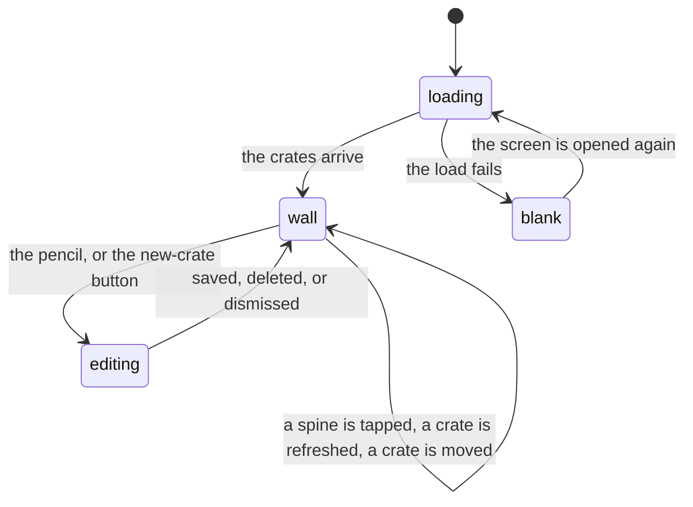

# The crate wall

## Summary

The crate wall is Crate's home screen and the reason the product exists. It is a vertical stack of shelves, one per [crate](../glossary.md), each holding a few [spines](../glossary.md) drawn edge-on as though standing in a physical crate. Every shelf is the result of running that crate's rules the moment the screen loaded, so the wall is a fresh answer to "what should I listen to" rather than a saved arrangement.

What the user can do here is narrow and all of it is immediate: tap a spine to open it, star a record to make it a favorite, refresh one crate to re-roll it, move a crate up or down, edit a crate, add a crate, and reach the listening log or sign out. There is no dirty state and no save button anywhere on the wall — every action either writes at once or writes nothing.

This document owns the wall's own states: what loads on arrival, what each control on a crate's header does, and what the wall looks like when it has nothing to show. It hands off at three points: the moment a spine is tapped goes to [picking a record](picking-a-record.md), the editor modal goes to [the crate editor](the-crate-editor.md), and everything about crates Claude fills goes to [AI crates](ai-crates.md).

## The simple case

The user opens Crate. A neon-green CRATES sits at the top of a dark screen. Below it, thirteen shelves' worth of grey pulsing blocks. A second or two later they fill in: FAVORITES with two broad spines showing sleeve art and titles, DISCOVER with two more, then SURPRISE ME still loading, then nine shelves named for a time of day or an activity — MORNING, GYM / WORKOUT, DEEP WORK — and FROM FRIENDS at the bottom.

They scroll, see something on the DEEP WORK shelf they had forgotten owning, and tap it. The spine lifts out of the row and a panel opens under the shelf with the tracks, the play button, and how long ago they last heard it. They press PLAY ON SPOTIFY and the album starts.

They tap the spine again to close the panel, tap the circular refresh arrow on the FAVORITES shelf, and get two different favorites. Nothing else on the screen changes.

## The interaction, event by event

### Arrive

The wall is what `/` shows, and also what `/callback` shows, so it is where a Spotify sign-in lands. Arriving starts three fetches at once — the wall's own contents, the whole library, and the whole listening log — and the wall is the only screen in the product that loads more than its own data. See [navigation and loading](../foundations/navigation-and-loading.md).

While the wall's fetch is in flight, **every crate shows the same skeleton**: three stacked pulsing bars in the shape of a shelf — the lip, the body, the base. The rows are already named and already counted, because the names come from the same answer, so in practice the whole wall appears at once rather than filling in row by row.

Two things happen on arrival that the user is not told about. On a brand-new account, the server **creates thirteen crate definitions and saves them**, so a first visit writes to the account. And any crate whose strategy has to ask Claude is deliberately left out of this first answer and fetched afterwards, one request per crate and all of them at once — those rows keep their skeleton for several more seconds. [AI crates](ai-crates.md) owns that.

The header is sticky and holds three things: the title CRATES in neon green with a glow, a round orange button with a crate icon that opens the editor on a new crate, and a round profile button. The profile button opens a small menu with exactly two items — View History and Sign Out — and tapping anywhere else closes it. That menu is the only way to reach the [listening log](../history/the-listening-log.md) from anywhere in the product.

Nothing is focused, nothing is prefilled, and no scroll position is restored: arriving from a scrolled library keeps the browser's scroll offset, which on a short wall can look like an empty screen.

### Leave untouched

Leaving the wall writes nothing and loses nothing that the [session cache](../foundations/navigation-and-loading.md) does not already hold. Coming back is instant and shows **the same records as before** — the crates are not re-run, because the wall was already loaded.

The one exception is the first visit on a new account, where arriving and leaving without touching anything has permanently written thirteen crate definitions.

### First change

There is no dirty state to enter. Every control on the wall is its own complete act:

| Control | Where | What it does |
| --- | --- | --- |
| A spine | on a shelf | Selects it and opens the [album detail panel](../library/the-album-detail-panel.md) under that shelf. Tapping it again closes the panel. See [picking a record](picking-a-record.md). |
| ★ | top-right of a spine, on hover only | Makes that record a favorite and re-runs the crate. |
| ▲ ▼ | in a shelf's header | Swaps the crate with the one above or below and saves immediately. |
| ✎ | in a shelf's header | Opens [the crate editor](the-crate-editor.md) on that crate. |
| ↻ | in a shelf's header | Re-runs that one crate. |
| The crate button | in the screen header | Opens the editor on a new, empty crate. |
| The profile button | in the screen header | Opens the two-item menu. |

The ★ deserves its own note, because it is easy to hit and hard to undo. It appears only while the pointer is resting on a spine, which means **it cannot be reached on a touch device at all**. Tapping it files the record as a favorite, fills the star in immediately, and then re-runs the whole crate — so the record the user just starred usually disappears from the shelf, along with everything else that was on it. The star is not shown for crates Claude fills with albums the user does not own, since there is nothing to promote.

### While working

**Refreshing a crate** asks the server to run that one crate again and replaces the shelf's contents. The arrow rotates for six-tenths of a second and then stops, whether or not the request has finished — so on a slow connection the animation ends long before the shelf changes, and there is no other indication that anything is happening. The button is disabled while its crate is loading, including for the whole of the wall's first load.

**Moving a crate** swaps it with its neighbour, renumbers every crate's position, and writes the whole set immediately. There is no drag-and-drop; moving a crate from the bottom of thirteen to the top is twelve taps and twelve writes. The ▲ on the first crate and the ▼ on the last are visible but dimmed to a quarter opacity. Moving a crate does **not** re-run anything: the shelves re-sort with the records they already had.

**Saving a crate** in the editor writes every definition, replaces them from the server's answer, then re-runs that one crate; the modal stays open, with its button reading SAVING…, until both have finished. **Deleting a crate** writes the remaining definitions and the shelf disappears at once.

Nothing else changes while the user is on the wall. Records filed on the [add screen](../add/search-and-add.md), records removed on the [library screen](../library/the-library-shelf.md), and picks made in another tab are all invisible here until the page is reloaded.

### Commit

Every action on the wall is its own commit and none of them can be undone. Three of them — moving, saving, and deleting a crate — write **all** of the crate definitions, because the definitions are stored as a single setting; see [the data model](../foundations/data-model.md). Starring a record writes that record's list. Tapping a spine's play button writes a [pick](../glossary.md).

Nothing on the wall shows a success message. The shelf changing, the star filling in, or the row vanishing is the confirmation.

## Modifiers

| Modifier | Set on arrival | Changed while working |
| --- | --- | --- |
| Spotify account state | No effect on the wall itself: every crate loads and every shelf draws for an email-only account. What differs is what happens after a spine is tapped — see [playback](../foundations/playback.md). Crates Claude fills work regardless, because the server asks Spotify with its own credentials. | Cannot change without signing in again. |
| Playback state | Nothing playing means the wall's last shelf clears the bottom navigation with room to spare. Something playing raises the [player bar](../player/the-player-bar.md) over it and every screen's bottom padding grows. | Starting playback while scrolled near the bottom shifts the page under the user's finger. Nothing on a shelf indicates which record is playing. |
| Library state | Decides everything a shelf can show. An empty library gives thirteen shelves all reading "crate empty — add some records". A library with no favorites empties the FAVORITES shelf and makes SURPRISE ME fall back to a random draw. A library whose records have no genres empties all nine of the activity shelves silently. | Filing or removing records elsewhere in the app changes nothing here until a refresh or a reload. |
| Viewport | Decides how a shelf looks, more than anything else does. Spines divide the row's width between them, so **a crate's count decides its spines' shape**: a two-record crate gets broad spines with the sleeve, title, and artist across the bottom, and a seven-record crate on a phone gets narrow spines with the title turned on its side. A row at least 600 px wide draws taller spines. | Resizing re-measures the row live and can flip a shelf between the two looks mid-session. |
| Crate and config settings | The definitions are the wall: their number is the number of shelves, their order is the order, their names are the labels, and their counts decide both how many records and how wide each spine is. A wall with several slow crates arrives in two waves. | Saving a definition re-runs that crate immediately. Changing one crate never affects another. |

## Cancel and interrupt

| Event | Before the first change | While working |
| --- | --- | --- |
| Escape, Cancel, Close, or a tap on the backdrop | Nothing to cancel. The wall itself has no dismissible surface; the profile menu closes on a tap anywhere outside it. | An open detail panel closes by tapping its spine again or its own close control; it holds nothing that could be lost. The editor modal owns its own dismiss — see [the crate editor](the-crate-editor.md). A refresh, a move, a save, or a delete cannot be cancelled once tapped. |
| Navigating inside the app: the bottom nav, another route, or a second panel or modal | Free. LIBRARY is one tap; the listening log is two, through the profile menu; the add screen cannot be reached from here at all without going through the library first. | Leaving mid-refresh still applies the result — the shelf is updated in the cache and the change is there on return. The open panel and the open menu are not: both are gone, and the wall comes back with nothing selected. |
| Browser back or forward | Works normally. Back from the wall at the start of a session leaves Crate. | The wall's contents survive, because back and forward do not reload. The selection does not: coming back finds every panel closed. |
| Reload, or the tab is closed | Nothing to lose. | Every crate is run again from scratch, so **the whole wall is different**. This is the ordinary way to get a fresh set of picks and it is indistinguishable from having refreshed all thirteen shelves by hand. Anything in flight is abandoned. |
| Network lost, or the request fails or times out | The wall's load fails and the screen shows **nothing at all** — the header above blank space. Not an empty state, not an error, no rows: the crate definitions arrive with the same fetch that failed, so there is nothing to draw. Going to the library and back tries again. | A single crate's refresh failing leaves that shelf showing exactly what it showed before, with no message; the user cannot tell it from a re-roll that happened to draw the same records. A failed save leaves the modal open with the change unwritten and unmarked. |
| The session expires, or Spotify rejects the token | Same as a failed load: a blank wall. | Every refresh and every save fails silently. The wall keeps showing whatever it already had, so it looks entirely healthy while nothing works. |
| The same account in a second tab, or the library changed elsewhere | No effect. | Two walls drift apart immediately and neither notices. Worse: both tabs write the whole set of definitions, so **a crate added in one tab is destroyed by any crate change in the other**, which is still holding the older set. Nothing warns. See [stale data and second tabs](../cross-cutting/stale-data-and-second-tabs.md). |
| The album in hand is deleted, or Spotify no longer returns it | No effect. | A record removed from its own detail panel here **stays on the shelf**: the deletion happens, the panel closes, and the spine remains, tappable, opening a panel for a record that no longer exists. Refreshing that crate clears it. |
| Playback moves to another device, or the tab is backgrounded | No effect. | No effect on the wall. The player bar disappears if Crate's own player loses the audio, which changes the page's bottom padding and nothing else. |

## Interactions with other systems

**Authentication and account state.** The wall is the default screen for every signed-in user and is fully usable without a Spotify link. It is also where a new account is set up: the first load seeds thirteen crate definitions and saves them. See [account and session](../foundations/account-and-session.md).

**The session cache and freshness.** The wall fills the cache for the whole app — the crates, the definitions, the library, the log, and the per-record play counts all arrive here — and is then never re-derived on its own. Everything on the wall can therefore be arbitrarily old, and the number beside a crate's name is as old as the shelf under it. See [navigation and loading](../foundations/navigation-and-loading.md).

**Pick history.** The wall is the only place in the product that writes picks, and it writes one when a record's play button is pressed rather than when the spine is tapped. It also *reads* picks twice over: [the selection engine](../foundations/selection-engine.md) uses them to decide what each shelf shows, and the detail panel shows the count and the date. See [picking a record](picking-a-record.md).

**Playback.** Tapping a spine does not play anything; the panel's play button does, and it runs the same four-route [chain](../foundations/playback.md) as everywhere else. Nothing on a shelf marks the record that is playing — only the open panel's track list does.

**Configuration and crate definitions.** The wall is the primary editor of the crate definitions and writes all of them on every change: reorder, save, and delete. It is not the only writer — the library's SAVE AS CRATE button writes them too, from a screen that may not have loaded them, which is how an account loses every crate at once. See [saving a crate from the library](../library/saving-a-crate-from-the-library.md).

**Offline and failed requests.** The wall has the product's worst failure surface, because a failed load produces a screen with no content and no message rather than an empty state, and because a failed refresh is invisible by construction — the shelf is *supposed* to change unpredictably. See [failed requests and offline](../cross-cutting/failed-requests-and-offline.md).

**Multiple tabs and the Spotify app.** Two tabs on the wall show two different walls, which is correct and expected. What is not is that either tab writing a definition overwrites the other's, silently and completely.

**Toasts, badges, and empty states.** No toasts anywhere on the wall. The badges are the ◈ on a recommendation's spine and a cyan bar along the bottom of a [suggestion](../glossary.md). The number beside a crate's name is how many records it drew. There is exactly one empty state — a small drawn vinyl disc and the words "crate empty — add some records" — and it covers a crate whose rules matched nothing, a crate whose whole pool is in cooldown, an empty library, and a crate whose refresh failed. **There is no empty state for the wall itself**: an account with no crate definitions gets a header and blank space.

**Viewport and accessibility.** Spines are `div`s with a click handler, not buttons: they cannot be reached or activated by keyboard, and a screen reader is given only the browser tooltip "title — artist". The ★ requires a hover, so it does not exist on touch devices and cannot be reached by keyboard either. The shelf-header buttons are real buttons but their labels are tooltips rather than text. Nothing announces that a shelf's contents changed after a refresh, and the skeleton has no live region, so a screen reader gets no signal that the wall has loaded.

## Edge cases

- **Two shelves showing the same record open two panels at once.** Which record is selected is one value for the whole screen rather than one per shelf, so a record that appears in two crates opens beneath both of them simultaneously.
- **Two AI shelves collide on every record.** Suggestions are numbered locally per shelf, starting from the same numbers on each, so tapping the first spine of one AI shelf also opens a panel under the first spine of every other AI shelf — for a different album. This is a straightforward bug.
- **Starring a record re-rolls its whole shelf,** so the usual result of starring something is that it and everything beside it vanishes. Nothing explains the connection.
- **The star stays filled even when the request failed.** It is set from the tap, not from the answer, and nothing resets it.
- **The star appears on records that are already favorites,** including every record on the FAVORITES shelf, where it does nothing except re-roll the shelf.
- **A one-record crate draws one spine as wide as the screen,** because spines divide the row between them. It reads as a banner rather than a record.
- **The refresh animation is a fixed six-tenths of a second** and is unrelated to the request. On a slow connection it finishes and stops before anything changes.
- **A record removed from the wall's detail panel stays on the shelf** until that crate is refreshed or the page is reloaded.
- **Reordering thirteen crates is up to seventy-eight taps,** each one a full write of every definition.
- **A wall whose load failed has no refresh buttons to retry with,** because it has no rows. Going to the library and back is the retry.
- **The new-crate button places the crate at the end of the list it currently knows about.** On the wall that is always correct; from the library it is not — see [saving a crate from the library](../library/saving-a-crate-from-the-library.md).
- **A crate saved with no name becomes "Untitled Crate",** and only then can it be deleted: the editor offers DELETE CRATE only for a crate that has a name.
- **The From Friends shelf is [out of scope](../README.md#scope-decisions)** but is one of the thirteen seeded crates, so it is on every account's wall. Its shelf, its accept and dismiss actions, and its empty state are not described here.
- **There is no way to reach the add screen from the wall.** A new user whose crates are all empty is told "add some records" thirteen times, on a screen with no way to add records.

## Open questions and verification

- Whether the whole wall really appears at once rather than row by row has not been watched. It follows from the names and the contents arriving in the same answer, but the deferred rows definitely arrive later, so a first load has at least two visible stages.
- The two-panels-at-once and colliding-suggestion-ids behaviors are read from the code and are cheap to confirm by hand; both need a record in two crates, or two AI crates, respectively.
- Whether starring a record actually makes it disappear from the shelf depends on the re-roll, which is random. It will not happen every time, which makes it worse rather than better.
- How long the deferred crates take to fill in on a real account has not been measured. The server defers them because they would otherwise add around five seconds to the load.
- The blank-wall-on-failure state has not been observed. It is the most important verification item for this document, because it is what a user on a bad connection sees first.
- Whether a second tab really destroys the first tab's new crate has not been tested. It follows from the definitions being stored as one value and every writer writing all of them.
- Nothing has been checked about keyboard navigation. The claim that spines are unreachable by keyboard follows from their being plain elements with click handlers.

Verified against Crate commit `8301127`.
