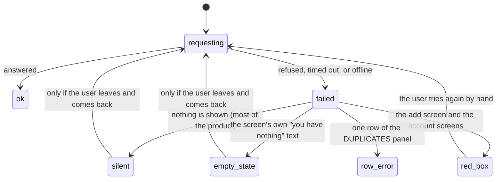

# Failed requests and offline

## Summary

Crate's default response to a failed request is to say nothing. There is no offline indicator, no retry button, no toast, no queue, and no service worker; nothing is cached for offline use, and nothing retries on its own or offers the user a way to ask again. What the user sees depends entirely on which screen they are on, and in most places it is a screen that looks like an ordinary, successful, empty result.

Across the whole product there are exactly **three** ways a failure reaches the user: a red box on the add screen and the two account screens, a per-row `delete failed — try again` in the DUPLICATES panel, and — everywhere else — nothing at all, with the reason written to the browser's developer console where no user will see it. Several screens go further and render a **cheerful empty state** on failure: the [listening log](../history/the-listening-log.md) tells a user whose log failed to load to start picking records.

This document is the inventory. Each feature document states what its own failures look like; this one owns the pattern, the complete list of messages, and the places where a failure is indistinguishable from success.

## The simple case

The user's wifi drops while they are on the crate wall. Nothing happens: the crates already on screen stay there, the sleeves already loaded stay loaded.

They tap ⟳ on a crate. The spines fade out for a moment and come back exactly as they were. Nothing is said. They tap a record; the panel opens with the sleeve and the title, and where the tracks should be there is nothing — no message, no spinner, just a gap. They tap PLAY ON SPOTIFY and a new browser tab opens onto an error page.

They go to the add screen and search for something. `SEARCH FAILED. TRY AGAIN.` in red — the first thing all afternoon that has told them anything is wrong.

## The interaction, event by event

Nothing in the product moves from `failed` back to `requesting` on its own.

### Arrive

Every screen's first load can fail, and the four load paths behave differently:

| What is loaded | Where | On failure |
| --- | --- | --- |
| The crate wall's picks, crate definitions, and pick counts | [the crate wall](../crates/the-crate-wall.md) | Logged to the console. The wall renders with no crates. |
| The two lists (the whole library) | [the library shelf](../library/the-library-shelf.md) | Logged to the console. The shelf renders as an empty library. |
| The pick history | [the listening log](../history/the-listening-log.md) | Silent, not even logged. The log renders its empty state: `START PICKING RECORDS TO BUILD YOUR LOG`. |
| The user's settings | everywhere | Silent, not even logged. The defaults are used, so a failure looks like an account that has never been configured. |

Three of the four are indistinguishable from a genuinely empty account. The fourth is worse than that, because the settings a screen falls back to are not the user's own: a settings load that quietly failed means the [selection engine](../foundations/selection-engine.md) is running on default weights and cooldowns without anyone knowing.

The one screen that reports load failures properly is the add screen. Its two import tabs put the failure in a red box where the list would be — and they show it **raw**, as the request layer produced it, so the user reads something like `API error 502: {"error":"Failed to fetch Spotify library","detail":"..."}`. It is honest and unreadable in equal measure.

> Technical note: the request layer turns any non-2xx answer into an error carrying the status code and the response body as text. Most screens discard that error; the two import tabs display it verbatim. Nothing anywhere translates a status code into a sentence, and nothing distinguishes "you are offline" from "the server said no".

### Leave untouched

A failure leaves no residue. Nothing is queued for later, nothing is marked as needing a retry, and nothing is stored. Leaving a screen after a failed load and coming back re-runs the load — which is the only retry mechanism in the product, and it exists by accident, because [the session cache](../foundations/navigation-and-loading.md) only remembers successes.

That accident works, as far as it goes. Each of the three cached loads marks itself loaded only when it succeeds, so a failure leaves it unmarked and the next screen that needs it asks again. Going from a failed library to the crate wall and back really does retry, and so does opening the log after the wall's own load of it failed. What does not happen is a retry **on the same screen**: nothing re-requests while the user stays put, and no screen offers a button to ask again. So the repair is a navigation the user has no reason to think of, or a page reload, and neither is suggested.

### First change

A write can fail, and this is where the silence is most expensive, because the screen has usually already changed to show the thing that did not happen:

| Action | Where | On failure |
| --- | --- | --- |
| The hover ★ on a spine | [the crate wall](../crates/the-crate-wall.md) | Logged. **The star stays filled.** The record was not promoted. This is the one write whose screen actively claims success. |
| ★ FAVORITE in the album panel | [the album detail panel](../library/the-album-detail-panel.md) | Logged. The button goes back to `★ FAVORITE`, as though it had never been pressed, and nothing is said. |
| Recording a pick | [picking a record](../crates/picking-a-record.md) | Logged. The album still plays. The pick is lost and the log will never show it. |
| Saving a crate from the crate editor | [the crate editor](../crates/the-crate-editor.md) | **Not even logged** — the failure is an unhandled rejection. The modal stays open with the edit still in it and the button back to SAVE. |
| SAVE AS CRATE from the library | [saving a crate from the library](../library/saving-a-crate-from-the-library.md) | Logged. The editor stays open with everything the user typed still in it, and the button comes back. |
| Filing a record from search | [search and add](../add/search-and-add.md) | Red: `Failed to add.` |
| Filing many records from an import tab | [the two import tabs](../add/importing-from-your-spotify-library.md) | Red: `Failed. Try again.` Nothing was written — the write is all-or-nothing. |
| Deleting duplicates | [duplicates and gaps](../library/duplicates-and-gaps.md) | Per row: `delete failed — try again`. The one place in Crate that reports a failed write next to the thing that failed. |
| Setting a new password | [resetting a password](../account/resetting-a-password.md) | Red, in the authentication service's own words. |
| Requesting a reset link | [resetting a password](../account/resetting-a-password.md) | **Green.** The answer is discarded, so a failure is reported as success. |

Ten writes. Five of them say nothing at all — the two promotes, the pick, and the two crate saves — and one reports success when it failed. The five silent ones are not equally bad. Only the hover ★ leaves the screen claiming the write happened; the panel's ★ FAVORITE and both crate saves leave the user's work visible and unwritten, which is the most recoverable failure behavior in the product and is entirely accidental, a consequence of the success handler sitting after the request in the same block rather than of any decision.

### While working

Nothing polls, nothing watches the connection, and nothing re-checks. A screen that loaded successfully before the network dropped keeps working for as long as it needs nothing new: the library can be sorted, grouped, filtered, and audited entirely offline, because all of that happens in the browser over data already in hand. So Crate offline is not a broken app — it is a read-only app that fails at the edges without saying so.

The edges are: opening a panel (the tracks are fetched), refreshing a crate, playing anything, and every write.

Requests are given no timeout of Crate's own, so a hanging request hangs for as long as the browser allows. A spinner in that state spins indefinitely with nothing to cancel it.

### Commit

There is nothing to commit. A failed write did not happen, and the only durable consequence of a failure is what the screen has already told the user: a filled star on a spine for a record that was not promoted, a played album with no pick behind it, a log that will never show that listen.

## Modifiers

| Modifier | Set on arrival | Changed while working |
| --- | --- | --- |
| Spotify account state | Decides which failures are even possible. An email-only account never reaches a Spotify request except through the album panel's details, which use Crate's own credentials. A linked account whose access was revoked from Spotify's side produces failures that look exactly like network failures — no message anywhere suggests reconnecting. See [Spotify dependence](spotify-dependence.md). | A token that has merely expired is refreshed on the server invisibly and costs nothing. A refresh that cannot succeed turns every Spotify-backed request into a silent failure. |
| Playback state | No effect on failures. | A network failure stops the music but leaves [the player bar](../player/the-player-bar.md) on screen with its counter still advancing, which is the most misleading single thing a failure produces. |
| Library state | Decides whether a silent failure is noticeable at all. On a full library, an empty crate wall is obviously wrong; on a new account it is correct. | No effect. |
| Viewport | No effect. Every message is the same at every width. | No effect. |
| Crate and config settings | A silent settings failure substitutes the defaults, so weights, cooldowns, and counts can all differ from what the user set with nothing to indicate it. | No effect. |

## Cancel and interrupt

| Event | Before the first change | While working |
| --- | --- | --- |
| Escape, Cancel, Close, or a tap on the backdrop | No failure has a dismiss control. The red boxes are cleared only by the next attempt, or by an action on the same screen that resets them. **Escape does nothing.** | A request in flight cannot be cancelled anywhere in the product. Closing the panel or modal that started it abandons the result; the request still completes and its write still lands. |
| Navigating inside the app: the bottom nav, another route, or a second panel or modal | Leaving a screen clears its messages. This is also the only way to retry a failed load. | Leaving mid-request abandons the outcome: a write that succeeds after the user left is invisible until a reload, and one that fails is never reported. |
| Browser back or forward | Same as navigating. | Same as navigating. |
| Reload, or the tab is closed | A reload is the only complete retry in the product, and nothing suggests it. | An in-flight write is abandoned by the browser and may or may not have landed; there is no way to tell from Crate. |
| Network lost, or the request fails or times out | This is the subject. There is no offline detection of any kind — no banner, no disabled buttons, no `navigator.onLine` check. | The same. Crate does not know it is offline and behaves as though every failure were a one-off. |
| The session expires, or Spotify rejects the token | An expired Supabase session is refreshed by the client library; a request made without one is refused by the server and surfaces as an ordinary failure. | A session that cannot be refreshed at all produces sign-out, which replaces the app with [the sign-in screen](../account/signing-in.md) — the one failure the product handles visibly, and it does so without explanation. |
| The same account in a second tab, or the library changed elsewhere | Unrelated. | A silent failure and a stale cache produce the same symptom — a screen showing something that is not true — and cannot be told apart. See [stale data and second tabs](stale-data-and-second-tabs.md). |
| The album in hand is deleted, or Spotify no longer returns it | A record deleted elsewhere makes a write against it fail, silently. | An album Spotify has withdrawn makes the panel's details request fail, and the panel shows no tracks, no genres, and no year, with no message. |
| Playback moves to another device, or the tab is backgrounded | No effect. | A backgrounded tab's requests complete normally, and the three-second timer on the add screen's green success line may be slowed, which only makes it linger. |

## Interactions with other systems

**Authentication and account state.** The only failure the product handles visibly is the loss of the session, and it handles it by replacing the whole app. Everything else is either a red box or nothing. Notably, the account re-sync that follows the session check is awaited with **no** error handling, so a failure at that exact moment leaves the app on its full-page spinner forever — the one failure that produces neither silence nor a message but a dead app.

**The session cache and freshness.** The cache is what makes a failed load permanent for the session: it only records successes, and nothing distinguishes a failed load from an empty one, so nothing retries. See [navigation and loading](../foundations/navigation-and-loading.md).

**Pick history.** A failed pick is lost with no trace. Because playback and picking are separate requests, a failure produces the common case of music playing with nothing recorded — the same outcome as playing from the library, the log, or the Spotify app, which never record anything by design.

**Playback.** Playback failures are the one place with a deliberate fallback chain rather than a message: the in-tab player, then Spotify's active device, then a new browser tab. Each step swallows its error and tries the next, and the last step cannot report anything because it has left. See [playback](../foundations/playback.md).

**Configuration and crate definitions.** A settings load that fails silently substitutes the defaults, and nothing is reported. A crate save that fails leaves the editor open with the work still in it, so the user at least still has the crate they were making — but the failure of the crate editor's save is not reported anywhere at all, not even to the console, and the only clue is that the modal did not close.

**Offline and failed requests.** This document.

**Multiple tabs and the Spotify app.** Two tabs writing at once is safe — the writes are upserts — but neither tab learns about the other's failures or successes.

**Toasts, badges, and empty states.** There is no toast system, so there is nowhere for a transient message to go, which is most of the reason for the silence. Empty states are doing double duty as failure states on three screens, and that is the single most misleading pattern in the product.

**Viewport and accessibility.** None of the red boxes is announced to a screen reader — they are plain elements with no live region — so a user who cannot see the box gets the same treatment as the rest of the product: nothing.

## Edge cases

- **Three screens show a friendly empty state when their load failed:** the listening log, the library shelf, and the crate wall. Two of them log the reason to the console; the log does not even do that.
- **A failed settings load silently substitutes the defaults,** so the selection engine can be running on numbers the user never chose.
- **Five writes fail with nothing said on screen:** the hover ★, the panel's ★ FAVORITE, a pick, and the two crate saves. Only the hover ★ leaves the screen claiming success; the other four leave it looking untouched.
- **One failure is not reported anywhere at all.** The crate editor's save has no error handling of any kind, so its failure does not even reach the console — it becomes an unhandled rejection.
- **The reset-link request reports success when it failed.** See [resetting a password](../account/resetting-a-password.md).
- **A failed re-sync after the session check hangs the app on its spinner forever.**
- **There is no offline detection.** No banner, no disabled controls, nothing.
- **Nothing is ever retried automatically, and no screen has a retry button.** Leaving a screen and coming back does retry the three cached loads, because each marks itself loaded only on success — but nothing says so, and a user staring at an empty library has no reason to think navigating away and back would fix it.
- **The server sends a retry-after hint on rate-limited Spotify requests and the client ignores it entirely.** See [Spotify dependence](spotify-dependence.md).
- **The import tabs show raw error text,** status code and JSON body included.
- **No request has a timeout,** so a hanging request spins forever with nothing to cancel.
- **A failed request during playback leaves the player bar's counter advancing** over silence.
- **The DUPLICATES panel is the only place a failed write is reported next to what failed,** and it is the only bulk action in the product.
- **Nothing is cached for offline use.** There is no service worker and no manifest, so Crate offline is whatever the tab already had in memory.
- **Every red box is cleared by the next action, not by the user,** so an error can be replaced by a fresh one that looks identical.

## Open questions and verification

- That the two promote surfaces behave differently on failure — the spine's hover ★ stays filled, the panel's ★ FAVORITE reverts — is read from the two components and has not been watched side by side. It is worth doing in one pass, because the difference is the difference between a lie and a shrug.
- Whether the crate editor's unhandled rejection produces anything visible in the browser — a console warning of its own, a devtools pause — has not been observed. From the product's side there is nothing.
- The full inventory above is read from the source and is believed complete: ten writes, four load paths, three visible failure mechanisms. It should be confirmed by walking the product with the network throttled to offline, which is the single most valuable verification pass in this repo.
- That a failed load is retried on the next visit is read from the guards — each screen's effect depends on the loaded flag, which is set only on success — and has not been watched. It is worth confirming, because it is the difference between a session-long empty screen and one that repairs itself.
- What the raw error text on the import tabs actually looks like on screen, and whether it overflows its box, has not been observed.
- Whether the browser's own request timeout ever fires in practice, and what the user sees when it does, is unknown.
- Whether a 429 from Spotify surfaces differently from a 502 anywhere the user can see has not been checked.
- Whether the player bar's counter really keeps advancing over a dropped connection has not been watched.
- Whether an in-flight write abandoned by a reload lands or not is a race that has not been tested.

Verified against Crate commit `8301127`.
