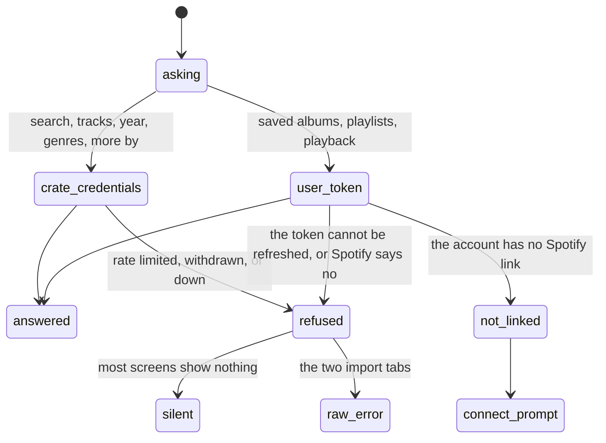

# Spotify dependence

## Summary

Crate stores almost nothing about an album: a title, an artist, a sleeve URL, a Spotify id, and three best-effort metadata fields. Everything else on screen — the tracks, the year, the genres, the artist's other albums, the search results, the sound itself — is fetched from Spotify while the user is looking at it. Without Spotify, Crate is a list of album titles.

But the dependence comes in **three separate degrees**, and the product never explains which one it is in:

| Degree | What it needs | What it gets |
| --- | --- | --- |
| Crate's own Spotify credentials | nothing from the user | search, album tracks, the year, the genres, the artist's other albums |
| A linked Spotify account | signing in with Spotify | importing saved albums and playlists, and handing playback to a device |
| Spotify Premium, on a desktop | the above, plus Premium | the in-tab player and [the player bar](../player/the-player-bar.md) |

The first degree is why an account created with an email address still has a fully working album panel. The second is why the two import tabs are unreachable for that account. The third is why playback silently opens a new browser tab for some users and plays in place for others. [Account and session](../foundations/account-and-session.md) owns the two account states and [playback](../foundations/playback.md) owns the fallback chain; this document owns the whole surface of what Spotify is asked for and what happens when it says no.

## The simple case

The user, signed in with an email address and no Spotify link, opens their library. Every spine is there. They tap one: the panel opens with the year, three genre badges, twelve tracks, and MORE BY the artist — all of it fetched from Spotify a moment ago using Crate's own credentials, none of it needing anything from the user.

They tap a track. Nothing plays in the tab; a new browser tab opens onto the album's page on Spotify's website. They go to the add screen and tap LIBRARY: a vinyl disc, CONNECT TO IMPORT YOUR LIBRARY, and a green button.

## The interaction, event by event

The two credential paths never mix, and nothing on screen distinguishes them.

### Arrive

Loading any screen in Crate asks Spotify nothing. Every screen's first load comes from Crate's own database: the crates, the library, the log, the settings. So the whole product opens, renders, and navigates without Spotify existing.

Spotify is asked for something only when:

- **The album panel opens.** Tracks, the year, the genres, and the artist's other albums, all with Crate's credentials. A failure leaves the panel with its sleeve and title and nothing else, silently. See [the album detail panel](../library/the-album-detail-panel.md).
- **A search is typed.** Crate's credentials. Singles are filtered out of the results before the user sees them, which is why searching for a well-known single returns nothing.
- **An import tab is opened.** The user's token, so it needs a linked account. Without one the tab is the connect prompt and nothing is requested.
- **A record is filed.** Crate's credentials, for the release date, the track count, and — on the single-add path only — the genres.
- **Something is played.** Either the in-tab player, or the user's token to reach an active device, or nothing at all if it ends up opening a browser tab.

> Technical note: the requests that use Crate's own credentials go out under a token the server fetches once and holds in memory. Because each serverless function is a fresh, short-lived process, that hold only helps while an instance stays warm, and a cold request fetches a new token first. It is the only in-memory cache left on the server.

### Leave untouched

Nothing about Spotify is written by simply looking. Reading an album panel fetches tracks and genres and stores none of them — the panel's genre badges are fetched every time it opens and are not the genres stored on the record.

The one thing that is stored comes at filing time, and it comes unevenly: the [single-add path](../add/search-and-add.md) asks Spotify for the artists' genres and stores them; the bulk paths do not ask, and nothing ever fills them in afterwards. See [the data model](../foundations/data-model.md).

### First change

The user's own Spotify link is created at sign-in and never touched again from inside Crate. There is no connect button that links an existing account, no disconnect, no reconnect, and no display of the link's state — the only signal is whether an import tab shows a list or a prompt.

CONNECT SPOTIFY on either import tab is not a link action. It is a fresh sign-in through Spotify, which produces a **different account** for anyone who signed up with an email address, and returns them to the crate wall rather than the tab they were on.

### While working

Crate never batches, throttles, or paces its Spotify requests except where Spotify's own limits force it: albums are fetched twenty at a time when filing in bulk, playlist tracks a hundred at a time, saved albums and playlists fifty at a time, and album tracks up to fifty — so **an album with more than fifty tracks shows only its first fifty**, silently.

Rate limiting is handled on one of the two paths and not the other. On the user's token, a rate-limited answer becomes a message naming the wait — `Spotify rate limited. Try again in 30 seconds.` — and the server passes the number along; the browser then **ignores it entirely** and shows the message as an ordinary failure with no countdown and no retry. On Crate's own credentials there is no rate-limit handling at all: the answer becomes a generic failure carrying the status code, which is what a user would see as `Spotify search failed: 429`.

### Commit

Nothing Crate writes depends on Spotify succeeding, except the three metadata fields, which are best-effort: a filed record whose metadata request failed is filed anyway, with no year, no track count, and no genres, permanently. Nothing retries and nothing backfills.

Playback is not a write at all. It is handed to Spotify and forgotten, which is why nothing about listening is ever recorded — see [the listening log](../history/the-listening-log.md).

## Modifiers

| Modifier | Set on arrival | Changed while working |
| --- | --- | --- |
| Spotify account state | This is the subject. An email-only account has a complete library, a complete album panel, and working search, and cannot import or play. A linked account has everything except the in-tab player. A linked Premium account on a desktop has all three degrees. Nothing states which degree the user is in. | Cannot change without signing in again, and signing in through Spotify from an email account creates a second account rather than linking the first. |
| Playback state | Which of the three playback outcomes happens is decided by the degree, and the only visible difference is whether [the player bar](../player/the-player-bar.md) appears. | Playback handed to another device is outside Crate's sight entirely; Crate cannot list devices, choose one, or take playback back. |
| Library state | Decides how much Spotify is asked for. A large library asks for nothing extra — crate contents are computed from Crate's own records — so browsing is cheap. Opening panels is what costs requests, one album at a time. | No effect. |
| Viewport | The in-tab player is desktop-only, decided from the browser's user-agent string, so the third degree is unavailable on a phone regardless of the account. | No effect. |
| Crate and config settings | Genre rules depend entirely on stored genres, which only the single-add path writes — so a library built by importing has no genres and every genre rule matches nothing, including the nine seeded context crates. AI crates go to Claude, not Spotify, and are a separate dependence. | No effect. |

## Cancel and interrupt

| Event | Before the first change | While working |
| --- | --- | --- |
| Escape, Cancel, Close, or a tap on the backdrop | Nothing Spotify-related can be cancelled. **Escape does nothing** anywhere in the product. | Closing the album panel abandons its in-flight requests' results but not the requests. A play already handed to Spotify cannot be recalled from Crate. |
| Navigating inside the app: the bottom nav, another route, or a second panel or modal | Free; no Spotify request is needed to move between screens. | Navigating away from a panel discards what its requests would have shown. Playback continues, because it belongs to Spotify now. |
| Browser back or forward | No effect. | Leaving Crate entirely kills the in-tab player and stops the music; a play handed to another device keeps going. |
| Reload, or the tab is closed | No effect. | A reload stops in-tab playback, because the tab was the device, and re-fetches every panel's details from scratch — nothing about Spotify is cached in the browser. |
| Network lost, or the request fails or times out | Every screen still loads from Crate's own database, so the product opens offline. | Panels lose their tracks and genres silently; search and the import tabs report a failure; playback falls through to opening a browser tab that also fails. See [failed requests and offline](failed-requests-and-offline.md). |
| The session expires, or Spotify rejects the token | A rejected user token is refreshed on the server automatically, once, and the request retried, so an expired token normally costs nothing. Crate's own credentials are refreshed the same way. | A link the user revoked from Spotify's side **cannot** be refreshed, and produces the same failures as a network problem. Nothing anywhere suggests reconnecting, and the connect prompt is only shown for an account with no link at all — not for one whose link stopped working. |
| The same account in a second tab, or the library changed elsewhere | Two Crate tabs on a desktop register two in-tab devices with the same name. | Only the tab that was played to has a player bar; the other shows nothing. Playing from the second moves Spotify's playback and freezes the first tab's bar mid-track. See [stale data and second tabs](stale-data-and-second-tabs.md). |
| The album in hand is deleted, or Spotify no longer returns it | An album Spotify has withdrawn is still a record in Crate and still appears on the shelves and in crates, with its stored sleeve URL — which may itself have stopped resolving, leaving a blank spine. | Its panel opens with no tracks, no year, and no genres, and says nothing. Playing it opens a Spotify page that reports the album is unavailable. |
| Playback moves to another device, or the tab is backgrounded | Not applicable. | Crate notices only in the sense that the in-tab player reports no state and the bar disappears. There is no device list and no way to bring playback back. |

## Interactions with other systems

**Authentication and account state.** The link is created once, at sign-in, and Crate holds the refresh token from then on. It cannot be created, repaired, or removed from inside the app. [Account and session](../foundations/account-and-session.md) owns the details, including that the stored expiry is assumed rather than read from Spotify's answer.

**The session cache and freshness.** Nothing fetched from Spotify is cached in the browser, so panels re-fetch on every open. That is why a stale Crate can still show a correct track list.

**Pick history.** Entirely Crate's own, and never informed by Spotify. Nothing Spotify does — a track finishing, an album skipped, playback moving — is recorded.

**Playback.** [Playback](../foundations/playback.md) owns the three-step fallback. The step worth naming here is the middle one: reaching the user's active device, which fails with `No active Spotify device found. Open Spotify on any device first.` — a genuinely useful message that **no user ever sees**, because the fallback discards it and opens a browser tab instead.

**Configuration and crate definitions.** Genre rules are the one part of the crate engine that depends on Spotify data, and the dependence is broken for anything imported in bulk.

**Offline and failed requests.** Every Spotify failure follows the product's general pattern: silence in most places, raw error text on the import tabs, and no retry. The one Spotify-specific detail is that the rate-limit hint the server computes is discarded by the browser.

**Multiple tabs and the Spotify app.** The Spotify app is the other half of the product for anyone without the in-tab player, and Crate has no window onto it: no device list, no now-playing, no queue.

**Toasts, badges, and empty states.** The connect prompt is the only place in Crate that names the Spotify dependence, and its READ-ONLY ACCESS line is inaccurate — the permissions requested at sign-in include modifying playback and streaming. Premium is named nowhere at all.

**Viewport and accessibility.** The in-tab player's desktop-only rule is decided from the user-agent string rather than from anything about the device's capabilities, so a desktop browser reporting itself as a phone loses the player and a tablet's treatment depends on how it identifies itself.

## Edge cases

- **Premium is required for the in-tab player and named nowhere in the product.** A free account's player fails, the fallback opens a browser tab, and nothing explains it.
- **The connect prompt's READ-ONLY ACCESS line is inaccurate.** The permissions requested include controlling playback and streaming.
- **CONNECT SPOTIFY does not link an existing account.** For an email account it signs the user into a different account, and it returns to the crate wall rather than the tab they were on.
- **A revoked Spotify link is indistinguishable from a network failure,** and nothing offers to reconnect.
- **The useful "open Spotify on any device first" message is never shown,** because the fallback chain swallows it.
- **An album with more than fifty tracks shows only its first fifty,** silently. See [the album detail panel](../library/the-album-detail-panel.md#edge-cases).
- **Singles are filtered out of search results,** so searching for a single by name returns nothing with no explanation.
- **Genres are stored only by the single-add path.** Bulk imports have none, nothing backfills them, and every genre rule — including the nine seeded context crates — therefore matches nothing in a bulk-built library.
- **The panel's genre badges are fetched live and are not the genres the crate engine filters on,** so a panel can show three genres for a record the engine considers genre-less.
- **The rate-limit hint is computed and discarded.** The server works out the wait and passes it along; the browser ignores it and shows a plain failure.
- **Rate limiting is only handled on one of the two credential paths.** On Crate's own credentials a 429 becomes a generic failure with a status code in it.
- **An album withdrawn from Spotify stays in the library forever,** with a panel that shows nothing and a play button that leads to an unavailable page.
- **A sleeve URL that stops resolving leaves a blank spine,** because the URL is stored rather than the image.
- **Nothing about listening comes back from Spotify.** Crate hands playback over and never asks what happened.
- **The whole product opens and navigates without Spotify,** which is a real strength and is nowhere reflected in what the product tells the user.

## Open questions and verification

- Whether a free (non-Premium) account really fails at the player rather than at the play request has not been observed, and it decides what a large share of users experience.
- Whether a revoked link produces a distinguishable failure anywhere has not been tested; the expectation is that it does not.
- The fifty-track ceiling on the panel's track list is read from the request and has not been checked against a long album — a box set would show it plainly.
- Whether the server's rate-limit message ever reaches the screen on the import tabs, given that they display the raw error text, is worth checking; it may be the one place the wait is visible.
- Whether Crate's own credentials are ever rate-limited in practice, and what a user sees when they are, is unknown. It would affect every user of the deployment at once, since the credentials are shared.
- How often the server's in-memory credentials token actually helps, given that serverless instances are short-lived, has not been measured.
- Whether a withdrawn album's stored sleeve URL keeps resolving after the album is gone from Spotify has not been checked.
- Whether the user-agent test for the in-tab player treats an iPad in desktop mode as a desktop, and whether the player then works there, is unverified.

Verified against Crate commit `8301127`.
