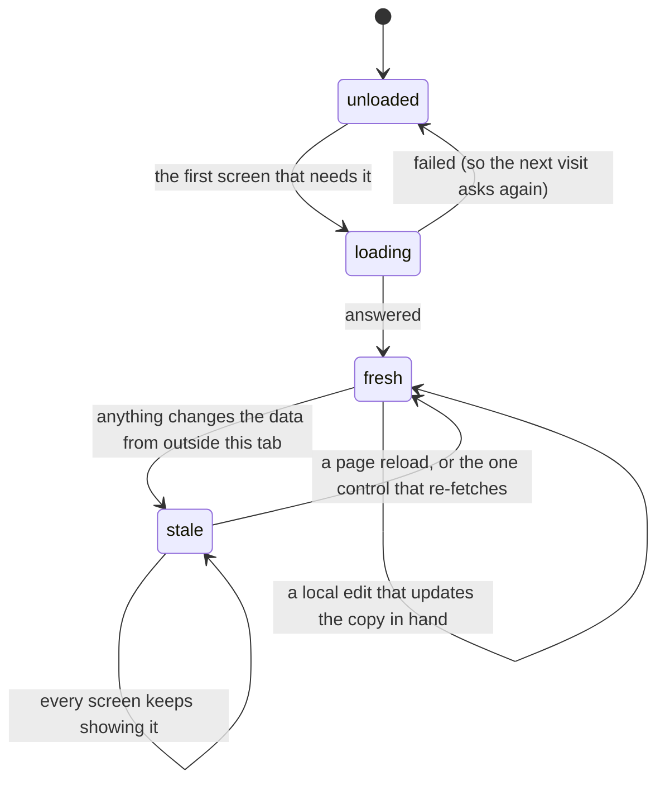

# Stale data and second tabs

## Summary

Crate loads its data once per browser tab and then stops asking. The crate wall's picks, the whole library, the pick history, and the settings are each fetched on the first screen that needs them and held in memory for the rest of the session — no polling, no revalidation, no subscription to the database, and no timestamp anywhere. [Navigation and loading](../foundations/navigation-and-loading.md) owns the mechanism; this document owns what it costs.

What it costs is that Crate is frequently, quietly, showing something that is no longer true. Not because of a bug in the cache, but because there are so many ways to change the data from outside what the cache is watching: the add screen writes records and never tells it, a second tab writes to the same account, and the library screen holds a copy of the crate definitions that is not merely stale but **empty**, which is how the product's most destructive bug happens.

Three symptoms are worth stating up front. Nothing imported on the add screen appears anywhere else in the app until the page is reloaded. The listening log is always missing the picks made since the session began, including the one the user just made. And a crate saved from the library after a direct visit to `/library` **deletes every other crate**, because the screen writes the whole set of definitions from a copy it never loaded.

## The simple case

The user opens Crate on their laptop. The crate wall loads: thirteen crates, the whole library, and the log, all fetched once.

They go to the add screen, search for an album, and file it into favorites. A green ✓. They go back to the crate wall — the album is not in any crate. They go to the library — it is not on the shelves. They open DUPLICATES — it is not counted. Nothing is wrong with the write; the record is in the database. Nothing in the tab has been told.

They reload the page. It is everywhere it should be.

## The interaction, event by event

Only the crate wall's per-crate ⟳ moves anything from `stale` back to `fresh` without a reload, and it moves one crate.

### Arrive

Four things are cached, each loaded once, each by whichever screen needs it first:

| What | Loaded by | Held until |
| --- | --- | --- |
| The crate wall's picks, the crate definitions, and the per-record pick counts | the crate wall only | the page is reloaded |
| The two lists — the whole library | the crate wall and the library screen | the page is reloaded |
| The pick history | the crate wall and the listening log | the page is reloaded |
| The settings | wherever they are first needed | the page is reloaded |

The consequence of the first row is the important one. Because **only the crate wall** loads the crate definitions and the pick counts, a direct visit to any other address leaves both empty for the rest of the session:

- On `/library`, the PLAYS and RECENT sorts do nothing, the panel's PLAYS and LAST PLAYED read `—`, and the GAPS audit reports **the entire library as uncovered**, because it is comparing the library against no crates at all.
- On `/history`, the panel's PLAYS and LAST PLAYED read `—` for an album the log itself lists four times on screen.
- On `/library`, SAVE AS CRATE writes `[the definitions in hand, plus the new one]` — and the definitions in hand are none. See [saving a crate from the library](../library/saving-a-crate-from-the-library.md).

A user who reaches the app by tapping a bookmark, following a link, or reloading while on the library is in that state and has no way to know it. Visiting the crate wall once repairs all of it.

> Technical note: nothing distinguishes "not loaded" from "loaded and found to be empty". Each of the four holds a loaded flag that is set only on success, which is what makes a failed load retry on the next visit — but the value itself starts as an empty list and stays an empty list until a load succeeds, so a screen reading it cannot tell whether it is looking at an empty account or at data that was never fetched.

### Leave untouched

Navigating between screens leaves the cache exactly as it is; that is its purpose, and it makes the product feel instant. Nothing expires, so a tab left open overnight shows yesterday's library the next morning.

Signing out does not clear it. It does not need to — the whole signed-in app is unmounted — but it means the cache's lifetime is really the page's lifetime, not the session's.

### First change

Local edits are handled in two different ways, and the difference is visible.

**Some writes update the copy in hand**, so the screen agrees with the database immediately:

- Removing a record from the album panel drops it from the lists in memory, so the spine disappears from the library and every crate on the wall.
- Promoting a record from ◈ to ★ moves it between the two lists in memory.
- Saving or deleting a crate from the crate wall's editor replaces the definitions in memory with what the server returned.
- The crate wall's ⟳ replaces one crate's contents with a fresh draw.

**Others do not**, and the screen then disagrees with the database until a reload:

- Everything on the add screen. All three tabs — search, the Spotify library, playlists — write records and touch nothing in the cache. See [search and add](../add/search-and-add.md).
- Recording a pick. The log in memory is never appended to, so the [listening log](../history/the-listening-log.md) never shows a pick made in this session.
- Deleting records from the DUPLICATES panel updates the lists but not the pick counts, so a deleted record's plays are still counted in the totals.
- Saving a crate from the library. The definitions in memory are replaced, but the new crate's **contents** are not fetched, so it arrives on the wall empty until it is refreshed.

Nothing marks the difference. Two writes that look identical to the user — filing a record from the add screen, filing one from the panel's MORE BY list — land in different places as far as the rest of the app is concerned.

### While working

Nothing watches anything. There is no polling, no websocket, no database subscription, no revalidation on window focus, and no check when a screen is revisited. A second tab, the Spotify app, and another device are all invisible.

The only refresh controls in the product are the per-crate ⟳ on the crate wall and, indirectly, whatever the crate editor's save triggers. There is no global refresh, and no screen has a "reload" affordance of its own.

### Commit

Every write goes to the database immediately and correctly. Staleness is never a data problem — the database is always right — it is a display problem, and the display is repaired only by a page reload.

Two writes make staleness dangerous rather than merely confusing, because they write a **whole** value derived from a stale copy:

1. **SAVE AS CRATE from the library.** The crate definitions are one setting, so saving one crate rewrites all of them. From a direct `/library` visit the copy in hand is empty, and the save replaces the user's entire wall with a single crate. There is no undo and no confirmation, and the failure is silent if the write itself fails.
2. **A stale tab's crate editor.** A tab that loaded the definitions before another tab added a crate will, on its next save, write its own older set and drop the crate the other tab added.

Both are the same shape: one setting holding a list, written whole from whatever the tab remembers.

## Modifiers

| Modifier | Set on arrival | Changed while working |
| --- | --- | --- |
| Spotify account state | Not cached and not stale — it comes from the session, which the authentication library keeps current. A Spotify link revoked from Spotify's side is the one piece of account state that can go stale, and nothing detects it. See [Spotify dependence](spotify-dependence.md). | Sign-out is global across every tab and device, so it is the one change that propagates — though a second tab only discovers it on its next request or reload. |
| Playback state | Not cached. [The player bar](../player/the-player-bar.md) mirrors Spotify's own player live, so it is the only surface in the product that is never stale. | It is also the only surface that reacts to another device: playback handed to a phone makes the bar vanish. |
| Library state | This is the thing most often stale. A library imported into in one place and read in another disagrees for the rest of the session. | Local removals and promotions update the copy in hand; imports do not. |
| Viewport | No effect. | No effect. |
| Crate and config settings | Loaded only by the crate wall, so on every other screen they may be not stale but absent — and absent is what makes SAVE AS CRATE destructive. A silently failed settings load substitutes the defaults, which is a third state again. | Saving from the crate wall's editor updates the copy in hand; saving from the library replaces it with what the server returned, which is the whole point of the damage. |

## Cancel and interrupt

| Event | Before the first change | While working |
| --- | --- | --- |
| Escape, Cancel, Close, or a tap on the backdrop | Nothing to cancel; staleness has no control surface. **Escape does nothing.** | Closing a panel or modal does not re-fetch anything. |
| Navigating inside the app: the bottom nav, another route, or a second panel or modal | This is the case the cache exists for: every screen after the first is instant, and every screen after the first may be stale. | A navigation never re-fetches what is already held. It does re-attempt anything whose load previously failed. |
| Browser back or forward | Within Crate, the same as navigating — the cache spans the whole tab. | The same. |
| Reload, or the tab is closed | A reload is the only complete repair, and nothing suggests it. | A reload discards every local edit that was not written — of which there are none, since every write is immediate — and re-fetches everything the first screen needs. |
| Network lost, or the request fails or times out | A failed load leaves its flag unset, so the next screen that needs it asks again. See [failed requests and offline](failed-requests-and-offline.md). | A silent failure and a stale cache produce the same symptom — a screen showing something untrue — and cannot be told apart from the outside. |
| The session expires, or Spotify rejects the token | Session state is not cached and stays current. | Sign-out replaces the app, taking the cache with it. |
| The same account in a second tab, or the library changed elsewhere | This is the subject. Nothing about a second tab is detected, ever. | Two tabs diverge from the moment either writes anything. Both are correct about the database at the moment they loaded and neither is corrected. The dangerous case is the two whole-value writes above. |
| The album in hand is deleted, or Spotify no longer returns it | A record deleted in another tab is still on the shelves here, still opens a panel, and still offers REMOVE and ★ FAVORITE — which then fail silently. | The same. A pick recorded against a deleted record fails silently, and the album plays anyway. |
| Playback moves to another device, or the tab is backgrounded | Not applicable. | A backgrounded tab does not refresh on return to the foreground. A tab left open for a day is a day stale. |

## Interactions with other systems

**Authentication and account state.** The one thing that is not cached. The authentication library refreshes the session itself and announces sign-in, token refresh, and sign-out, so the account is the only piece of state in the product with a live subscription behind it.

**The session cache and freshness.** [Navigation and loading](../foundations/navigation-and-loading.md) owns what is cached and which screen loads it. The point worth repeating: the crate definitions and the pick counts are loaded **only** by the crate wall, which is why so many oddities on the library and log screens depend on how the user arrived.

**Pick history.** The most visibly stale surface, because a user usually reaches the log immediately after picking something and the pick is not there.

**Playback.** Never stale — the player bar mirrors Spotify's own player — and completely disconnected from Crate's data, so it happily plays a record that no longer exists.

**Configuration and crate definitions.** One setting holds all the crate definitions, so every save rewrites all of them from whatever the tab remembers. This is the single design decision that turns ordinary staleness into data loss.

**Offline and failed requests.** A failed load and a stale cache are indistinguishable to the user. See [failed requests and offline](failed-requests-and-offline.md).

**Multiple tabs and the Spotify app.** Nothing is shared between tabs beyond the session. Record writes are upserts and are safe to do concurrently; the crate-definitions setting is not, and last write wins.

**Toasts, badges, and empty states.** Nothing indicates freshness anywhere — no "last updated", no timestamp, no refreshing indicator except the per-crate ⟳'s own fade. Empty states are shown for absent data as readily as for empty data, which is how the library's GAPS audit comes to report a full library as entirely uncovered.

**Viewport and accessibility.** No effect either way. Nothing about staleness is announced, and the per-crate ⟳ gives no spoken confirmation that anything was refreshed.

## Edge cases

- **A crate saved from the library after a direct `/library` visit deletes every other crate.** The most damaging bug in the product, and it is purely a staleness bug.
- **A stale tab's crate save drops crates the other tab added,** for the same reason.
- **Nothing imported on the add screen appears anywhere else until a reload,** across all three tabs, including bulk imports of hundreds of albums.
- **The listening log never shows a pick made in this session.**
- **On a direct `/library` or `/history` visit, the pick counts are absent,** so PLAYS and LAST PLAYED read `—`, and the library's PLAYS and RECENT sorts silently do nothing.
- **On a direct `/library` visit, GAPS reports the whole library as uncovered,** because it is comparing against no crate definitions.
- **Deleting duplicates updates the library but not the pick counts,** so deleted records' plays remain in the totals for the rest of the session.
- **A crate saved from the library arrives on the wall empty** until it is refreshed, because only the definitions were updated, not the contents.
- **Nothing expires.** A tab left open overnight is a day out of date and looks exactly like a fresh one.
- **A record deleted in another tab still shows a full panel here,** with controls that fail silently when used.
- **There is no timestamp, no freshness indicator, and no global refresh** anywhere in the product.
- **A second tab is completely invisible.** Two tabs are two independent, equally confident views.
- **The cache is not cleared on sign-out** — it does not matter, because the app is unmounted, but it means the cache's real lifetime is the page's.
- **Two writes that look identical to the user land differently:** filing from the add screen is invisible to the rest of the app, filing from the album panel's MORE BY list is not.

## Open questions and verification

- The two whole-value write hazards are read from the code and are the highest-value things in this repo to reproduce by hand. The library one needs only a direct visit to `/library` and one SAVE AS CRATE; the two-tab one needs two tabs and one crate added in each.
- Whether the crate wall's ⟳ updates the pick counts as well as the crate's contents has not been traced; the expectation is that it does not, which would mean a refreshed crate shows counts from the original load.
- Whether anything at all refreshes when a backgrounded tab returns to the foreground has been read as "no" and not observed.
- How long a tab can be left open before something breaks rather than merely going stale is unknown; the session refresh should keep working indefinitely.
- Whether the GAPS audit on a direct `/library` visit really reports everything uncovered, rather than erroring or showing nothing, is worth watching — it is the clearest visible symptom of the absent definitions.
- Whether removing a record updates the pick counts in memory has not been checked; the DUPLICATES path is known not to.
- Whether two tabs both filing the same album produce one record or two has been read as one — the write is an upsert on the Spotify id — but not tested.

Verified against Crate commit `8301127`.
