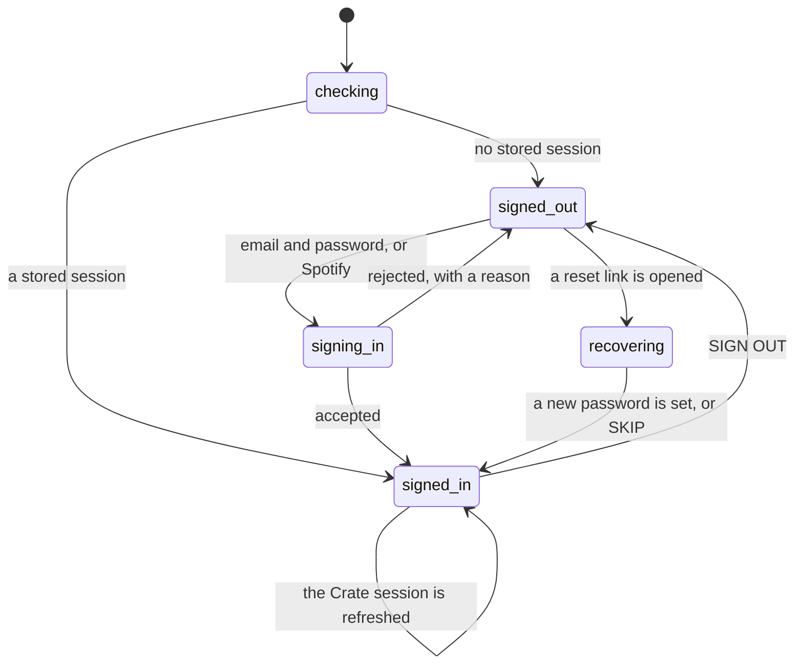

# The account and the session

## Summary

Crate has two independent ideas of who the user is, and almost every account-related surprise in the product comes from the gap between them.

The first is being **signed in**: the browser holds a Crate session, obtained either with an email address and a password or by signing in through Spotify. Being signed in is what gets past the sign-in screen, and it is all that is needed for the library, the crate wall, the crate editor, the listening log, filter rules, and the album search.

The second is being **linked to Spotify**: the account also holds Spotify tokens on the server, so Crate can act as the user on Spotify. Linking is what the import screens and playback need. It is set once, when the user signs in through Spotify, and there is no way to add it to an existing email account except by signing in through Spotify instead — and no way to remove it at all.

There is no account screen, no settings screen, and no "connected to Spotify" indicator. The only place the distinction is ever named is the add screen's two import tabs, which replace themselves with a CONNECT TO IMPORT YOUR LIBRARY prompt. Everywhere else, a user who is not linked meets the difference as an individual feature quietly failing.

## The simple case

A new user opens Crate and gets the sign-in screen. They tap CONTINUE WITH SPOTIFY, approve the permissions Spotify asks for, and come back to a crate wall that is already populated — thirteen crates, each with two records, seeded on that first load. Their name is not shown anywhere; the only sign they are signed in is that the app works.

They close the tab and come back the next day. There is a brief spinner — a single orange ring on an empty page — and then the crate wall again. They did not sign in a second time: the session was in the browser, and the app reused it.

A week later they tap a spine and playback works, because the server quietly swapped their expired Spotify token for a fresh one at some point in between without telling them.

## The interaction, event by event

### Arrive

Every visit begins with the app asking the browser whether it already holds a session, and showing nothing but a spinner until it answers. This is the only full-page loading state in Crate. It is usually instant, but it is a network call, so on a slow connection the user waits on a blank page with a spinner and no text.

Three things can come back. **No session** shows the [sign-in screen](../account/signing-in.md). **A session** puts the user straight into the app at whatever route they asked for. **A session that arrived by way of a password-reset link** shows the [reset-password screen](../account/resetting-a-password.md) instead of the app, whatever route was asked for.

When a session is found, the browser immediately tells the server about it, and the server creates or updates the account row from it. This happens on every arrival, not just the first, and nothing in the interface reflects it — including its failure.

What arrival decides: whether the user is signed in, what their display name and Spotify id are (both read from the Spotify identity on the session, so both are empty for an email account), and nothing else. The Spotify *tokens* are not consulted on arrival; whether they still work is discovered later, one feature at a time.

### Leave untouched

Closing the tab or navigating away writes nothing and ends nothing. The session lives in the browser's local storage and survives the tab closing, the browser closing, and the machine restarting; it expires on Supabase's own schedule and is refreshed in the background as long as the tab is open. Reloading is not signing out.

### First change

The first change is signing in, signing up, or signing out. Each is a single act with no intermediate state the user can abandon: the sign-in form has no draft worth keeping, and there is no confirmation on sign-out.

Signing up with an email address and password creates an account and signs in immediately, with no email to confirm — a deliberate configuration choice, not an oversight. Signing in through Spotify leaves Crate entirely: the browser goes to Spotify, the user approves, and Spotify sends them back to `/callback`, which renders the crate wall. Spotify is always asked to show its approval dialog, so a returning user sees it every time rather than being waved straight through.

### While working

While signed in, two things happen without the user's involvement.

The **Crate session** refreshes itself periodically. Each time it does, the browser tells the server again, and the server updates the account row again. This is invisible and harmless.

The **Spotify access token** is refreshed on the server, on demand, at the moment some feature needs it: if it is within a minute of expiring, or if Spotify rejects it once, the server exchanges the refresh token for a new one, saves it, and retries. The user is never asked to reconnect and never sees that this happened. When it cannot succeed — the refresh token is missing or Spotify has revoked it — nothing global happens either. Each Spotify-dependent feature fails on its own terms: the import tabs come up empty, playback falls back down [its chain](playback.md), the web player never appears.

> Technical note: Spotify hands Crate a token only at the moment of sign-in. The browser forwards it to the server then, and only then — later Crate-session refreshes carry no Spotify token, so they cannot overwrite what is stored, which is what makes the arrangement work. The stored expiry is not read from Spotify's answer; it is assumed to be an hour from when the server wrote it.

### Commit

Signing in commits when Supabase accepts the credentials: the account row is written and the app appears. Signing up commits the same way. Neither shows a success message; the app appearing is the confirmation.

Signing out commits immediately and globally — it ends the session everywhere, not just in this tab. There is no confirmation dialog. The user lands on the sign-in screen with everything the session held thrown away.

## Modifiers

| Modifier | Set on arrival | Changed while working |
| --- | --- | --- |
| Spotify account state | Decides everything about what the account can reach outside Crate. An account created with an email address has no Spotify id, so the two import tabs show the connect prompt, playback has no device to reach, and the [web player](playback.md) is never built. It has no effect on the crate wall, the library, the editor, the log, or the album search. | Cannot change without signing in again, which ends the session and everything in it. There is no "link Spotify" that keeps the current account: tapping the connect prompt starts a full Spotify sign-in. |
| Playback state | No effect. | Signing out while something is playing stops the [web player](playback.md), because the whole app is torn down. Playback on a Spotify app elsewhere keeps going — Crate has no way to stop it. |
| Library state | No effect on the account. On a *new* account, the first load of the crate wall seeds thirteen crate definitions; this is the only thing that happens once per account rather than once per session. | No effect. |
| Viewport | No effect. Sign-in, sign-up, and reset are single-column at every width. | No effect. |
| Crate and config settings | No effect on the account. The account is what settings hang off, not the other way around. | No effect. |

The one modifier that matters here is the first, and it is set at sign-in and fixed for the life of the account.

## Cancel and interrupt

| Event | Before the first change | While working |
| --- | --- | --- |
| Escape, Cancel, Close, or a tap on the backdrop | Nothing to cancel; the sign-in screen is a page, not a modal, and has no dismiss. Escape in a text field does nothing. | The reset-password screen has a SKIP button that abandons the reset and drops the user into the app still signed in — the password is unchanged. Nothing else here can be cancelled: a sign-in request in flight has no cancel, and a sign-out is instantaneous. |
| Navigating inside the app: the bottom nav, another route, or a second panel or modal | The sign-in screen is shown instead of the whole app, so there is nowhere to navigate. Typing a URL while signed out still shows sign-in. | Navigating between screens never touches the account. Signing out while on any screen replaces the whole app with the sign-in screen. |
| Browser back or forward | Back from the sign-in screen leaves Crate. | Back after signing out does not sign the user back in — the session is gone, so every route shows sign-in. Back during a Spotify sign-in returns to Crate's sign-in screen with nothing changed. Forward after signing in works normally. |
| Reload, or the tab is closed | Nothing lost; sign-in again. A half-typed email and password are discarded. | The session survives, so the user comes back signed in. Everything else — the session cache, the web player, what was playing in the tab — is gone. A reload during the Spotify hand-off abandons it and shows the sign-in screen again. |
| Network lost, or the request fails or times out | The first session check fails, and there is no error state for it: the app treats "could not ask" the same as "not signed in" and shows the sign-in screen. A user who is signed in but offline is shown a sign-in screen they cannot use. | The call that tells the server about the session fails silently; the user notices only if their account row was never created, in which case every other request returns unauthorized and every screen looks empty. Sign-in itself shows the failure inline. |
| The session expires, or Spotify rejects the token | Nothing to expire yet. | A Crate session that cannot be refreshed does not sign the user out and does not say anything: the tab keeps its stale token, every request fails with unauthorized, and every screen looks like a [silent failure](../cross-cutting/failed-requests-and-offline.md) — retrying, silently and fruitlessly, each time it is opened. Reloading fixes it, by showing the sign-in screen. Spotify rejecting the token is handled invisibly by the server and, if it cannot be, degrades feature by feature. |
| The same account in a second tab, or the library changed elsewhere | No effect. | The session is shared: signing in in one tab signs the other in, and signing out in one tab signs the other out — the second tab drops to the sign-in screen on its own, mid-task, without warning, because sign-out is global. |
| The album in hand is deleted, or Spotify no longer returns it | No effect. | No effect on the account. |
| Playback moves to another device, or the tab is backgrounded | No effect. | No effect on the account. A backgrounded tab still refreshes its session. |

The one destructive interrupt is sign-out, and it is destructive across tabs and devices rather than locally.

## Interactions with other systems

**Authentication and account state.** This document owns it. Two facts other documents depend on: being signed in is enough for everything inside Crate, and being linked to Spotify is required for everything outside it. The one exception is the album search, which reaches Spotify using Crate's own application credentials rather than the user's, so it works for every signed-in user — see [search and add](../add/search-and-add.md).

**The session cache and freshness.** The session cache is created when the app renders for a signed-in user and destroyed when it stops. Signing out therefore empties it, and signing back in reloads everything from scratch. See [navigation and loading](navigation-and-loading.md).

**Pick history.** Nothing about the account affects picks, and picks survive everything short of the account being deleted. An email-only user who cannot play anything can still pick records; the pick is recorded even when the playback that was attempted with it failed.

**Playback.** Playback needs a linked account for every route it can take, including the fallback that opens Spotify's website — that one works without a link, because it is just a link. The web player additionally needs Spotify Premium and a desktop browser. [Playback](playback.md) owns the details.

**Configuration and crate definitions.** Settings hang off the account and are per-user. A new account has none, and the first load of the crate wall writes thirteen crate definitions to it. Nothing else about the account touches settings.

**Offline and failed requests.** Offline, the first session check fails and the user sees the sign-in screen — which is the worst version of Crate's [silent failure](../cross-cutting/failed-requests-and-offline.md) pattern, because it looks like an intentional state rather than a failure.

**Multiple tabs and the Spotify app.** The Crate session is shared between tabs in the same browser, and sign-out is global, so it affects other browsers and devices too. The Spotify tokens are stored once on the server and shared by every tab, which is why one tab's refresh benefits all of them. See [stale data and second tabs](../cross-cutting/stale-data-and-second-tabs.md).

**Toasts, badges, and empty states.** There is no toast, badge, or indicator anywhere for account state. The sign-in and sign-up forms show failures in an inline box; the reset flow shows a success box. Nothing else about the account is ever announced — not a successful sign-in, not a session refresh, not a Spotify token refresh, and not a Spotify token that can no longer be refreshed.

**Viewport and accessibility.** The sign-in and reset screens are single-column at every width and are the only screens in Crate with a real form. Both use required fields, so the browser's own validation blocks an empty submit. The password fields have no reveal control. The full-page spinner during the first session check has no text, so a screen reader has nothing to announce while the app decides whether the user is signed in.

## Edge cases

- **A user who is signed in but offline sees the sign-in screen,** because the session check cannot distinguish "cannot ask" from "no session". Signing in from that screen also fails.
- **Signing out signs out everywhere,** including other browsers and devices, and there is no confirmation.
- **A second tab loses its work when the first signs out.** It drops to the sign-in screen mid-task.
- **An account created with an email address can never be linked to Spotify.** Tapping the connect prompt starts a Spotify sign-in, which produces a Spotify account rather than adding Spotify to the current one. What happens when both accounts share an email address has not been tested.
- **The display name comes from Spotify only.** An email account has none, and nothing in the interface shows a name anyway, so this is invisible today.
- **A Spotify sign-in that returns no refresh token** leaves the account permanently unable to refresh: an hour later, every feature that needs the user's own Spotify token fails and keeps failing, and nothing suggests signing in again. Signing in again is the only fix.
- **The stored token expiry is assumed, not read.** The server writes "an hour from now" rather than what Spotify said. If Spotify ever issued a shorter-lived token, Crate would use it past its expiry and rely on the retry-once-on-rejection path to recover.
- **Spotify's approval dialog appears on every sign-in,** because Crate always asks for it. This is deliberate but reads as though the previous approval did not stick.
- **The reset-password screen's SKIP button** leaves the user signed in with their old password, having arrived from a reset link. That is a reasonable escape hatch and an odd one: the link's whole purpose was to change the password.
- **A password-reset link takes over the app.** Whatever route the user asked for, they get the reset screen until they set a password or skip.
- **An unknown URL renders a blank page.** There is no not-found route, so a signed-in user who mistypes a path gets the page's background and nothing else. The bottom navigation is not rendered either, so there is no way back except the browser.

## Open questions and verification

- What happens when a Spotify sign-in and an existing email account share an email address is unverified. Supabase can be configured to link identities or to refuse; which one this project does has not been checked, and the outcome matters — it is the only path by which an email user could become linked.
- Whether a Crate session that has genuinely expired reliably produces the "everything fails silently" state described above, rather than being caught and turned into a sign-out, has not been observed.
- The claim that the account-sync call happens on every arrival and every session refresh is read from the code; how often a session refresh actually fires has not been measured.
- The blank page on an unknown URL is read from the absence of a catch-all route and should be confirmed by hand. If it is real it is a bug, and a cheap one to fix.
- Whether Spotify ever declines to return a refresh token on this flow is unknown; the code tolerates it by storing an empty one, which then fails every refresh. Either way the failure mode — permanent, silent, per-feature — is worth treating as a bug.
- The full-page spinner has no timeout. What the user sees if the session check never answers has not been observed; presumably the spinner forever.

Verified against Crate commit `8301127`.
