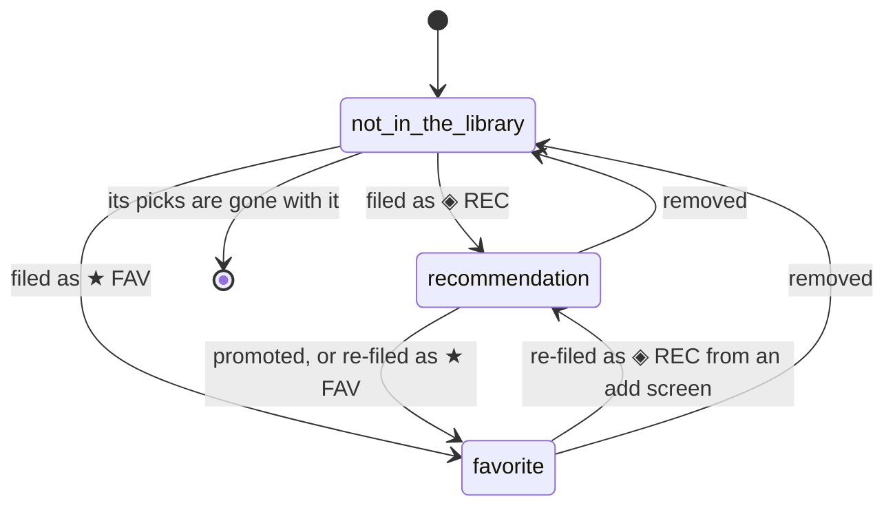

# The data model

## Summary

Crate stores four things about a user, and only four: **the account**, **the records** in their library, **the picks** they have made, and **the settings** they have changed. Everything else the user sees — a crate's contents, a play count, a release year, a genre badge, a duplicate group, a coverage gap — is computed from those four on the spot and stored nowhere.

That is the single most useful fact about the product. It explains why a crate can show a different set of records every time the wall loads, why deleting a record erases its history, why a record with no genres silently disappears from crates that filter on genre, and why nothing in Crate has a "last updated" state to be out of sync with. It also explains the shape of every failure: a load that fails leaves nothing behind, and a write that succeeds is immediately and permanently true.

This document has no phases, modifiers, or interrupt table: the data model is not something the user interacts with directly. Every interaction with it belongs to one of the screen documents. What this document owns is what the four stored things are, what is derived from them, and what identifies a record.

## What is stored

**The account.** One row per user, created the first time they sign in and updated on every sign-in after that. It holds the Supabase identity that signing in produces, a display name, an email address, and — if the user is [linked to Spotify](account-and-session.md) — a Spotify id, an access token, a refresh token, and the moment that access token expires. Nothing else about a user is stored: there is no profile, no avatar, no preferences beyond the settings below.

**The records.** One row per album in the library, holding the title, the artist (all credited artists, joined with commas), the sleeve art URL, the [Spotify id](../glossary.md), the Spotify URI and web URL, which of the two lists it is in, the moment it was filed, and its [metadata](../glossary.md). Every record also has a number the database assigns, which is what everything internal to Crate refers to it by.

Metadata is a free-form bag with three fields in practice: `genres`, `release_date`, and `total_tracks`. It is written when the record is filed and is best-effort — a record filed while Spotify was unreachable has none of it. The [library screen](../library/the-library-shelf.md) can ask the server to fill in missing release dates and track counts afterwards, merging them into whatever metadata is already there. Nothing fills in genres, ever.

**How a record was filed decides whether it has genres at all.** A record filed one at a time — from [the album search](../add/search-and-add.md), or from the artist's other albums in [the detail panel](../library/the-album-detail-panel.md) — gets all three fields, because the server fetches the album and then its artists. A record filed in bulk, from [the Spotify library tab](../add/importing-from-your-spotify-library.md) or [a playlist](../add/importing-from-a-playlist.md), gets only the release date and the track count, because the bulk path asks Spotify for twenty albums at a time and never asks about their artists. Since nothing backfills genres, **a bulk-imported record has no genres for as long as it exists**, and the only way to give it any is to remove it and add it again by hand. A user who built their library by importing it has no genre data at all, which silently empties every genre rule and the nine seeded context crates that are made of them.

**The picks.** One row each time the user chooses a record from the crate wall, holding which record, which crate produced it, an optional context string, and the moment it happened. Picks are append-only: nothing in the product edits or deletes one, and there is no way for a user to remove an entry from the [listening log](../history/the-listening-log.md).

**The settings.** A small set of named values on the account, each stored on its own. The user only ever changes one of them by hand: `crates`, which holds every [crate definition](../glossary.md) as a single value. Because all the definitions live in one setting, saving a change to one crate rewrites all of them — see [the crate editor](../crates/the-crate-editor.md). The rest are the weighting numbers and context lists that [the selection engine](selection-engine.md) owns, and they exist on the account only if something has written them; otherwise the server falls back to its built-in defaults, merging the two on every read so a partially-customized account behaves like a fully-populated one.

> Technical note: the settings are key/value rows and the read is a plain merge of the defaults with whatever rows exist. There is no schema and no validation on write. A setting written with an unexpected shape is handed to whatever reads it, and the failure surfaces wherever that value is used rather than at the moment it was saved.

## What is derived

| What the user sees | Where it comes from |
| --- | --- |
| A crate's contents | Recomputed from the whole library, the crate's rules, and the pick history every time the crate wall loads. Not stored, not stable between loads. |
| Play count ("N plays") | Counted from the picks for that record. |
| Last played | The most recent pick for that record; "never" when there are none. |
| Release year | The first four characters of `release_date`, read as a number. A record with no release date has no year. |
| Genre badges and genre filters | The `genres` list in metadata, lowercased for comparison. |
| Whether an album is already in the library | Compared by Spotify id, on the two import tabs and in the album detail panel's list of an artist's other albums. |
| Duplicate groups | Computed in the browser from titles, artists, and Spotify ids — see [duplicates and gaps](../library/duplicates-and-gaps.md). |
| Coverage gaps | Computed in the browser from the crate definitions and the library. |
| The player's position in a track | Reported by Spotify and advanced locally between reports; see [playback](playback.md). |

Nothing in that column is cached on the server. Two loads a second apart can legitimately produce different crate contents, because the weighted draw is random.

## The life of a record

A record enters the library from one of the three add screens and leaves it from the detail panel's remove button or the duplicates panel. There is no archive and no trash: removal is immediate and permanent, and it takes every pick of that record with it, so the play count, the last-played date, and every entry in the listening log for that album vanish at the same time. Nothing warns about that.

The two lists are almost, but not quite, symmetric. Promoting a recommendation to a favorite is a first-class action with a button on it. Moving a favorite back is not: there is no button anywhere, although the route accepts the request, and re-filing the album from an add screen does it as a side effect. See [the album detail panel](../library/the-album-detail-panel.md).

## Identity, and what counts as the same album

Two different ids matter and they are used for different things.

The **Spotify id** is the album's id on Spotify. It is what "already in the library" means: the database refuses two records with the same Spotify id for the same user, and the import screens compare by it. Filing an album that is already in the library therefore does not create a second record — it overwrites the one that is there, resetting its filed-at time, replacing its metadata, and moving it to whichever list was chosen.

The **record's own id** is the number the database assigns. Picks point at it, the detail panel opens by it, remove and promote act on it, and a spine's colour is derived from it. Because an overwrite keeps the id, re-filing an album keeps its whole history.

Neither id captures what a person means by "the same album". Spotify issues separate ids for remasters, deluxe editions, and regional releases, so the standard and deluxe versions of one album are two unrelated records as far as the database is concerned. Two parts of the product paper over this in different ways and neither is authoritative: the library's [duplicates panel](../library/duplicates-and-gaps.md) groups records whose titles and artists match once edition suffixes are stripped, and the crate wall refuses to *suggest* an album whose stripped title and artist already appear in the library. Nothing prevents the user from filing both.

> Technical note: records also carry a media type, fixed to `album` everywhere in the product, and it participates in the uniqueness rule. It exists so the same tables could hold something other than albums later; nothing reads it today.

## Time

Everything durable is stored as whole seconds since the epoch: when a record was filed, when a pick happened, when a token expires, when a setting was last written. Nothing durable is stored in milliseconds, and nothing is stored as a date string or with a time zone. "Days ago" is always computed by subtracting and dividing, in whichever process is asking — so a day boundary can fall on different sides of the same moment on the client and the server. Nothing depends on that difference except the [cooldown](selection-engine.md), which is only ever computed on the server.

Playback is the exception and is described in [playback](playback.md): track lengths and positions are milliseconds throughout.

## Interactions with other systems

**Authentication and account state.** Every stored thing hangs off the account row, and every query is scoped to it. Signing out does not delete anything; deleting the underlying identity would cascade and delete everything. Whether the account is linked to Spotify changes nothing about the shape of the data — only whether the fields that hold Spotify tokens are filled in. See [account and session](account-and-session.md).

**The session cache and freshness.** The browser holds its own copy of the library, the crate wall's results, the pick history, the crate definitions, and the per-record pick counts for the length of the session. Everything derived is derived from that copy, not from the server, so a derived number can be stale even though nothing stored is. See [navigation and loading](navigation-and-loading.md).

**Pick history.** Picks are both the log the user reads and the input the selection engine uses to decide what is overexposed. There is no separate "listen history": the same rows do both jobs, which is why removing a record quietly changes what the engine thinks about nothing at all — the record is gone — but also erases the log entries a user might have wanted to keep.

**Playback.** Nothing about playback is stored. Playing an album does not write a pick, does not raise a play count, and leaves no trace; only *choosing* a record on the crate wall does. A user who plays everything from the Spotify app has a library full of records with zero plays.

**Configuration and crate definitions.** Crate definitions are settings, not tables, and they are stored as one value. That has two consequences a user can feel: any save writes all of them, and there is no history of what a crate used to be. Deleting a crate deletes its definition and nothing else — the records it drew from are untouched, because a crate never contained them.

**Offline and failed requests.** Nothing is written locally and nothing is queued. A write that fails did not happen; a read that fails leaves the browser's copy as it was, or empty if there was nothing yet. See [failed requests and offline](../cross-cutting/failed-requests-and-offline.md).

**Multiple tabs and the Spotify app.** The database is the only shared state between two tabs, and neither tab watches it. Two tabs can hold contradictory derived views of the same account indefinitely. Writes themselves are safe: filing the same album from two tabs overwrites rather than conflicts, and two picks of the same record are simply two picks. See [stale data and second tabs](../cross-cutting/stale-data-and-second-tabs.md).

**Toasts, badges, and empty states.** Everything the interface shows as a badge or a count is derived: the ◈ on a spine is the record's list, "N plays" is a count of picks, the cyan bar is a [suggestion](../glossary.md) marker carried in metadata rather than a stored flag. A record whose metadata never arrived shows no genre and no year, which looks identical to an album that genuinely has neither.

**Viewport and accessibility.** Nothing stored depends on the viewport, and nothing about the data model is remembered per device. A sort order chosen on the library screen, a tab chosen on the add screen, and a scroll position are all transient and none of them is stored anywhere.

## Edge cases

- **A record with no metadata** has no year and no genres, so every year rule and every genre rule excludes it. It is invisible to the nine seeded context crates, which are all genre rules, and nothing anywhere says why.
- **A record with a partial release date.** Spotify returns dates that are sometimes just a year and sometimes a full date; both work, because only the first four characters are read.
- **A record whose release date is unparseable, or missing entirely,** is excluded by every year rule, including rules it should obviously satisfy — "released after 1000" excludes it.
- **Removing a record removes its picks.** The listening log shrinks, and the total number of entries the log can show shrinks with it. Nothing warns about this.
- **Re-filing an album already in the library** overwrites it: new filed-at time, new list, new metadata — including empty metadata if the fresh fetch failed. Its id and its picks survive. This is reachable from all three add screens and nothing warns about it.
- **The standard and deluxe editions of one album** are two records with two ids, two filed-at times, and two independent pick histories. The duplicates panel will offer to merge them by deleting one, which deletes that one's picks.
- **A pick's crate is stored as the crate's id, not its name** — a machine-generated string like `crate_seed_3_481920`. Nothing stores the name the crate had at the time, so a crate that is later renamed or deleted leaves its picks pointing at something the user cannot recognise, and the [listening log](../history/the-listening-log.md) shows the raw id in upper case for every pick made from any crate. This looks like a bug.
- **A suggestion is not a record.** An album Claude proposed is assembled on the server for one response, given a negative id in the browser so it does not collide with a real record, and thrown away on the next load. It cannot be picked, favorited, or removed. See [AI crates](../crates/ai-crates.md).
- **The one field with the wrong unit.** A suggestion carries a filed-at time in milliseconds rather than seconds, because it is synthesized rather than stored. It is never shown, so nothing displays a nonsensical date — but any code path that treated a suggestion like a record would.

## Open questions and verification

- The claim that removing a record removes its picks follows from the schema's cascade rule and has not been observed by hand. It is worth a verification item, because it is destructive and invisible.
- Whether an account can end up with a setting whose shape is wrong — a hand-edited crate definition, a value written by an older version of the product — is unverified. Nothing validates settings on write, so the failure mode is unknown and probably ugly.
- The metadata bag is described as having exactly three fields because that is what the product writes. Whether older accounts carry other fields is unknown.
- The suggestion filed-at time being in milliseconds looks like a bug, though a currently harmless one: no screen displays it. It is worth recording so that a future screen that does display it does not inherit the problem.
- Nothing checks that a record's Spotify id still resolves to an album on Spotify. A record whose album has been withdrawn stays in the library and can still be picked; what the detail panel and playback do with it has not been tested.

Verified against Crate commit `8301127`.
