# Navigation and loading

## Summary

Crate is five routes and one load. The five routes are the crate wall (`/`), the library (`/library`), the add screen (`/add`), the listening log (`/history`), and `/callback`, which is the crate wall again and exists only to catch the return from a Spotify sign-in. The one load is the **session cache**: each of the three data-bearing screens fetches its data once per session and then never again on its own.

That is the whole model, and two consequences follow from it that a user meets constantly. First, Crate feels instant after the first screen: moving between the crate wall and the library is free, because both are already in memory. Second, Crate is permanently a little stale: nothing polls, nothing expires, nothing refetches when the tab regains focus, and a change made on one screen is not seen by another unless that screen was told about it directly. Reloading the page is the only way to get a genuinely fresh view of everything.

This document owns the session cache, what fills it, what refreshes it, and how the user gets from screen to screen.

## The simple case

The user opens Crate. The crate wall shows skeleton rows for a second or two and then fills in. In the background, and invisibly, it has also loaded the whole library and the whole listening log.

They tap LIBRARY in the bottom bar. The shelf appears immediately — no skeletons, no wait — because it was loaded a moment ago. They tap the profile icon and then View History; the log appears immediately too, for the same reason.

They spend ten minutes filing records, editing crates, and picking albums. Nothing they do ever produces a loading state again, and nothing they do on one screen shows up on another. When they finally reload the page, everything is loaded again from scratch and every screen agrees with the server.

## The interaction, event by event

```mermaid
stateDiagram-v2
    [*] --> cold
    cold --> loading : a screen that needs data is opened
    loading --> warm : the fetch succeeds
    loading --> failed : the fetch fails
    failed --> failed : staying on the screen; nothing retries
    failed --> loading : the screen is opened again
    warm --> warm : any navigation between screens
    warm --> cold : reload, or sign out
    failed --> cold : reload, or sign out
```

There is no state between `warm` and `cold`. A screen is loaded or it is not, and "loaded" means the fetch *succeeded*: a failed fetch leaves the screen exactly as cold as it was, which is why leaving and coming back tries again.

### Arrive

Arriving at a screen asks one question: is this screen's data already in the session cache? If it is, the screen renders immediately. If it is not, the screen shows skeletons and fetches.

Which fetches each screen starts is not symmetric, and this is the single most load-bearing fact in this document:

| Screen | What it loads |
| --- | --- |
| The crate wall (`/`, `/callback`) | The crate wall's contents **and** the whole library **and** the whole listening log — all three, on arrival. |
| The library (`/library`) | The library only. |
| The listening log (`/history`) | The listening log only. |
| The add screen (`/add`) | Nothing at all. |

The crate wall is therefore the door the product expects to be entered by, and the only screen that warms everything. A user who lands directly on `/library` — from a bookmark, or by reloading while the library is open — gets a library screen that never loaded the crate wall's data, and so has no play counts and no crate definitions. What breaks as a result is listed under [edge cases](#edge-cases), and it includes destroying every crate.

Arriving does not reset anything. Scroll position is not restored and not cleared: React Router is used without any scroll handling, so moving between screens keeps the browser's scroll offset, and arriving at a short screen from a long one can land part-way down a page that has no content there.

### Leave untouched

Nothing is written by arriving at or leaving a screen. Leaving a screen unmounts it, which discards everything held by the screen rather than the cache: the add screen's query and results, the library's sort, grouping, search text, and filter rules, the crate wall's open detail panel, the listening log's scroll position. All of that is rebuilt at its default the next time the screen is opened.

### First change

There is no "first change" for navigation itself. The first change belongs to whatever screen the user is on. What matters here is what a change on one screen does to the cache, and the answer is: usually nothing, sometimes a targeted patch, and never a full reload.

### While working

Five things update the cache while the app is running. Nothing else does.

1. **A crate's refresh button** re-runs that one crate on the server and replaces its contents. Nothing else on the wall changes.
2. **Saving a crate definition** writes all the definitions, replaces them in the cache from the server's answer, and then re-runs that one crate.
3. **Reordering or deleting a crate** writes all the definitions and replaces them in the cache. Contents are not re-run — a deleted crate's row simply disappears, and a reordered wall re-sorts what it already has.
4. **A slow crate finishing its own fetch** fills in its contents. See [AI crates](../crates/ai-crates.md).
5. **The library screen's local edits.** Removing a record, promoting a record, and deleting marked duplicates all patch the cached library in place rather than reloading it, and they do it optimistically — the cache is changed before, or regardless of whether, the server agrees.

There is also one automatic write, once per browser tab: the first time the library screen sees a record missing a release date or a track count, it asks the server to fill them in, marks a flag so it will not ask again, and reloads the library if anything was updated. The flag lives in the browser's session storage, so it survives navigation but not a new tab.

Nothing refetches on focus, on visibility change, on reconnecting, or on a timer. There is no pull-to-refresh. The refresh buttons on the crate rows are the only manual refresh in the product, and they only refresh one crate each.

### Commit

Navigation has no commit. Every write in Crate belongs to a screen and is described in that screen's document.

## Modifiers

| Modifier | Set on arrival | Changed while working |
| --- | --- | --- |
| Spotify account state | No effect on navigation or loading. Every screen is reachable by every signed-in user; the two import tabs render a connect prompt rather than being hidden. | No effect. |
| Playback state | No effect on what loads. When the [player bar](../player/the-player-bar.md) is showing, every screen's bottom padding grows so the last row clears it. | Playback starting or stopping changes that padding, which can shift the page under the user's finger mid-scroll. |
| Library state | An empty library still loads: every screen shows its empty state rather than a skeleton. On a brand-new account the crate wall's first load also seeds thirteen crate definitions. | No effect on loading. Filing records does not invalidate anything, which is exactly the problem: the crate wall and the library keep showing what they showed before. |
| Viewport | No effect. All five routes are one column, centered, capped at a comfortable reading width on wide screens. | No effect. |
| Crate and config settings | The crate definitions decide how many rows the wall has and therefore how much it loads. A wall with several slow crates loads its fast rows first and fills the slow ones in afterwards. | Changing a definition re-runs that crate; changing the count or the rules is visible immediately on the next run. |

## Cancel and interrupt

| Event | Before the first change | While working |
| --- | --- | --- |
| Escape, Cancel, Close, or a tap on the backdrop | Nothing to cancel. Navigation has no dismissible surface of its own; the crate editor is a modal and owns its own Escape behavior. | A load cannot be cancelled. Navigating away from a loading screen leaves the fetch running; its answer still lands in the cache, so coming back finds the screen loaded. |
| Navigating inside the app: the bottom nav, another route, or a second panel or modal | Free and instant. The bottom navigation has two items — CRATES and LIBRARY — and there is no back button anywhere in the app, on any screen, including the add screen and the listening log. | Same. Nothing is lost from the cache; everything is lost from the screen. |
| Browser back or forward | Works normally between routes. Back from the first screen of the session leaves Crate. | The cache survives back and forward, because they do not reload the page. Screen state does not: going back to the library finds it re-sorted to its default with no filter rules. |
| Reload, or the tab is closed | Nothing to lose. | The cache is destroyed and rebuilt. This is the only way to make every screen agree with the server, and the only way to recover from a failed load. The once-per-tab backfill flag survives a reload, so the backfill does not re-run. |
| Network lost, or the request fails or times out | Nothing loaded yet. Every screen will fail and show its empty state — except the crate wall, which shows nothing at all. | The skeletons clear, the screen renders as though the account were empty, and nothing is said. Nothing retries while the user stays there, but the screen is still marked *not* loaded, so leaving and coming back tries again. The user cannot tell an empty library from a failed one, and the retry is invisible: it looks like the same empty screen until it happens to work. See [failed requests and offline](../cross-cutting/failed-requests-and-offline.md). |
| The session expires, or Spotify rejects the token | Nothing loaded yet. | Every fetch fails, so every screen the user visits looks empty and tries again on each visit, failing each time. Already-loaded screens keep showing data that may be arbitrarily old. Nothing announces either. |
| The same account in a second tab, or the library changed elsewhere | No effect. | No effect, and that is the point: the cache has no idea another tab exists. Two tabs drift apart from the moment they are both open. See [stale data and second tabs](../cross-cutting/stale-data-and-second-tabs.md). |
| The album in hand is deleted, or Spotify no longer returns it | No effect. | A record deleted on one screen stays in the other screen's copy of the cache until something reloads it. Deleting from the crate wall's detail panel is the clearest case: the server deletes it, the panel closes, and the spine stays on the shelf, tappable, until that crate is refreshed. |
| Playback moves to another device, or the tab is backgrounded | No effect. | A backgrounded tab keeps everything and loads nothing new. Coming back to it after hours shows exactly what it showed when it was backgrounded, with no indication of age. |

## Interactions with other systems

**Authentication and account state.** The cache is created when the app renders for a signed-in user and destroyed when it stops — so signing out empties it and signing in fills it from scratch. The sign-in screen, the reset-password screen, and the first full-page session check all sit outside it and have no cache of their own. See [account and session](account-and-session.md).

**The session cache and freshness.** This document owns it. Two facts other documents lean on: **loaded means the fetch succeeded, so a failed screen retries the next time it is opened and only then**, and **the crate wall is the only screen that loads more than its own data**.

**Pick history.** The cache holds two different things derived from picks and loads them from two different places. The listening log's entries come from the log's own fetch. The per-record play counts and last-played dates come with the *crate wall's* fetch. A screen that never loaded the crate wall therefore shows every record as never played, which is not a failure state anyone would recognise as one.

**Playback.** The player lives above the routes, so it survives navigation: switching screens does not interrupt playback, and the player bar stays put. It is not part of the cache and is rebuilt only on reload. See [playback](playback.md).

**Configuration and crate definitions.** The definitions arrive with the crate wall's fetch and are held in the cache. Two screens write them — the crate wall and the library's SAVE AS CRATE button — and both write the whole set. A screen that holds an empty set and writes it destroys the user's crates; see [edge cases](#edge-cases).

**Offline and failed requests.** Every load in the product fails the same way: silently, with no message, and with no retry while the user is looking at it. The cache is what limits the damage — a failed screen is not marked loaded, so opening it again re-fetches — and also what hides it, because there is no way to tell a screen that failed from a screen that is empty. See [failed requests and offline](../cross-cutting/failed-requests-and-offline.md).

**Multiple tabs and the Spotify app.** Nothing is shared between tabs except the session and the server. Each tab has its own cache, loaded at its own moment, and neither ever notices the other. The one-shot backfill flag is per tab, so a second tab runs the backfill again.

**Toasts, badges, and empty states.** Skeletons are the only loading indicator and they appear on a screen's first load only. After that, everything is instant, including things that are wrong. The album count in the library's header, the number beside each crate's name, and every empty state are all read from the cache, so all of them can be confidently wrong rather than obviously stale.

**Viewport and accessibility.** The bottom navigation is fixed and always rendered on the four app screens, with the current item in orange and a dot under it. It is a real link list, so it is keyboard-reachable. Skeletons are decorative blocks with no text and no live region, so a screen reader hears nothing while a screen loads and nothing when it finishes. The sticky headers on the crate wall and the library take up the top of the viewport at every size and are not collapsible.

**Detail panel details.** One more cache exists and is worth naming here, because it does not follow the rules above: the [album detail panel](../library/the-album-detail-panel.md) keeps the tracks, genres, and artist albums it fetched in a store keyed by Spotify id that lives for as long as the page does. It is shared by every screen that opens a panel, is never invalidated, and is not cleared by signing out — only by a reload.

## Edge cases

- **Landing directly on `/library` breaks four things quietly.** Because that screen never loads the crate wall's data, it has no play counts and no crate definitions. Every record shows "never" and no plays; the PLAYS and RECENT sorts do nothing; the `plays` and `last played` filter rules match as though nothing had ever been played; and the GAPS panel reports the entire library as uncovered.
- **Landing directly on `/library` and then tapping SAVE AS CRATE destroys every crate.** The button saves "the definitions I know about, plus this new one", and the definitions it knows about are none — so the account is left with exactly one crate and the other thirteen are gone, with no warning and no undo. This is the most damaging bug found in the product. See [saving a crate from the library](../library/saving-a-crate-from-the-library.md).
- **A failed first load looks like an empty account.** On the library it reads "no albums yet — add some records"; on the listening log, its own empty state. **On the crate wall it shows nothing at all** — not even empty rows — because the crate definitions arrive with the same fetch, so there is nothing to draw rows for. The header sits above blank space with no explanation.
- **Leaving a failed screen and coming back retries it,** because a failed load does not count as loaded. Nothing tells the user this, and there is no visible difference between the retry succeeding on the second visit and the screen having been empty all along.
- **Records filed on the add screen are invisible everywhere else until a reload.** The add screen does not touch the cache.
- **A record deleted from the crate wall stays on the shelf.** The deletion happens, the panel closes, and the spine remains until that crate is refreshed or the page is reloaded. Tapping it again opens a panel for a record that no longer exists.
- **Scroll position carries across navigation.** Nothing resets it, so arriving at a short screen from a scrolled-down long one can look like an empty page.
- **An unknown URL renders nothing** — no content, no bottom navigation, no way back except the browser. There is no not-found route.
- **`/callback` is the crate wall.** A user who bookmarks it gets the crate wall with a URL that will be reused by the next Spotify sign-in.
- **The backfill runs once per tab, not once per account.** Opening a second tab runs it again; it is harmless but it is a real request that pages through every record missing metadata.
- **A crate row's refresh button cannot retry a failed wall.** It is disabled while that crate is loading, and a wall whose load failed has no rows at all and therefore no buttons. Navigating to the library and back is the only retry short of a reload.
- **The detail panel's own cache never expires.** Reopening the same album an hour later shows the tracks and artist albums fetched an hour ago, and an album whose detail fetch failed shows an empty panel that will retry — that one cache does not record failures.

## Open questions and verification

- The `/library`-direct-entry consequences are derived from which screen calls which loader and have not all been observed by hand. The crate-destroying one is the most important verification item in the whole project.
- Scroll behavior across route changes is inferred from the absence of any scroll handling; it should be watched directly, because React Router's default depends on how the navigation happened.
- The blank page on an unknown route follows from there being no catch-all route and has not been confirmed by hand.
- How long the first load of the crate wall takes on a real account, and how much of that is the three parallel fetches versus the crate engine, has not been measured. The code defers slow crates specifically because the whole response would otherwise take around five seconds.
- The retry-on-re-entry behavior is read from the code — every screen's load effect checks its loaded flag on mount, and the flag is only set on success — and has not been watched by hand. It matters because it is the only retry the product offers, and because a user who does it has no way to know whether it happened.
- Whether a fetch that is in flight when its screen unmounts reliably lands in the cache has not been tested. It should, because the cache is above the routes, but React's development-mode double-mounting makes this the kind of thing that behaves differently in production.
- Nothing verifies that the once-per-tab backfill flag is actually respected across a reload in the same tab; it is written before the request rather than after, so a failed backfill is never retried in that tab either.

Verified against Crate commit `8301127`.
