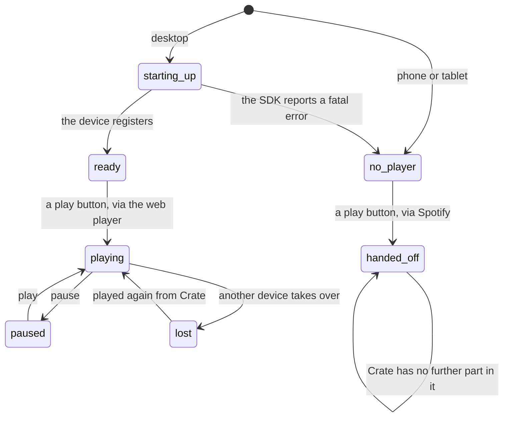

# Playback

## Summary

Crate can play a record four different ways, and it decides which one without asking. On a desktop browser with a Spotify Premium account it builds its own player — a device called "Crate Web Player" that appears in Spotify's device list — and the album plays in the tab, with a player bar above the bottom navigation. If that player cannot be built or cannot be reached, Crate asks Spotify to play the album on whatever device the account is already using. If that fails too, it opens the album on Spotify's website in a new tab. And on a phone or tablet it does not try at all: it hands the album to Spotify immediately, which means leaving Crate.

Every play button in the product runs the same chain, in the same order, and it is silent at every step. There is no "playing on your phone" message, no "open Spotify first" prompt, and no error when nothing happens. The only feedback that playback worked is the player bar appearing — and the player bar only ever appears for the first route, so a successful play on another device looks exactly like a failure.

This document owns the chain, the requirements for each step, and the player bar's controls. It does not own what a play button is attached to, or whether tapping it records a [pick](../glossary.md) — that is [picking a record](../crates/picking-a-record.md).

## The simple case

A user on a laptop, signed in through Spotify with a Premium account, opens Crate. A second or two after the page loads, and invisibly, Crate has registered a player with Spotify.

They tap a spine, the [detail panel](../library/the-album-detail-panel.md) opens, and they tap PLAY ON SPOTIFY. The album starts. A bar slides in above the bottom navigation with the sleeve, the track name, the artist, a volume slider, previous / pause / next, and a seek bar with the elapsed and total time. The first track is highlighted green in the panel's track list with a ▶ beside it.

They keep browsing. Moving to the library, opening other panels, editing a crate — none of it interrupts the music, because the player lives above the screens. Tapping a track in the track list jumps to that track. Reloading the page stops the music, because the player is torn down with the page.

## The interaction, event by event

### Arrive

Nothing about playback is per-screen; it is set up once when the app renders for a signed-in user, and it survives every navigation until the page is reloaded or the user signs out.

On a desktop browser, Crate loads Spotify's player script and connects a device named **Crate Web Player**. This takes one to two seconds and produces no visible sign — no bar, no indicator, nothing in the interface says a player exists or is coming. On a phone or tablet, decided by the browser's user-agent string, none of this happens at all.

Crate treats a click during that startup window as "wait for the device" rather than "fall back", polling for up to five seconds before giving up. So a play button pressed the instant the page loads still plays in the tab; it just takes a moment.

### Leave untouched

Playback writes nothing. Leaving a screen, closing a panel, and navigating between the four screens have no effect on what is playing. Signing out stops the web player, because the whole app is torn down; music started on some other device keeps going, and Crate has no way to stop it.

### First change

The first change is pressing a play button. There are four of them and they behave identically:

- PLAY ON SPOTIFY in the album detail panel — plays the album from the start.
- A track row in the same panel — plays the album from that track.
- The play button on a search result or an import row.
- The transport controls on the player bar, which are a different thing: they control what is already playing, not what to play.

Pressing one runs the chain below. **The chain has no user-visible steps.** A user cannot tell which route was taken except by whether the bar appeared and whether they can hear anything.

| Order | Route | Requires | What the user sees |
| --- | --- | --- | --- |
| 1 | Hand off to Spotify by navigating to the album's Spotify link — **phone and tablet only, and it is the only route tried there** | Nothing beyond the album having a link | Crate closes. The Spotify app opens if it is installed, otherwise Spotify's website. |
| 2 | Play on the in-tab web player | Desktop, Spotify Premium, [linked to Spotify](account-and-session.md), and the device registered within five seconds | The album plays and the player bar appears. |
| 3 | Ask Spotify to play on the account's active device | Linked to Spotify, and Spotify already has an active device somewhere | Nothing at all in Crate. The music starts on the phone, the desktop app, or the speaker that was last used. No bar, no message. |
| 4 | Open the album on Spotify's website in a new tab | The album having a web link | A new browser tab on Spotify's album page, not playing yet — the user has to press play there. |

Route 3 is the one that most often surprises people. It succeeds only if Spotify considers some device active; when it does not, the server's answer says so in as many words — "No active Spotify device found. Open Spotify on any device first." — and that sentence is **never shown to the user**. It is discarded and the chain falls to route 4.

### While working

While something is playing on the web player, the [player bar](../player/the-player-bar.md) is the whole interface. Track name, artist, and sleeve come from Spotify and update themselves as the album advances. The position advances twice a second between Spotify's own updates, so the seek bar moves smoothly rather than in jumps, and is re-synced whenever Spotify reports something new and whenever the user drags it.

The volume slider is hidden on narrow viewports. There is no shuffle, no repeat, no queue, no stop, and no way to dismiss the bar — it disappears only when playback stops entirely.

### Commit

Playback has no commit and leaves nothing behind. Nothing is written to the account when a record is played: no play count, no history entry, no last-played date. The only thing that writes is *choosing* a record on the crate wall, which happens to also trigger playback — see [picking a record](../crates/picking-a-record.md) and [the data model](data-model.md).

## Modifiers

| Modifier | Set on arrival | Changed while working |
| --- | --- | --- |
| Spotify account state | Decides which routes exist. An email-only account has no Spotify link, so routes 2 and 3 both fail and every play button opens Spotify's website in a new tab. A free Spotify account is linked but not Premium: the web player reports an account error, is abandoned permanently for the session, and every play falls to route 3 or 4. | Cannot change without signing in again. A Premium subscription that lapses mid-session is discovered the first time the player is built, not while it is running. |
| Playback state | Nothing playing means no bar and more room at the bottom of every screen. Something playing means the bar and 44 pixels less. | Starting or stopping playback changes every screen's bottom padding, which shifts the page under the user's finger. Playing a second album replaces the first with no confirmation and no way back to it. |
| Library state | No effect. Playback works from a search result that is not in the library at all, and from a [suggestion](../glossary.md) that can never be in it. | No effect. Removing a record while it is playing does not stop the music. |
| Viewport | Narrow: no volume slider, and playback is hand-off-only if the narrow viewport is a real phone. A narrow *desktop* window keeps the web player and loses only the slider. | Resizing across the breakpoint shows or hides the volume slider mid-playback. The mobile decision is made once, from the user-agent, and never revisited. |
| Crate and config settings | No effect. Nothing about crates, weighting, or counts touches playback. | No effect. |

## Cancel and interrupt

| Event | Before the first change | While working |
| --- | --- | --- |
| Escape, Cancel, Close, or a tap on the backdrop | Nothing to cancel; playback has no dismissible surface. The player bar has no close button. | Closing the detail panel or the modal a play came from does not stop the music. Escape does nothing to the player. |
| Navigating inside the app: the bottom nav, another route, or a second panel or modal | No effect. | Nothing is interrupted. The player and the bar live above the screens, so playback continues across every navigation. Opening a second panel and playing from it replaces what is playing. |
| Browser back or forward | No effect. | Playback continues; back and forward do not reload the page. |
| Reload, or the tab is closed | Nothing to lose. | **Playback stops.** The device disconnects with the page, and Spotify has nowhere to send the audio. Nothing warns before a reload, and nothing resumes afterwards — the bar comes back empty and the album has to be played again from the beginning. |
| Network lost, or the request fails or times out | The player script cannot load, so no device registers and every play falls to route 3 or 4 — which also fail offline, leaving route 4's new tab, which cannot load either. Nothing is said. | Audio stops when the connection does. Spotify's player reports its own errors to the browser console and Crate shows none of them; the bar keeps showing the track it was on, paused or frozen. |
| The session expires, or Spotify rejects the token | A token that cannot be fetched means the device never registers; the five-second wait times out and the chain falls through. | The player asks Crate for a fresh token whenever it needs one, and Crate's server refreshes it silently, so a long session normally keeps playing. If it cannot, the audio stops with no message. A Spotify authentication complaint during startup is deliberately ignored, because Spotify raises it spuriously on accounts that work fine. |
| The same account in a second tab, or the library changed elsewhere | No effect. | Each tab registers its own Crate Web Player, so a Premium account can have two, both named the same. Playing in one takes the audio from the other; the first tab's bar empties out and disappears, mid-track, with no explanation. |
| The album in hand is deleted, or Spotify no longer returns it | No effect. | Deleting a record while its album is playing does not stop it. An album Spotify has withdrawn produces a failed play at every step and ends as a new tab on a Spotify page that says the album is unavailable. |
| Playback moves to another device, or the tab is backgrounded | No effect. | Taking over from Spotify on a phone or the desktop app stops Crate's player, and Crate notices: the bar disappears. It does not follow the music — there is no indication of what is playing elsewhere and no way to control it. A backgrounded tab keeps playing normally; browsers do not suspend audio. |

## Interactions with other systems

**Authentication and account state.** Every route except the last needs the account [linked to Spotify](account-and-session.md), and the web player additionally needs Premium. Nothing in the interface states either requirement, and both failures are silent. The user's Spotify token is refreshed on the server on demand, so the player keeps working across a long session without being asked to reconnect.

**The session cache and freshness.** Playback is not part of the [session cache](navigation-and-loading.md) and nothing about it is cached. It is rebuilt only by a reload — which is also the one thing that stops it. When the bar is showing, every screen's bottom padding grows so the last row clears it.

**Pick history.** Playing is not picking. The two coincide on the crate wall, where the same button both records a pick and starts playback, and they come apart everywhere else: playing from a search result, an import row, or the library records nothing. That is why a user who plays their whole library from Crate's library screen still has a library full of records with zero plays, and why [the selection engine](selection-engine.md) keeps offering them. It also runs the other way — on the crate wall the pick is recorded *before* the chain is tried, so a play that fails at every step is still recorded as a pick.

**Playback.** This document owns it. Two facts other documents lean on: **the player bar appears only when Crate's own in-tab player is playing**, and **the chain is silent at every step**.

**Configuration and crate definitions.** No relationship in either direction.

**Offline and failed requests.** Playback is the clearest case of Crate's [silent failure](../cross-cutting/failed-requests-and-offline.md) pattern, and the worst, because the last step of the chain is itself indistinguishable from a failure: a new browser tab that is not playing anything looks like the product not working, and it is in fact the product's designed last resort. The one route that produces a real, specific, useful error message — "Open Spotify on any device first" — throws it away.

**Multiple tabs and the Spotify app.** Spotify allows one playing device at a time and Crate does not manage that. Two Crate tabs, or a Crate tab and the Spotify desktop app, contend for it, and whichever played most recently wins. See [stale data and second tabs](../cross-cutting/stale-data-and-second-tabs.md).

**Toasts, badges, and empty states.** There is no toast, no spinner, and no error state anywhere in playback. The player bar is the only indicator. The only other visible trace is the currently-playing track highlighted green with a ▶ in the detail panel's track list, which is matched against Spotify's report of what the *web player* is playing — so on a phone, or after a fall-through to another device, no track is ever highlighted.

**Viewport and accessibility.** The bar is fixed above the bottom navigation at every width. Its controls are real buttons with labels, and its two sliders are range inputs labelled Volume and Seek, so all of it is keyboard-reachable and announced. Nothing announces that playback started, stopped, or changed track, and the green track highlight is colour plus a ▶ character, so it is not colour alone. The volume slider is removed entirely on narrow viewports rather than being moved somewhere reachable.

## Edge cases

- **A phone or tablet always leaves Crate to play.** There is no in-app playback on mobile at all, and the user is navigated away rather than opened in a new tab, so they lose whatever they were doing and have to come back by hand. This is the single largest behavioral difference between the two viewports.
- **The mobile decision is made from the user-agent string, once.** A desktop browser pretending to be a phone gets hand-off; a tablet browser that reports itself as a desktop gets the web player. Neither can be overridden.
- **A free Spotify account never plays in the tab.** Spotify reports an account error, the player is abandoned for the rest of the session, and every play afterwards goes to another device or to a new tab. Nothing says the word "Premium".
- **"No active Spotify device found. Open Spotify on any device first." is never shown.** It is the most useful sentence in the whole playback path and it exists only in the server's response body.
- **Route 4 does not play anything.** It opens Spotify's album page in a new tab and stops there. A user who ends up on this route has to press play themselves, and has no idea Crate meant them to.
- **Playing on another device shows nothing in Crate.** No bar, no track, no controls. Success and failure look identical.
- **Reloading stops the music.** Every other kind of navigation preserves it, so this is easy to do by accident.
- **Two Crate tabs both register a device called "Crate Web Player".** They are indistinguishable in Spotify's device picker and they steal playback from each other.
- **The player bar has no stop and no close.** The only way to get rid of it is to stop playback from Spotify elsewhere, or reload.
- **Playing a track from a multi-disc album is asked for by its position in the flat track list.** Whether that lands on the right track for every multi-disc release is unverified.
- **The seek bar's step is one second and its range is the track length,** so a track whose length has not arrived yet has a seek bar of width zero that looks broken rather than unavailable.
- **Volume is per player, not per account,** and it is read from Spotify's player when the device registers rather than defaulting to full. A user who turned it down in a previous session may find it already down, or already up, depending on what Spotify remembered.
- **A play attempt from the crate wall records a pick even when nothing plays.** The pick is written first, unconditionally. Every failed play is in the [listening log](../history/the-listening-log.md) as though it had been listened to.
- **A suggestion can be played but not picked.** The play chain works on an album that is not in the library; the pick is skipped because there is nothing to point at. See [AI crates](../crates/ai-crates.md).

## Open questions and verification

- Nothing in the four-route chain has been observed by hand. Which route a given browser and account actually takes is the highest-value verification in this document, and it needs three different accounts — Premium, free, and email-only — plus a phone.
- Whether the five-second wait for the device is long enough on a slow connection is unknown. If it is not, the user gets a five-second pause and then a new browser tab, which would read as a serious bug.
- The claim that a phone navigates away rather than opening a tab is read from the code and should be confirmed on a real phone, with and without the Spotify app installed.
- What the bar shows when the connection drops mid-track — frozen position, or a paused state — has not been observed.
- Whether Spotify's `player_state_changed` reliably reports the device being taken over, and therefore whether the bar really does disappear, is unverified. It follows from the code but depends on the SDK.
- Track offsets on multi-disc albums are unverified, as above. It would take a specific multi-disc album in the library to check.
- Whether the deliberately-ignored Spotify authentication complaint is still spurious on current accounts is worth re-checking. A code comment records that it was verified once, on this project, and that treating it as fatal was what previously forced every play to fall through to a browser tab.
- Nothing verifies what happens if the Spotify player script itself fails to load — for instance behind a content blocker. Presumably the device never registers and every play falls through after a five-second wait.

Verified against Crate commit `8301127`.
