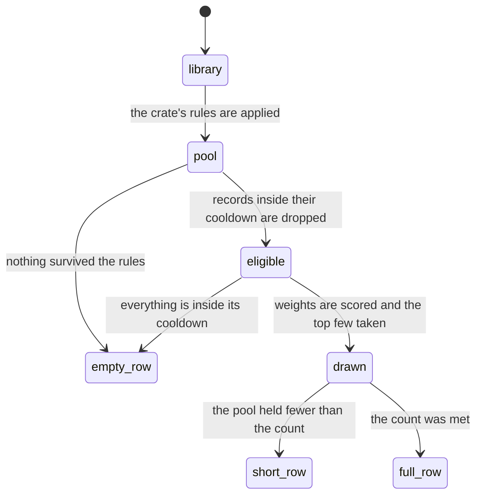

# The selection engine

## Summary

Every row on the crate wall is the answer to the same question, asked fresh each time: *given this crate's rules and everything I know about what the user has played, which few records should be on the shelf right now?* The selection engine is what answers it.

It works in two steps, always in this order. First the **pool**: the crate's filter rules are applied to the library, and what survives is what the crate could possibly show. Then the **draw**: the crate's strategy picks from the pool — evenly, by weight, or by asking Claude. The weighted draw is the interesting one, and it is the default for every crate Crate seeds. It gives each record a number based on how long ago it was last picked, refuses to consider anything played too recently, and then draws without replacement.

This document owns every number in that process: the operators a filter rule can use, the tiers the weighted draw uses, the defaults, the values the crate editor's sliders can produce, and how the count is honored. No other document restates them. What this document does *not* own is what Claude is asked and what happens when it fails — that is [AI crates](../crates/ai-crates.md) — or the interface for changing any of it, which is [the crate editor](../crates/the-crate-editor.md).

## The simple case

A user has 300 records. Their Favorites crate has one rule — list is favorite — and the weighted strategy with everything at its default. It shows two records.

The engine takes the 300, keeps the 190 that are favorites, and looks at each one. Twelve were played in the last three days: those are out entirely. Forty were played between three days and two weeks ago: those get a weight of 1. Thirty were played two weeks to a month ago: weight 3. Sixty were played longer ago than that: weight 5. And forty-eight have never been played at all: they get the same 5, plus a bonus of 2, for 7.

Then each of those weights is multiplied by a random number, and the two highest-scoring records are taken. A never-played record is roughly seven times as likely to come up as one played last week — but not certain to, because the randomness is real. Refreshing the crate gives two different records.

## The interaction, event by event

The engine has no user-facing lifecycle of its own; it runs inside another interaction. What it passes through on each run is worth naming anyway, because a crate can come up short or empty at three different points.

**The rules are applied first, to the whole library.** A rule with a blank value is skipped rather than matching nothing, so a half-typed rule never empties a crate. A crate with no rules at all matches everything.

**Cooldown is applied second, inside the draw** — so a record inside its cooldown is in the pool but cannot be drawn. That distinction matters: the number shown beside a crate's name is how many records it drew, not how large its pool was, and a crate whose whole pool is in cooldown shows the same empty row as a crate whose rules matched nothing.

**The draw never exceeds the pool.** Asking for four from a pool of two gives two, with no message.

### Arrive, leave untouched, first change, while working, commit

These five phases belong to whichever screen is running the engine. The crate wall's are in [the crate wall](../crates/the-crate-wall.md); the crate editor's are in [the crate editor](../crates/the-crate-editor.md). One fact spans both and belongs here: **the engine runs on the server, on every load and every refresh, and its result is never stored.** Two runs a second apart legitimately disagree. Nothing the user does makes a crate's contents stable, and nothing lets them get a previous run back.

## What a filter rule can say

Six fields, each with its own operators. A rule needs a value to count; the one exception is `never played`, which needs none.

| Field | Operators | What it compares | If the record has no data |
| --- | --- | --- | --- |
| Year | `is`, `is between`, `before`, `after` | The first four characters of the release date, as a number. `is between` accepts its two values in either order. | **Never matches**, whatever the operator. A record with no release date is excluded even by "after 1000". |
| Genre | `is`, `is not`, `is any of` | The record's genre list, compared case-insensitively. `is any of` matches when any one of the chosen genres is present. | `is` and `is any of` never match. **`is not` always matches** — a record with no genres is "not jazz". |
| Artist | `is`, `contains` | The record's artist text, case-insensitively. `is` is an exact match of the whole string. | Not possible; every record has artist text. |
| List | `is` | Whether the record is a favorite or a recommendation. | Not possible; every record is in exactly one list. |
| Plays | `≥`, `≤`, `is` | How many picks the record has. | A record with no picks counts as 0, so `≤ 2` and `is 0` match it. |
| Last played | `more than (days) ago`, `within (days)`, `never played` | Days since the most recent pick. | A record with no picks matches `never played` and `more than (days) ago` for any number of days, and never matches `within (days)`. |

Rules combine with **AND** or **OR**, chosen per crate; the choice is only offered when there is more than one rule. AND requires every complete rule; OR requires at least one.

> Technical note: "artist is" compares the whole artist string, which is every credited artist joined with commas. An album credited to "Miles Davis, John Coltrane" does not match "artist is Miles Davis" — only "artist contains Miles Davis" does. Nothing in the interface hints at this.

## The weighted draw, number by number

Each record in the pool gets one weight. The tier is chosen by how many days ago it was last picked — a fractional number, not a whole one, so the boundaries are exact to the second.

| Condition | Weight | Default value |
| --- | --- | --- |
| Last picked less than **cooldown** days ago | 0 — not eligible at all | cooldown 3 days |
| Last picked less than **recent** days ago | low | recent 14 days, low **1** |
| Last picked less than **medium** days ago | medium | medium 30 days, medium **3** |
| Last picked longer ago than that, or never | high | high **5** |
| Never picked | plus a **discovery bonus** | **+2** |
| Filed within **recently-added** days | plus a **freshness bonus** | recently-added 14 days, bonus **+0** — off by default |

So the default weights a user actually meets are: 0 for anything played in the last three days, 1 for the last fortnight, 3 up to a month, 5 beyond that, and 7 for anything never played. The freshness bonus is off unless the user turns it on, and it is only applied at all when it is above zero.

Then every eligible weight is multiplied by a random number raised to a power set by the **variety** setting, and the highest results are taken, one at a time, without replacement. The default variety is 1.0, which makes the multiplier a plain uniform random number. Above 1.0 the multiplier clusters near its maximum, so the weights dominate and the picks become predictable; below 1.0 it spreads out, so the weights matter less and the picks become erratic.

If every eligible weight somehow comes out at zero, the draw falls back to picking uniformly at random from what is left, so a crate never fails because of arithmetic.

### What the editor can set, and what it cannot

The [crate editor](../crates/the-crate-editor.md) exposes four of these numbers, each as a slider with five stops:

| Slider | Sets | Stops |
| --- | --- | --- |
| Cooldown | cooldown days | 0, 3, 7, 14, 31 — "None", "A few days", "A week", "Two weeks", "A month" |
| Variety | the randomness power | 2.0, 1.5, 1.0, 0.7, 0.4 — "Predictable", "Consistent", "Balanced", "Random", "Chaotic" |
| Discovery bias | the never-picked bonus | 0, 1, 2, 3, 5 — "Off", "Subtle", "Moderate", "Strong", "Maximum" |
| Recently added | the freshness bonus | 0, 1, 2, 3, 5 — "Off", "Subtle", "Moderate", "Strong", "Maximum" |

The other six numbers — the two tier boundaries and the three tier weights, plus the fourteen-day window the freshness bonus uses — cannot be changed anywhere in the interface. They exist on the account as settings and can be written by hand, and the server honors them if they are, but nothing in the product writes them.

Weights are stored per crate, so two crates can weight differently. Only the weighted and hybrid strategies have them; random and the two AI strategies ignore weights entirely, which means **cooldown does not apply to them** — a record picked an hour ago can come straight back from a random crate.

## The five strategies

| Strategy | What it does | Honors cooldown and weights |
| --- | --- | --- |
| **Weighted** | The draw described above, from the filtered pool. | Yes |
| **Random** | An even draw from the filtered pool. | No |
| **Pool with AI** | Claude picks from the filtered pool, given the crate's prompt. Without a prompt it is a weighted draw with neutral defaults instead. | No — even the fallback uses the built-in defaults rather than the crate's own weights |
| **New with AI** | Claude suggests albums that are *not* in the library. The rules are ignored: nothing is being filtered, because nothing is being drawn from the library. | No |
| **Hybrid** | One third of the count from new-with-AI, rounded, at least one; the rest a weighted draw from the pool. | For its library half only |

Every AI strategy has a local fallback, and the fallbacks are not all sensible: when new-with-AI fails, the crate falls back to a random draw from **the whole library, ignoring the crate's rules entirely**. [AI crates](../crates/ai-crates.md) owns those paths.

The count is 1 to 7 per crate. A crate made by hand starts at 4. The thirteen crates Crate seeds for a new account start at 2, because they take their count from an account setting whose default is 2.

## Modifiers

| Modifier | Set on arrival | Changed while working |
| --- | --- | --- |
| Spotify account state | No effect on the pool or the draw. New-with-AI additionally needs Spotify to look up what Claude proposed, and asks with Crate's own credentials rather than the user's, so it works for an email-only account. | No effect. |
| Playback state | No effect. Playing an album does not change any weight, because playing is not picking. | No effect. |
| Library state | Decides everything. A pool smaller than the count gives a short row; an empty pool gives an empty row. A library where nothing has ever been picked gives every record the same weight of 7, so the draw is effectively uniform. | Filing or removing records changes future runs but not the current one — the wall does not re-run. |
| Viewport | No effect. The count is per crate, not per screen width; a wide viewport shows the same few spines with more space around them. | No effect. |
| Crate and config settings | The rules, the strategy, the count, and the four sliders are all read at run time, so a change takes effect on that crate's next run. | Saving a crate re-runs it immediately. Changing a crate's numbers never re-runs any other crate. |

## Cancel and interrupt

| Event | Before the first change | While working |
| --- | --- | --- |
| Escape, Cancel, Close, or a tap on the backdrop | Not applicable; the engine has no surface. Dismissing the crate editor without saving leaves every crate running on its previous rules. | A run in progress cannot be cancelled. Dismissing the editor while a save-then-re-run is in flight still saves and still re-runs. |
| Navigating inside the app: the bottom nav, another route, or a second panel or modal | No effect. | A run whose screen has gone away still completes and still lands in the session cache, so coming back finds the crate filled in. |
| Browser back or forward | No effect. | Same as navigating; nothing is cancelled. |
| Reload, or the tab is closed | No effect. | Every crate is re-run from scratch on the next load, giving a different wall. This is the normal way a user gets fresh picks and it is indistinguishable from having refreshed each crate by hand. |
| Network lost, or the request fails or times out | No effect. | The whole wall load fails at once, so every crate shows its empty row and nothing retries. A single crate's refresh failing leaves that crate showing what it had. See [failed requests and offline](../cross-cutting/failed-requests-and-offline.md). |
| The session expires, or Spotify rejects the token | No effect. | The engine itself does not use the user's Spotify token; only new-with-AI does, and only to look up suggestions, using Crate's own credentials. So an expired Spotify link does not break any weighted or random crate. An expired Crate session breaks every crate, by breaking the request. |
| The same account in a second tab, or the library changed elsewhere | No effect. | Each tab's runs are independent and can legitimately disagree. Picks recorded in one tab do affect the other tab's *next* run, because the engine reads the picks from the server every time. |
| The album in hand is deleted, or Spotify no longer returns it | No effect. | A record deleted between two runs simply stops appearing. A record whose album Spotify has withdrawn keeps being drawn, because the engine never asks Spotify about the library. |
| Playback moves to another device, or the tab is backgrounded | No effect. | No effect. Nothing about playback is an input to the engine. |

## Interactions with other systems

**Authentication and account state.** The engine runs entirely server-side against the signed-in account, and nothing about being linked to Spotify changes what it draws. See [account and session](account-and-session.md).

**The session cache and freshness.** A crate's contents are cached for the session and never re-derived on their own, so a crate's row can outlive the facts that produced it — records it shows may have been removed, and records it excluded for cooldown may have come out of cooldown since. See [navigation and loading](navigation-and-loading.md).

**Pick history.** Picks are the engine's only memory. Every weight, every cooldown, and the `plays` and `last played` rules all read the same rows. Two consequences a user can feel: a record's history disappearing when the record is removed, and **the engine treating an album the user actually listened to as unplayed unless it was picked in Crate**. A user who plays their whole library from the Spotify app keeps getting a weight of 7 on everything.

**Playback.** No relationship in either direction. Picking records a pick and therefore affects the engine; playing does not, and playing without picking is possible from every add screen.

**Configuration and crate definitions.** The engine's inputs are almost entirely per crate. Two things are not: the six numbers the editor cannot reach, and the count a new account's seeded crates inherit. Both live as account settings. See [the crate editor](../crates/the-crate-editor.md).

**Offline and failed requests.** The engine has no offline behavior of its own; it either runs on the server or the request that would have run it failed. Every AI strategy fails *inward* rather than outward — the crate quietly shows a locally-drawn row instead of an error. See [failed requests and offline](../cross-cutting/failed-requests-and-offline.md).

**Multiple tabs and the Spotify app.** Runs are independent per tab and per request; there is no shared randomness and no dedup between crates, so the same record can appear in two crates on the same wall at the same time.

**Toasts, badges, and empty states.** The number beside a crate's name is how many records it drew, so a crate that came up short shows a smaller number with no explanation. There is exactly one empty row — "crate empty — add some records" — and it covers four different situations: no rules matched, everything matched is in cooldown, the library is empty, and the load failed.

**Viewport and accessibility.** Nothing about the engine varies by viewport. Its outcomes are conveyed only visually: there is no text anywhere saying why a crate is short or empty, and nothing announces that a crate's contents changed after a refresh.

## Edge cases

- **A record with no release date is excluded by every year rule,** including "after 1000". This is the most common way a crate silently loses records.
- **A record with no genres matches "genre is not X".** A crate meant to exclude a genre therefore includes every record whose metadata never arrived.
- **"Artist is" needs the whole credit line.** Multi-artist albums do not match a single artist name exactly.
- **A blank rule value is ignored, not treated as empty.** A crate being edited never collapses to nothing mid-typing — but a rule left blank and saved does nothing at all, silently, forever.
- **Cooldown set to "None" still tiers by recency.** A record picked an hour ago gets a weight of 1, not 0 — it is unlikely, not impossible.
- **A crate whose entire pool is in cooldown shows the empty row,** which reads "add some records" even though the crate is full of records.
- **Every record having the same weight is normal on a new account,** where nothing has been picked. The first few picks are effectively uniform and only start to differentiate after three days, when cooldown begins excluding things.
- **The freshness bonus is off by default and the seeded crates force it off,** so "recently added" has no effect on any crate until a user opens the editor and turns it on. Its fourteen-day window cannot be changed.
- **A random crate ignores cooldown,** so the same record can come back immediately after being picked. The user has no indication that the two strategies treat recency differently.
- **The same record can appear in two crates at once.** Nothing dedupes across crates, and on the crate wall selecting it opens the detail panel in both rows simultaneously — see [the crate wall](../crates/the-crate-wall.md).
- **New-with-AI ignores the crate's rules,** by design when it succeeds and destructively when it fails: the fallback draws at random from the entire library, so a carefully filtered AI crate can show anything at all.
- **Hybrid always reserves at least one slot for AI,** so a hybrid crate with a count of 1 draws nothing from the library.
- **A crate with a count of 7 and a pool of 300 still shows 7,** but the draw is done one at a time without replacement, so the same record cannot appear twice in one row.

## Open questions and verification

- The tier boundaries are compared against a fractional number of days, so "3 days" means 72 hours to the second. This has not been checked at a boundary by hand and would be tedious to check.
- The exact effect of the variety setting has not been measured. The direction is clear from the arithmetic and the labels agree with it, but whether "Chaotic" is perceptibly different from "Random" over a two-record row is unknown.
- A non-numeric value in a `plays`, `year`, or `last played` rule excludes every record rather than being ignored — the code checks for it and answers "no match". Whether such a value can be entered at all is unverified: the fields are numeric inputs, but a pasted value may get through.
- The claim that the six unreachable numbers are honored if written by hand is read from the code and has not been tested against a real account.
- The fallback for a run where every eligible weight is zero cannot be reached with the default numbers; it would need every weight set to 0 by hand. It is described for completeness.
- Nothing has been measured about how long a run takes. The wall defers its slow crates specifically because the total was around five seconds, which suggests the weighted and random crates are fast, but this has not been observed.

Verified against Crate commit `8301127`.
