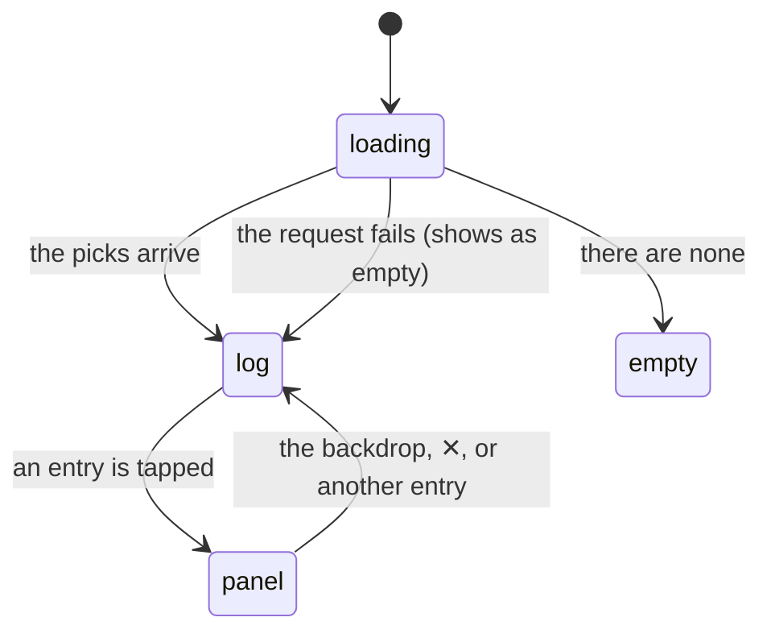

# The listening log

## Summary

The listening log at `/history` is the record of every album the user has [picked](../glossary.md), newest first, grouped under date headings. Each entry shows the sleeve, the title, the artist, where the pick came from, and the time of day. Tapping one opens [the album detail panel](../library/the-album-detail-panel.md) as a modal.

It is the only screen in Crate that looks backwards, and the only one that is purely a report: nothing on it can be edited, removed, or re-ordered, and the one thing it can do — open the panel — is stripped of every control that writes. It exists to answer "what have I actually been listening to", which is the question the whole product is built around.

Three things about it are worth knowing before reading further. It shows **only the hundred most recent picks**, with no paging and nothing to say that anything is missing. The line under each entry that should say which [crate](../glossary.md) the pick came from shows the crate's **machine-generated id in upper case** instead, for every pick made since crates replaced the old fixed modes. And **playing an album never puts it here** — only picking one from the crate wall does, so a user who plays from the library screen, the listening log itself, or the Spotify app builds no log at all. See [picking a record](../crates/picking-a-record.md).

The log is reached from View History in the profile menu, which appears in the header of the crate wall, the library, and the log itself. It is not in the [bottom navigation](../foundations/navigation-and-loading.md), and there is no way back except the bottom navigation or the browser's back button.

## The simple case

The user taps their profile circle on the crate wall and chooses View History. The screen reads LISTENING LOG. Five skeleton rows flash and are replaced by a list.

At the top, a small tab reading **TODAY** with a hairline running to the right and `3 RECORDS` at the end. Under it, three entries: a 48 px sleeve, `Bitches Brew`, `Miles Davis`, and a third line reading `CRATE_SEED_1_481920` — then `4:12 PM` at the right edge. Below that, a **YESTERDAY** tab with seven records, then **SATURDAY**, then **Mar 3**.

They tap the Miles Davis entry. A panel slides up from the bottom of the screen over a dark backdrop, showing the sleeve, the album's genres and year, its tracks, and PLAYS `×4` — but no ★ FAVORITE, no REMOVE, and no SEND TO FRIEND. They tap a track; it starts playing. They tap the backdrop and the panel closes.

## The interaction, event by event

There is no state on this screen that the user can change. Every arrow above is either a load or a panel opening.

### Arrive

The log is reached from the profile menu's View History, or by typing `/history`. On arrival it needs the pick history, which the [session cache](../foundations/navigation-and-loading.md) may already hold: the crate wall loads the log as part of its own load, so arriving from the wall is instant and shows five skeleton rows only on a direct visit.

The most recent hundred picks are requested. Nothing else is: not the library, not the crate definitions, and — importantly — **not the per-record pick counts**, which belong to the crate wall's load. On a direct visit to `/history` the panel therefore shows PLAYS `—` and LAST PLAYED `—` for an album the log itself lists four times on screen.

Entries are grouped by a date label as they are read, in the order they arrive, so the groups run newest first with no gaps for days that have no picks. The label is:

| Age | Label |
| --- | --- |
| Less than 24 hours | `TODAY` |
| 24 to 48 hours | `YESTERDAY` |
| Under 7 days | the weekday name — `SATURDAY` |
| 7 days or more | month and day — `Mar 3` |

Each group's tab sticks to the top of the scroll under the header as the user scrolls through it, and carries a count on the right: `1 RECORD` or `N RECORDS`.

> Technical note: the label is computed from the elapsed time in whole 24-hour periods, not from the calendar. A pick made at 11 pm and looked at the following morning is less than 24 hours old and is labelled TODAY. So the TODAY group can contain last night's listening, and the boundary between every pair of groups drifts through the day.

### Leave untouched

There is nothing to leave untouched. Reading the log writes nothing, opening the panel writes nothing, and leaving the screen writes nothing. There is no confirmation anywhere and no state to lose: nothing on this screen is remembered, but nothing on it can be changed either.

Scrolling and the open panel are both discarded on leaving, so coming back returns to the top of the list.

### First change

The only thing the user can do is tap an entry, which opens the panel. That commits to nothing.

The panel it opens is [the album detail panel](../library/the-album-detail-panel.md) with every writing control removed:

| Control | On the log |
| --- | --- |
| ▶ PLAY ON SPOTIFY | Present, and **records no pick** — the log does not hand the panel a play handler. |
| A track in the list | Present, plays, and records no pick. |
| ★ FAVORITE | Never shown, even for a record that is a recommendation. |
| REMOVE | Never shown. |
| SEND TO FRIEND | Never shown. |
| MORE BY this artist | Present, with its own ★ and ◈ buttons — which **do** write, and are the only way to add a record from this screen. |

So the log is read-only about the entries it lists and not about the artist's other albums, which is inconsistent and easy to miss.

### While working

There is no "while working" on this screen in the sense the other documents use it. What changes as the user reads:

- The sticky date tab swaps as each group scrolls past.
- Sleeves load lazily as they come into view, so a long log fills in as it is scrolled.
- Tapping a second entry while the panel is open is not possible; the backdrop covers the list, so the first tap closes the panel.

The list is never re-fetched. A pick made in another tab, or made in this tab after the log was first loaded, does not appear. Because the crate wall loads the log on its first visit and the log is never reloaded within a session, **picks made after that first load are invisible until the page is reloaded** — including a pick made thirty seconds ago on the crate wall.

### Commit

Nothing on this screen commits anything about the entries. The only writes reachable from it are the ★ and ◈ buttons under MORE BY in the panel, which file a new record into the library, and — indirectly — playback, which changes what is coming out of the speakers and leaves no trace in Crate.

Picks cannot be deleted here or anywhere else. The only way an entry leaves the log is by removing the record itself from [the library](../library/the-library-shelf.md), which deletes every pick of that album at once and silently. See [the data model](../foundations/data-model.md).

## Modifiers

| Modifier | Set on arrival | Changed while working |
| --- | --- | --- |
| Spotify account state | No effect on the log itself: the entries are Crate's own records, and the panel's tracks and genres are fetched with Crate's own Spotify credentials, so an email-only account sees a complete log and a complete panel. Only playing from the panel needs a linked account, and Premium only for the in-tab player. See [account and session](../foundations/account-and-session.md). | Cannot change without signing in again. |
| Playback state | The page's bottom padding grows when the player bar is showing so the last entry is not hidden behind it. A track playing from Crate's own in-tab player is highlighted green in the panel's track list. | Starting playback from the panel makes the player bar appear. The log's entries do not change, and nothing marks the album that is currently playing. |
| Library state | An account with no picks shows a vinyl disc, `EMPTY`, and START PICKING RECORDS TO BUILD YOUR LOG. A record removed from the library takes its entries with it, so the log can shrink without anything happening on this screen. | Removing a record elsewhere does not remove its entries from this screen until a reload. Filing a record from the panel's MORE BY list does not add an entry, because filing is not picking. |
| Viewport | The panel is a bottom sheet on a narrow screen and a centered modal from 640 px up. The list itself is a single column at every width, centered and capped. | No effect. |
| Crate and config settings | Decides what the third line of each entry says, badly. A pick made from a crate stores that crate's id, and the log has friendly names only for the four modes that existed before crates, so every recent pick shows a raw id. Renaming or deleting the crate changes nothing, because the name was never stored. | Nothing on this screen reads a live crate definition, so renaming a crate in another tab has no effect either way. |

## Cancel and interrupt

| Event | Before the first change | While working |
| --- | --- | --- |
| Escape, Cancel, Close, or a tap on the backdrop | Nothing to cancel. **Escape does nothing** on this screen. | With the panel open, a tap on the backdrop closes it and so does its ✕. Escape still does nothing — no modal a user can open in Crate responds to it, so every one of them needs a pointer or a tab to the ✕. |
| Navigating inside the app: the bottom nav, another route, or a second panel or modal | Free. Nothing is lost. | The panel and the scroll position are discarded. The profile menu can be opened over the list but not over the panel. |
| Browser back or forward | Returns to the previous route, which is usually the screen the profile menu was opened from. | Back does **not** close the panel — it is not a route — so it leaves the screen with the panel open, and coming forward again gives a fresh log with no panel. |
| Reload, or the tab is closed | Nothing is lost. | Nothing is lost, and the reload is the only way to see picks made since the log was first loaded. |
| Network lost, or the request fails or times out | A failed load shows the **empty state** — the vinyl disc and START PICKING RECORDS TO BUILD YOUR LOG — because the failure leaves the list empty and there is no error state. A user whose log failed to load is told they have never picked anything. Nothing retries while they stay on the screen; leaving and coming back does. See [failed requests and offline](../cross-cutting/failed-requests-and-offline.md). | The panel's own details request failing leaves the panel with no tracks, no genres, and no year, and says nothing. |
| The session expires, or Spotify rejects the token | The load fails, and the screen claims the log is empty. The user is not signed out and not told why. | The panel opens from data already in hand and shows what it has; its details request fails silently. |
| The same account in a second tab, or the library changed elsewhere | The log is as fresh as the moment the session cache first loaded it, which may have been on the crate wall minutes or hours earlier. | Nothing is noticed. Picks made in the other tab are absent; records deleted in the other tab still have entries here, and tapping one opens a panel for a record that no longer exists. See [stale data and second tabs](../cross-cutting/stale-data-and-second-tabs.md). |
| The album in hand is deleted, or Spotify no longer returns it | An entry whose record was deleted before the log was loaded is not in the log at all — its pick went with the record. | An entry whose record was deleted after the log loaded stays on screen and opens a panel; the panel's Spotify request still succeeds, so it looks entirely normal, and its ★ and ◈ buttons under MORE BY still work. An album Spotify has withdrawn opens a panel with no tracks. |
| Playback moves to another device, or the tab is backgrounded | No effect. | The green track highlight only ever follows Crate's own in-tab player, so playback moving elsewhere leaves the panel showing nothing playing. A backgrounded tab keeps its list; nothing polls. |

## Interactions with other systems

**Authentication and account state.** The log needs only a signed-in account. Everything it shows is Crate's own data, and the panel's extra detail comes from Crate's Spotify credentials rather than the user's, so the screen is complete for an email-only account. Sign Out is one of the two items in the profile menu in this screen's own header.

**The session cache and freshness.** The log is one of the three things the crate wall loads on its first visit, and it is loaded once per session and never again. Nothing on this screen — and nothing anywhere else — updates it after a pick, so the log is reliably behind by however many picks have been made since the session began. This is the screen where staleness is most visible, because the user usually arrives having just picked something.

**Pick history.** This screen *is* the pick history, read directly, with one caveat: it reads the hundred most recent rows, while the per-record counts the panel shows come from a different query that the crate wall runs. The two can disagree — a direct visit shows a full log and `—` for every count.

**Playback.** Playing from this screen works exactly as it does everywhere else and records nothing, so listening from the log does not extend the log. The [selection engine](../foundations/selection-engine.md)'s cooldown therefore does not move for an album the user played here, and it can be drawn again the same day.

**Configuration and crate definitions.** Read only accidentally: the entry's third line is a crate id that the screen cannot resolve to a name, because names are not stored on picks and the screen does not look them up.

**Offline and failed requests.** A failed load is indistinguishable from an empty log. Nothing retries, nothing is queued, and there is no error message anywhere on the screen.

**Multiple tabs and the Spotify app.** Nothing is shared or watched. The Spotify app is irrelevant except as somewhere the panel's play button can end up.

**Toasts, badges, and empty states.** No toasts and no badges. One empty state, which is also the failure state and also what a truncated log would look like if the truncation went the other way. The date tabs and the `N RECORDS` counts are the only summary information on the screen.

**Viewport and accessibility.** The entries are list items with a click handler rather than buttons, so the log **cannot be operated by keyboard at all**: no entry is focusable, and the panel cannot be opened without a pointer. Inside the panel, focus is not moved in and not trapped. The date tabs are decorative text rather than headings, so the grouping is invisible to a screen reader, and the time at the right edge is unlabelled.

## Edge cases

- **The crate is shown as a raw id.** `CRATE_SEED_1_481920` where a name belongs, for every pick made since crates replaced the old modes. Only the four legacy mode values — favorites, discover, for_right_now, surprise — have friendly labels, so a log with any history at all is a mix of readable names for old picks and machine ids for new ones.
- **The context suffix is dead.** The third line can read `Right Now · COOKING`, but nothing has written a context onto a pick since crates arrived, so that form only ever appears on legacy entries.
- **Only the hundred most recent picks are shown.** There is no paging, no LOAD MORE, and nothing that says the log is truncated. A user who picks daily loses sight of anything older within a few months.
- **A failed load looks like an empty log,** and tells the user to start picking records.
- **The log does not include what the user listened to** — only what they picked from the crate wall. Playing from the library screen, from the log itself, or from the Spotify app records nothing. The screen's name promises more than it holds.
- **Every track tap on the crate wall is another entry.** Playing an album by tapping four of its tracks puts four entries in the log at four times, all for the same album. See [picking a record](../crates/picking-a-record.md).
- **PLAYS and LAST PLAYED read `—` on a direct visit** to `/history`, because the counts belong to the crate wall's load, while the log on screen plainly shows the album several times.
- **TODAY can mean last night.** The grouping counts 24-hour periods rather than calendar days, so the label drifts through the day and a group can straddle midnight.
- **Two picks of the same album in one day are two entries** with two times, which is correct and makes the log look longer than the number of albums in it.
- **An entry whose record was deleted after the log loaded still opens,** and its MORE BY buttons still file records, so a screen showing an album that no longer exists can be used to add one.
- **The log is never refreshed within a session,** so it is always missing the picks made since it loaded — usually including the one the user just made.
- **The panel on this screen is the only one with no writing controls of its own,** and yet its MORE BY list writes freely. Nothing explains the difference.
- **Nothing can be deleted.** There is no way to remove a mistaken pick — a mis-tapped track, a play recorded for an album the user skipped after ten seconds — except by deleting the record and losing everything else about it.

## Open questions and verification

- The 24-hour grouping drift is read from the arithmetic and has not been observed. The clean test is a pick made late at night looked at the next morning.
- Whether the sticky date tab positions correctly under the 56 px header at every width has not been checked; the offset is hard-coded.
- What the log does with a legacy pick whose mode is neither a crate id nor one of the four known modes is unverified. It would be shown upper-cased, which is the same treatment a crate id gets.
- Whether a hundred entries is enough to require scrolling performance work has not been measured; the list is not virtualized and each entry carries an image.
- Whether the panel's details request for a deleted record really succeeds has not been tested; it is keyed on the Spotify id, which does not depend on Crate's record still existing.
- The complete absence of keyboard access to the entries should be confirmed by trying to tab to one. The entries are list items with click handlers and no tab index.
- The hundred-pick limit is worth confirming against an account with more than a hundred picks, to see whether anything at all indicates the cut.

Verified against Crate commit `8301127`.
