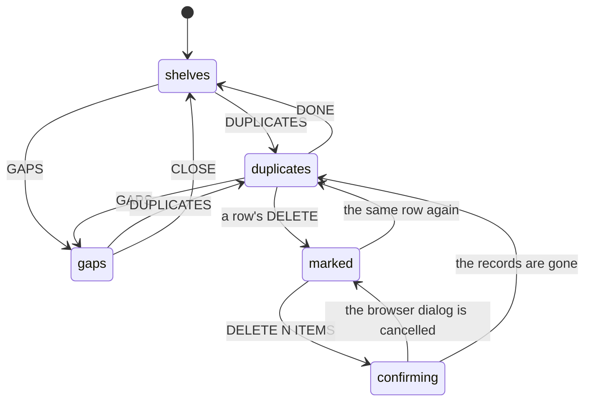

# Duplicates and gaps

## Summary

Two buttons in [the library](the-library-shelf.md)'s header replace the shelves with an audit of the collection. **DUPLICATES** looks for the same album filed twice under different Spotify ids — the standard edition and the deluxe, the original and the remaster — and lets the user delete whichever copies they do not want, several at a time. **GAPS** answers the opposite question: which [records](../glossary.md) could never be drawn by any [crate](../glossary.md) the user has, and which genres are missing from their crates entirely.

They are the only two places in Crate that reason about the collection as a whole rather than showing part of it, and the only two that offer a bulk action. Both are computed in the browser from data already loaded, so both are instant and neither asks the server anything until the user deletes.

Both are also the two features most damaged by the library screen not loading everything it displays. DUPLICATES shows a play count for each copy — the most useful thing for deciding which to keep — and it reads zero for every record unless the [crate wall](../crates/the-crate-wall.md) was visited first. GAPS reads the [crate definitions](../glossary.md), which the library screen never loads at all, so opening it on a fresh visit to `/library` reports that **every album in the library is in no crate**.

This document owns both panels. What a [filter rule](../glossary.md) means, and therefore what "could be drawn" means, belongs to [the selection engine](../foundations/selection-engine.md).

## The simple case

The user suspects they have added a few albums twice. They tap DUPLICATES. The shelves vanish and are replaced by a list: `3 DUPLICATE GROUPS`, each in a box headed ◇ POSSIBLE DUPLICATE.

The first box holds two rows. Both read IN RAINBOWS; one says `Radiohead · 2007 · ★ FAV · 10 tracks · 4 plays` and the other `Radiohead · 2016 · ◈ REC · 10 tracks · 0 plays`. They tap DELETE on the second; it turns red and reads ✕ DELETE. They do the same in the other two boxes, and the button pinned to the bottom of the screen now reads DELETE 3 ITEMS.

They press it. The browser asks "Delete 3 albums? This can't be undone." They confirm. The button reads DELETING… for a moment, then the three rows are gone and so are two of the three boxes — the third still has two copies in it, because one of the deletions failed and the row says so in red.

## The interaction, event by event

### Arrive

Both panels are reached only from the library's header, and each is a toggle: pressing DUPLICATES a second time goes back to the shelves, and pressing GAPS while DUPLICATES is open swaps to GAPS. They cannot both be open. Opening either clears the selected spine, so an open [detail panel](the-album-detail-panel.md) is closed.

Neither fetches anything. DUPLICATES groups the records already in the browser; GAPS runs every crate's filter rules over them. Both appear instantly and neither has a loading state.

Both work on the **whole** library — both lists, every record — and ignore the library's search box, its LIST buttons, and its filter rules. A user who has narrowed the shelves to eleven albums and then presses DUPLICATES is shown duplicates across all four hundred.

DUPLICATES groups in two ways, and only one of them can ever happen:

- **◆ EXACT DUPLICATE**, two records with the same Spotify id. The database will not store two records with the same Spotify id for one user, so **this group can never appear**. The heading, its colour, and the code that finds it are unreachable.
- **◇ POSSIBLE DUPLICATE**, two or more records with different Spotify ids whose titles and artists match once edition wording is stripped out. "(Deluxe Edition)", "(Remastered)", "(Expanded)", "(20th Anniversary)", "(Bonus Track Version)", and a trailing "- 2011 Remaster" are removed, then punctuation is dropped and case and spacing are flattened before comparing.

GAPS asks whether each record is in the pool of at least one crate. A crate counts only if it draws from the library and its [strategy](../glossary.md) is WEIGHTED, RANDOM, or AI · LIBRARY. AI · NEW and HYBRID crates never count, because what they contain is not decided by rules, and a From Friends crate never counts because it has no library pool at all.

### Leave untouched

Both panels are read-only until a delete is confirmed. Opening either, reading it, and pressing DONE or CLOSE writes nothing and leaves the shelves exactly as they were, with the same search, sort, group, and filter rules — those live on the library screen, not on the panel.

Nothing about an audit is remembered. Which rows were marked for deletion is discarded when the panel is closed.

### First change

In DUPLICATES the first change is marking a row: its DELETE button turns red and reads ✕ DELETE, and the pinned footer button counts up. Marking commits to nothing — the same button unmarks it — and every row in a group can be marked, including all of them.

GAPS has no changes to make. Its only control is CLOSE. It is a report.

### While working

Marks accumulate across every group; the footer button reads DELETE 1 ITEM or DELETE 7 ITEMS and is dead until at least one row is marked. Every row's DELETE button is disabled while a deletion is running.

Pressing the footer button raises **the browser's own confirmation dialog** — "Delete 3 albums? This can't be undone." — which is the only native dialog anywhere in Crate and the only place the product asks the user to confirm anything twice. Cancelling it leaves every mark in place and nothing happens.

Confirming sends one delete request per marked record, all at once, and waits for all of them. The footer reads DELETING…. When they have all answered:

- Records that were deleted disappear from the panel and from the library's shelves at once. A group left with only one member disappears with them.
- Records whose delete failed stay in the panel, stay marked, and gain a small red line under the title reading "delete failed — try again". The footer button comes back with those still counted, so pressing it again retries exactly those.

The panel recomputes from what is left, so deleting is visibly progressive: the list shrinks as the user works through it.

### Commit

The only write is the delete, and it is the most destructive action in the product: it removes the record and every [pick](../glossary.md) that referenced it. There is no undo and no soft delete. Re-adding the album gives a fresh record with no history, which is what makes the play count in each row the thing to read before marking.

GAPS commits nothing, ever.

## Modifiers

| Modifier | Set on arrival | Changed while working |
| --- | --- | --- |
| Spotify account state | No effect. Both panels work entirely from Crate's own records, and neither talks to Spotify. A row's sleeve and its Spotify link come from what was stored when the record was filed. | Cannot change without signing in again. |
| Playback state | No effect on the panels. The page's bottom padding grows for the player bar, which matters here because DUPLICATES' delete button is pinned to the bottom of the scroll. See [playback](../foundations/playback.md). | The pinned button shifts as the bar appears and disappears. |
| Library state | Decides the whole content. An empty library shows `NO DUPLICATES FOUND` and, in GAPS, `UNCOVERED ALBUMS (0)` with "every album lives in at least one crate" — technically true and misleading. A library with no duplicates shows only the header line and no delete button at all. | Deleting the last member of a group removes the group; deleting enough records switches DUPLICATES to `NO DUPLICATES FOUND`, still with a DONE button. |
| Viewport | Both panels are a single column of rows at any width, capped at 896 px in DUPLICATES. Nothing reflows. | No effect. |
| Crate and config settings | Decides GAPS entirely, and has no effect on DUPLICATES. A library whose crates are all AI · NEW or HYBRID reports every album as a gap even though every album could turn up in them. A crate with no filter rules at all covers the whole library, so one such crate makes GAPS permanently empty. | Nothing in either panel can change a crate. A crate saved in another tab is not noticed. |

## Cancel and interrupt

| Event | Before the first change | While working |
| --- | --- | --- |
| Escape, Cancel, Close, or a tap on the backdrop | DONE closes DUPLICATES and CLOSE closes GAPS; pressing the header button again does the same. There is no backdrop — the panels replace the shelves rather than floating over them — and **Escape does nothing**. | Escape does dismiss the browser's confirmation dialog, which is the one keyboard cancel that works anywhere on this screen. Closing the panel with marks outstanding discards them silently. |
| Navigating inside the app: the bottom nav, another route, or a second panel or modal | Free. Coming back to the library reopens on the shelves, not on the panel. | Marks are lost. A delete already confirmed completes on the server regardless of where the user goes. |
| Browser back or forward | Nothing to lose. The panels are not routes, so back leaves the library entirely rather than closing the panel. | The same, and a confirmed delete still completes. |
| Reload, or the tab is closed | Nothing to lose. | Marks are lost. Deletes already sent complete; deletes that had not been sent do not happen. A reload mid-delete can leave the user unsure which copies survived, and the only way to find out is to open the panel again. |
| Network lost, or the request fails or times out | Neither panel needs the network to open, so both work fully offline on data already loaded. | Every failed delete is reported, individually, on its own row — which makes this the **only place in Crate that tells the user a write failed**. Everywhere else the failure goes to the browser console. See [failed requests and offline](../cross-cutting/failed-requests-and-offline.md). |
| The session expires, or Spotify rejects the token | The panels open normally, because they need neither. | Every delete fails and every row says so. Nothing suggests signing in again. |
| The same account in a second tab, or the library changed elsewhere | The panels read this tab's copy of the library, so a record added or removed elsewhere is not reflected. GAPS additionally reads this tab's crate definitions, which may be empty. | Deleting a record another tab already deleted fails and is reported as a failure to retry, which it will never succeed at. See [stale data and second tabs](../cross-cutting/stale-data-and-second-tabs.md). |
| The album in hand is deleted, or Spotify no longer returns it | Not applicable — the panels are about Crate's records, not Spotify's catalogue. A record whose album Spotify has withdrawn looks like any other. | A record deleted from the [detail panel](the-album-detail-panel.md) is already gone from the library's copy, so it never appears here. |
| Playback moves to another device, or the tab is backgrounded | No effect. | No effect on the deletes. Deleting the record that is currently playing does not stop the music. |

## Interactions with other systems

**Authentication and account state.** Both panels need only a signed-in account, and neither touches Spotify. Deleting needs the session to be valid, and is the one action here that can fail because it is not. See [account and session](../foundations/account-and-session.md).

**The session cache and freshness.** Both read the [session cache](../foundations/navigation-and-loading.md) and nothing else, which is what makes them fast and what makes them wrong on a fresh `/library` visit: the pick history and the crate definitions are loaded by the crate wall, not the library. Deleting updates the cache's two lists directly, without re-fetching.

**Pick history.** DUPLICATES displays it, as `N plays` in each row's meta line, and it is the field that decides which copy to keep. On a fresh visit to `/library` every row reads `0 plays` and the user has no basis for choosing — and if they choose wrong, the picks are deleted with the record. GAPS uses the pick history only because filter rules can refer to plays and last-played.

**Playback.** Nothing here plays. The album title in a DUPLICATES row is a link that opens Spotify's website in a new tab, which is the only way to hear either copy before choosing.

**Configuration and crate definitions.** GAPS is entirely a function of them, and reads them without loading them. Nothing here writes a definition; [SAVE AS CRATE](saving-a-crate-from-the-library.md) is the neighbouring button that does.

**Offline and failed requests.** These panels are the exception to Crate's silent-failure pattern: a failed delete is named, in place, with an instruction. Everything else about them cannot fail, because nothing else is fetched.

**Multiple tabs and the Spotify app.** Each tab audits its own copy of the library against its own copy of the crate definitions, so two tabs can give different answers, and the tab that was opened on `/library` gives the worse one.

**Toasts, badges, and empty states.** No toasts. DUPLICATES' badges are the ◆/◇ group headings, the amber border on a possible-duplicate box, the red ✕ DELETE mark, and the red "delete failed — try again" line. GAPS' badges are the ★ or ◈ at the end of each row and the orange genre pills. Three empty states: `NO DUPLICATES FOUND`, `UNCOVERED ALBUMS (0)` with "every album lives in at least one crate", and the absence of the UNCOVERED GENRES section, which is simply not drawn when there are none rather than saying so.

**Viewport and accessibility.** Both panels are made of real buttons and real links, so unlike the shelves they are keyboard-reachable. A DUPLICATES row is a link wrapping the sleeve, the title, and the meta line, with the delete button beside it — so a keyboard user tabbing through reaches "open in Spotify" and "delete" alternately, with nothing distinguishing one row's pair from the next. The delete button's label is `DELETE` or `✕ DELETE`, which does not say what it would delete. The browser's confirmation dialog is the one thing here that is announced properly, because it is the browser's.

## Edge cases

- **The ◆ EXACT DUPLICATE group is unreachable.** The database forbids two records with the same Spotify id for one user, so only ◇ POSSIBLE DUPLICATE can ever be shown. Half the panel's vocabulary is dead.
- **GAPS on a fresh `/library` visit reports the entire library as uncovered,** because the crate definitions were never loaded. The report is confident, detailed, and completely wrong; visiting the crate wall first fixes it.
- **A crate with no filter rules covers everything,** so a single such crate makes GAPS permanently report no gaps whatever the user's other crates look like.
- **AI · NEW and HYBRID crates cover nothing.** A user whose crates are all AI is told every album is in no crate.
- **"Covered" means "could be drawn", not "has been drawn".** A crate with a count of 1 over a pool of four hundred covers all four hundred, so GAPS can report perfect coverage of a library the user will realistically never hear.
- **The uncovered-genres list depends on stored genres,** which bulk-imported records do not have. A library built by importing has no genres, so the UNCOVERED GENRES section never appears — not because coverage is good but because there is nothing to measure. See [the data model](../foundations/data-model.md).
- **A genre counts as covered if any one album carrying it is covered,** so a crate that draws a single jazz record covers jazz however much jazz is left out.
- **Both audits ignore the library's own filtering,** so the DUPLICATES count and the shelf count can disagree wildly and nothing explains why.
- **The play count that decides which copy to keep reads zero when it is unknown,** and there is nothing to distinguish "never played" from "not loaded".
- **Tapping a duplicate row navigates to Spotify.** The whole row is a link, and the delete button is the only part of it that is not, so a misplaced tap on a delete-confirmation screen opens a new tab.
- **Marking every copy in a group and confirming deletes the album entirely.** Nothing prevents it and nothing warns that the group would be emptied rather than de-duplicated.
- **A partial failure leaves the failed rows marked,** so pressing the button again retries only them — which is right, but the count in the button silently changes between the two presses.
- **Edition wording is matched by a fixed list of words.** "(Super Deluxe)" is stripped because it contains "deluxe"; "(Mono Version)", "(Japanese Edition)", and "(Radio Edit)" are not, so those pairs are never offered as duplicates.
- **A remaster whose artist credit differs by a featured artist is not a duplicate,** because artists are compared after flattening punctuation but not after removing anything.

## Open questions and verification

- Whether the ◆ EXACT DUPLICATE branch is genuinely unreachable has been read from the database's unique constraint over the user, the Spotify id, and the media type, but not tested by trying to create one.
- The wording of the browser confirmation dialog is taken from the code; how it renders differs between browsers and has not been observed.
- Whether a failed delete's red line is noticeable in a long list has not been judged. The list is not scrolled to the failure.
- How the panel behaves when many deletes are confirmed at once — whether the requests are rate-limited or all land — has not been tested. They are all sent together with no batching.
- Whether GAPS is fast on a large library has not been measured; it runs every crate's rules over every record on every render of the panel.
- The exact set of edition words stripped from a title has been read from the code but not exercised against real Spotify titles, so how many genuine duplicate pairs it catches is unknown.
- Whether the pinned delete button is reachable behind the player bar on a short viewport has not been checked.

Verified against Crate commit `8301127`.
