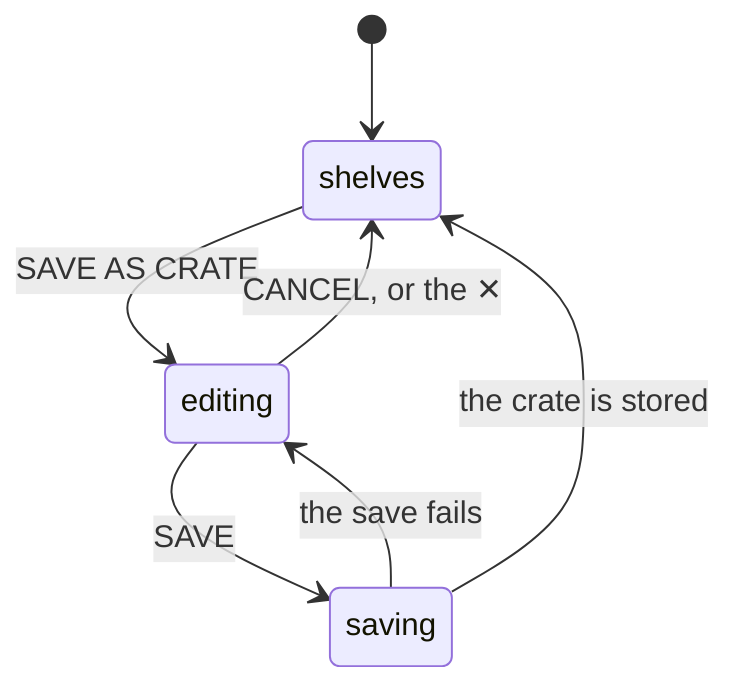

# Saving a crate from the library

## Summary

**SAVE AS CRATE** is the third button in [the library](the-library-shelf.md)'s header. It takes the [filter rules](../glossary.md) the user has built with ADVANCED FILTERS, adds a rule for whichever list is selected, and opens [the crate editor](../crates/the-crate-editor.md) on a new [crate](../glossary.md) already carrying them. The user names it, adjusts anything they like, and saves — and the crate appears on [the crate wall](../crates/the-crate-wall.md).

It is the one place in Crate where browsing turns into a standing rule. Everywhere else, arranging the shelves is a throwaway act: nothing about a search, a sort, or a set of rules survives leaving the screen. This button is the exception, and it is the reason the library's filter rules and the crate editor's filter rules are the same thing rather than two similar things.

Two facts shape the whole feature. First, **not everything the user did is captured**: the rules and the list selection are, but the search box, the sort order, and the grouping are not, and nothing says so. Second, and much worse, **saving a crate here can destroy every crate the user has**. The library screen never loads the crate definitions, and saving writes the full set — so on a visit that did not go through the crate wall first, the full set is one crate.

## The simple case

The user is on the library screen, having come from the crate wall. They open ADVANCED FILTERS and build two rules: genre is jazz, released before 1970. The shelves narrow to nineteen spines. They tap LIST → ★ FAV, and it narrows again to eleven.

They tap SAVE AS CRATE. The crate editor opens over the screen, with the name field empty and three rules already in it: `genre is jazz`, `released before 1970`, and `list is favorite`, joined by AND. Everything else is at its default — four records, WEIGHTED, the standard sliders.

They type `Early Jazz` and press SAVE. The button reads SAVING… and the editor closes. They tap CRATES in the bottom nav, and EARLY JAZZ is at the bottom of the wall — empty, until they tap its ♻ and four of the eleven albums appear.

## The interaction, event by event

### Arrive

SAVE AS CRATE is always present in the library's header, beside DUPLICATES and GAPS, and is always pressable — with no rules, no filter, and an empty library alike. Pressing it opens the crate editor as a modal over the shelves; the shelves stay behind it, with the spines and the selected album exactly as they were.

The new crate arrives already carrying:

- **The filter rules**, verbatim, in the order they were built, with their AND/OR setting.
- **A rule for the selected list**, appended as `list is favorite` or `list is recommendation`, when LIST is not on ALL. If a rule saying exactly that is already in the list it is not added twice, and when LIST is on ALL nothing is added.
- **A position** at the end of the wall, and everything else at the editor's defaults: no name, four records, WEIGHTED, the standard [weighting](../foundations/selection-engine.md) numbers, and the library as its source.

What it does **not** carry is the search box, the sort order, and the grouping. A user who typed "coltrane", sorted by PLAYS, and grouped by DECADE gets none of those three: the crate they save draws from everything the rules match, in the engine's own order. The rules are visible in the editor and can be checked; the three that were dropped are not mentioned anywhere.

> Technical note: the list selection is folded in by appending a `list is` rule to the flat rule list. When the rules are joined by OR, that appended rule becomes another OR term rather than a constraint on the others, so an OR crate saved with a list filter matches more than the shelves did. The source calls this a documented limitation.

### Leave untouched

Opening the editor and closing it again writes nothing, changes no crate, and leaves the library's rules, search, sort, group, and selected album exactly as they were. The editor is a modal over the screen, not a route, so nothing about the library is unmounted while it is open.

Nothing about a discarded crate is remembered. Pressing SAVE AS CRATE again builds a fresh one from whatever the rules are at that moment.

### First change

The first change happens inside the editor — a name typed, a slider moved, a rule added or deleted. From here on the behavior is [the crate editor](../crates/the-crate-editor.md)'s, and this document does not repeat it. Two differences from the wall's own editor are worth naming:

- There is **no DELETE button**, because the crate does not exist yet.
- Changing a rule here changes only the crate being saved. The library's own rules, and the shelves behind the modal, do not move — so the shelves stop being a preview of what the crate will contain the moment the user edits a rule in the editor.

### While working

The editor is modal: the shelves cannot be touched, the header buttons cannot be pressed, and the bottom nav is behind it. The [player bar](../player/the-player-bar.md) keeps playing and can still be reached.

Pressing SAVE disables the button and changes it to SAVING… while the write is in flight. A crate saved with the name field empty is stored as **Untitled Crate** rather than refused.

### Commit

Saving writes **the whole set of crate definitions**, not just the new one, because they all live in a single setting — see [the data model](../foundations/data-model.md). What is written is this tab's copy of the definitions with the new crate appended.

On success the editor closes and the definitions in this tab are replaced by what the server stored. The crate wall is not refreshed, so:

- The new crate appears on the wall, at the bottom, **empty**, and stays empty until the user taps its ♻ or reloads the page. A crate saved from the wall's own editor is filled immediately; one saved from the library is not.
- The library screen shows no confirmation of any kind. The modal closes, and nothing on the screen has changed. The only way to see that anything happened is to visit the wall.

On failure the editor stays open with everything the user typed still in it, the button comes back, and **nothing says the save failed** — it goes to the browser console. Pressing SAVE again retries.

## Modifiers

| Modifier | Set on arrival | Changed while working |
| --- | --- | --- |
| Spotify account state | No effect. A crate is Crate's own object; nothing here touches Spotify. An unlinked account can build and save crates freely, and only playing what they produce needs Spotify. | Cannot change without signing in again. |
| Playback state | No effect. Music keeps playing through the editor and through the save. | The player bar is reachable above the modal; nothing about playback affects the save. |
| Library state | Decides what the rules are worth, not whether they can be saved. An empty library saves a crate that matches nothing. The genre choices offered in ADVANCED FILTERS come from the genres actually stored on the user's records, so a bulk-imported library offers none — see [the data model](../foundations/data-model.md). | Records added or removed elsewhere do not change the crate being saved; the rules are text, not a snapshot. |
| Viewport | The editor is a centered modal at any width, scrolling internally when it does not fit. On a phone it occupies nearly the whole screen. | No effect. |
| Crate and config settings | Decides how much damage a save can do. **The library screen never loads the crate definitions**, so on a visit that did not pass through the crate wall this tab believes the user has none — and saving stores exactly one crate, deleting the rest. Having visited the wall in this session, the save appends correctly. | Nothing here can change the existing definitions except by overwriting them. A crate saved in another tab is not seen, and is overwritten by the next save in this one. |

## Cancel and interrupt

| Event | Before the first change | While working |
| --- | --- | --- |
| Escape, Cancel, Close, or a tap on the backdrop | CANCEL and the ✕ both close the editor and discard the crate. **Escape does nothing**, and a tap on the backdrop does nothing — the modal can only be dismissed by its own two controls. | The same, and everything typed is discarded without a warning. There is no "discard changes?" prompt anywhere in Crate. |
| Navigating inside the app: the bottom nav, another route, or a second panel or modal | Nothing to lose. | The bottom nav is behind the modal and cannot be reached, so this is not directly possible; the editor must be closed first, which discards the crate. |
| Browser back or forward | Leaves the library entirely. The editor is not a route, so back does not close it. | Discards the crate silently, because the whole screen unmounts. A save already sent completes on the server. |
| Reload, or the tab is closed | Nothing to lose. | The crate is lost unless the write had already been sent and accepted. A reload immediately after pressing SAVE can leave the crate stored but unseen. |
| Network lost, or the request fails or times out | The editor opens without the network — everything it needs is already in the browser. | SAVE fails silently: the button comes back, the editor stays open, and the console has the error. Pressing it again is the only recovery. See [failed requests and offline](../cross-cutting/failed-requests-and-offline.md). |
| The session expires, or Spotify rejects the token | The editor opens; nothing it needs is authenticated. | The save fails, silently, exactly like a lost network. Nothing suggests signing in again. |
| The same account in a second tab, or the library changed elsewhere | Whatever this tab believes the definitions to be is what will be written. Another tab's new crate is not in that belief. | The save overwrites the other tab's work without noticing or warning. Two tabs each saving a crate leaves one of them. See [stale data and second tabs](../cross-cutting/stale-data-and-second-tabs.md). |
| The album in hand is deleted, or Spotify no longer returns it | Not applicable — nothing here is about a particular album. A crate is a rule over whatever the library holds when it is drawn. | The same. Deleting a record while the editor is open changes nothing about the crate. |
| Playback moves to another device, or the tab is backgrounded | No effect. | No effect. A backgrounded tab's save completes normally. |

## Interactions with other systems

**Authentication and account state.** The save needs a valid session and nothing else; it fails silently without one. Nothing here is affected by whether Spotify is linked. See [account and session](../foundations/account-and-session.md).

**The session cache and freshness.** This feature is the clearest case of the [session cache](../foundations/navigation-and-loading.md) deciding correctness rather than speed. The library screen loads the two lists and stops; the crate definitions belong to the crate wall's load. Saving reads this tab's copy of the definitions and writes it back, so a copy that was never filled in is written back empty-plus-one.

**Pick history.** Not read here, and not needed: the rules that refer to plays and last-played are stored as rules and evaluated on the server when the crate is drawn. A crate saved from a `/library` visit with no pick data still works correctly on the wall.

**Playback.** Untouched throughout.

**Configuration and crate definitions.** This is a write to the crate definitions, and therefore a write to the single setting that holds all of them. It appends; it cannot edit or reorder anything existing. The saved crate's position is the number of definitions this tab knows about, which on a stale tab is 0 — so the crate arrives at the top of the wall rather than the bottom.

**Offline and failed requests.** Opening the editor works offline. Saving does not, and says nothing when it does not.

**Multiple tabs and the Spotify app.** The definitions are read-modify-write with no version check, so the last save wins wholesale. The Spotify app is irrelevant.

**Toasts, badges, and empty states.** No toast, no badge, no confirmation. Success and failure look identical from the library screen except that one closes the modal. The only visible consequence of a successful save is on another screen.

**Viewport and accessibility.** The button is a real button and reads `SAVE AS CRATE`, which is accurate. Inside the editor, focus is not moved into the modal when it opens and is not trapped there, so a keyboard user tabbing forward can reach the shelves behind it. Escape does not close it.

## Edge cases

- **Saving a crate after a direct visit to `/library` deletes every other crate.** The crate definitions are loaded only by the crate wall; the library's save writes its own copy plus the new crate. On a tab that opened on the library — from a bookmark, a reload on that route, or a link — that copy is empty, and thirteen definitions become one. There is no confirmation, no warning, and nothing on screen afterwards to suggest anything went wrong; the user finds out the next time they open the wall. This is the most damaging bug in the product.
- **The search box, the sort, and the grouping are silently dropped.** The rules and the list are carried over and the other three are not, so a crate saved while the shelves showed eleven albums can draw from four hundred. Nothing distinguishes what was captured from what was not.
- **An OR rule set plus a list filter matches more than the shelves.** The list rule joins the OR, so `genre is jazz OR released before 1970 OR list is favorite` includes every favorite regardless of genre or year. The source acknowledges this.
- **A crate saved with no name is stored as "Untitled Crate".** Nothing asks for a name and nothing shows the fallback before it happens.
- **A crate saved with no rules at all draws from the whole library,** which is a legitimate thing to want and indistinguishable from having forgotten to set the rules.
- **The new crate is empty on the wall until refreshed.** A crate saved from the wall's own editor fills immediately; one saved here does not, so the user's first sight of their new crate is an empty one.
- **A stale tab puts the new crate first, not last.** Its position is the number of definitions the tab knows about, so a tab that knows about none gives it position 0.
- **Nothing prevents duplicates.** Pressing SAVE AS CRATE twice with the same rules stores two identical crates with two names.
- **The genre rules a user can build depend on data a bulk-imported library does not have.** ADVANCED FILTERS offers only genres present on the user's records, so an imported library offers an empty genre list and every genre-based crate has to be typed elsewhere or not made at all.
- **A rule referring to a genre the library no longer has keeps working and matches nothing,** because rules are stored as text and never validated against the library.
- **The library's rules stay in place after saving.** The shelves are still filtered, which reads as though the crate were still being edited.

## Open questions and verification

- The crate-destroying overwrite has been read from the code — the library never calls the dashboard load, and the save writes `[...crateDefs, crate]` — but not reproduced by hand. It is the first thing a verification pass should attempt, on an account whose crates can be lost.
- Whether a crate saved from the library is visibly missing anything else the wall's editor would have set has not been checked field by field; the defaults come from the same helper.
- Whether the empty-on-arrival crate refreshes on its own after a while has not been observed. Nothing in the code suggests it does.
- How the editor behaves at a phone width with a long rule list — whether SAVE stays reachable — has not been checked.
- Whether a failed save leaves the tab's copy of the definitions consistent with the server is unverified. The copy is only replaced on success, so it should, but the failure path has not been exercised.
- The OR-plus-list behavior is described from the source's own comment and has not been observed on the wall.

Verified against Crate commit `8301127`.
