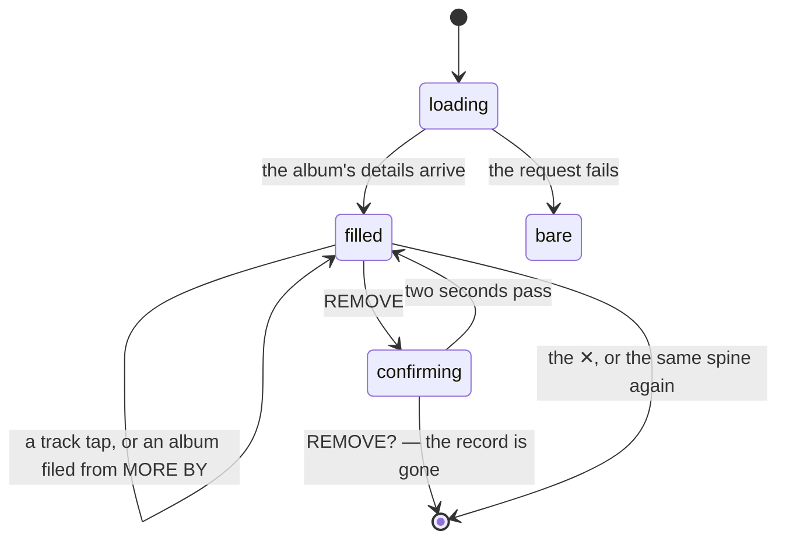

# The album detail panel

## Summary

Tapping a [spine](../glossary.md) anywhere in Crate opens the album detail panel: the sleeve, the title, the artist, when it was last played and how often, a green PLAY ON SPOTIFY button, the [list](../glossary.md) actions, the album's genres, its full track list, and a scrolling row of up to ten other albums by the same artist that can be filed with one tap.

It is the deepest single surface in the product and the only place an album is shown in full. It appears in three places with three slightly different sets of controls: under a shelf on the [crate wall](../crates/the-crate-wall.md), under a shelf in [the library](the-library-shelf.md), and inside a modal on [the listening log](../history/the-listening-log.md). The differences are not cosmetic — the same PLAY ON SPOTIFY button records a [pick](../glossary.md) on the crate wall and records nothing in the other two.

Almost everything in it is fetched live from Spotify when it opens and then kept for the life of the page in a cache that is never invalidated — including the genres, which are the album's artists' genres rather than the album's own. Those genres are shown here whether or not the record has any stored on it, so a bulk-imported record with no genres of its own still shows them in the panel while every genre [filter rule](../glossary.md) ignores it. See [the data model](../foundations/data-model.md).

This document owns the panel: what it shows, its five actions, and what each writes. The pick that PLAY ON SPOTIFY records belongs to [picking a record](../crates/picking-a-record.md); the routes it tries belong to [playback](../foundations/playback.md).

## The simple case

The user taps a spine on their FAVORITES shelf. The spine lifts and turns orange and the panel slides open under the shelf: a small sleeve, THE LOW END THEORY in cream capitals, A TRIBE CALLED QUEST under it, and two boxes reading LAST PLAYED `2w ago` and PLAYS `×4`.

Three grey pills pulse where the genres will be and five grey bars where the tracks will be. Half a second later the genres arrive — `hip hop`, `jazz rap`, `east coast hip hop` — then fourteen tracks with their numbers and durations, then a row of sleeves under MORE BY A TRIBE CALLED QUEST.

They press PLAY ON SPOTIFY. The music starts and the player bar appears at the foot of the screen. Track 1 turns green with a ▶ beside it. LAST PLAYED still reads `2w ago` and PLAYS still reads `×4`.

## The interaction, event by event

### Arrive

The panel opens the instant a spine is tapped, with everything Crate already knows drawn immediately: the sleeve, the title, the artist, the ◈ RECOMMENDATION line if it is one, and the two statistic boxes. Nothing about that first paint waits on the network.

Three regions are then filled by one request to Spotify — the genres, the tracks, and MORE BY — and all three show their own pulsing skeleton until it lands: three pills, five bars, four squares. The regions hold their height while loading so the panel does not jump when they fill.

That request is made once per album per page. A second, third, and tenth opening of the same album is instant and shows exactly what the first one showed, because the answer is kept in a cache keyed by the album's Spotify id that nothing ever clears or refreshes. See [navigation and loading](../foundations/navigation-and-loading.md).

The two statistic boxes are handed in by whichever screen opened the panel, from that screen's copy of the [pick](../glossary.md) history. LAST PLAYED reads `—`, Today, Yesterday, `3d ago`, `2w ago`, or `5mo ago`, and turns green when the album was played within the last seven days. PLAYS reads `×4`, or `—` when there are no picks. Neither is re-read while the panel is open.

Which controls appear depends on the host:

| Control | On the crate wall | In the library | On the listening log |
| --- | --- | --- | --- |
| PLAY ON SPOTIFY | Yes, and it records a pick | Yes, and records nothing | Yes, and records nothing |
| A track tap | Yes, and each tap records another pick | Yes, and records nothing | Yes, and records nothing |
| ★ FAVORITE | Only for a recommendation, and only outside an AI · NEW crate | Only for a recommendation | Never |
| REMOVE | Yes | Yes | Never |
| SEND TO FRIEND | Yes — out of scope, see the [scope decisions](../README.md#scope-decisions) | Yes — out of scope | Never |
| ★ FAV / ◈ REC in place of the above | For a [suggestion](../glossary.md); see [AI crates](../crates/ai-crates.md) | Not applicable | Not applicable |
| The genres, tracks, and MORE BY | Yes | Yes | Yes |

There is one shape difference too. On the two shelf screens the panel is a panel: it is inserted into the page under the row the spine is on, pushing everything below it down, with no backdrop and nothing dimmed. On the listening log it is a modal over a dimmed page. Everything inside is identical.

### Leave untouched

Opening a panel and closing it writes nothing and changes nothing on the server. The one lasting effect is the cached album details, which live in the browser for the life of the page and make the next opening instant.

Closing is the ✕ in the top corner, or tapping the same spine again. On the shelf screens there is no backdrop to tap and Escape does nothing; on the log the dimmed page is tappable. Selecting a *different* spine replaces the panel rather than opening a second one.

### First change

The panel has five things that change something, and they commit at different moments.

**PLAY ON SPOTIFY** and **a track tap** are immediate and unconditional: on the crate wall each writes one pick before it tries to play anything, and then walks the [playback chain](../foundations/playback.md) in silence. Neither is reversible and neither reports anything.

**★ FAVORITE** moves a recommendation to the favorites list. It is one request, the button reads `★ …` while it is in flight, and then `★ FAVED` and is disabled.

**REMOVE** is the only two-step control in the panel. The first press changes it to `REMOVE?` in brighter red for **two seconds**; a second press inside that window deletes the record. If the two seconds pass the button quietly goes back to REMOVE and nothing has happened.

**The ★ and ◈ buttons under a MORE BY sleeve** file that album into the library, in one request each. An album already in the library arrives with its sleeve dimmed and a `★ FAV` or `◈ REC` label over it and offers only a Spotify link.

### While working

The panel's own numbers do not move. LAST PLAYED and PLAYS are given to it when it opens and are never recalculated, so playing an album five times from an open panel leaves both reading what they read at the start. Closing and reopening it does not help either, because the screen's copy of the pick history is not refreshed by recording a pick. Only a reload changes them.

Track rows react to Crate's own in-tab player and nothing else: the currently playing track's number becomes a green ▶ and its name and row turn green. A play that went to the phone's Spotify app, to another device, or to a new browser tab highlights nothing, so on a phone the track list never shows what is playing.

Filing from MORE BY is optimistic in one direction only: the sleeve dims and gains its label as soon as the request succeeds, and if it fails nothing changes and nothing is said. A spinner covers the sleeve while it is in flight.

Removing and favoriting both act on the host screen immediately: in the library the spine disappears or moves between the lists at once, and on the crate wall the whole [crate](../glossary.md) is re-run so the shelf may change entirely.

### Commit

Four writes can come out of this panel:

- **A pick**, from PLAY ON SPOTIFY or a track tap, and only when the panel was opened from a crate on the wall. One per press. See [picking a record](../crates/picking-a-record.md).
- **A promotion**, from ★ FAVORITE: the record's list changes from recommendation to favorite. Its id, its picks, and its filed-at time are untouched.
- **A deletion**, from REMOVE?: the record and every pick that referenced it are gone. This is the only destructive action in the panel and there is no undo — re-adding the album gives a new record with no history.
- **A new record**, from a MORE BY ★ or ◈: filed exactly as [the add screen](../add/search-and-add.md) files one, including overwriting an album that is already in the library.

Nothing is written when the panel closes.

## Modifiers

| Modifier | Set on arrival | Changed while working |
| --- | --- | --- |
| Spotify account state | The genres, tracks, and MORE BY are fetched by the server with Crate's own credentials, so **the panel is complete on an account that is not linked to Spotify**. What that account cannot do is play: the in-tab player never becomes available, so every press falls through to opening Spotify's website in a new tab. On a free (non-Premium) account the same is true. See [account and session](../foundations/account-and-session.md). | Cannot change without signing in again. |
| Playback state | If Crate's own player is already playing something from this album, that track is already green with a ▶ when the panel opens. If it is playing something else, nothing in the panel is highlighted. | The green highlight follows Crate's player from track to track, including tracks the user did not choose, so an album left playing walks down the list. |
| Library state | Decides which actions appear. A favorite gets REMOVE only; a recommendation gets ★ FAVORITE and REMOVE and the ◈ RECOMMENDATION line; a suggestion gets ★ FAV and ◈ REC instead of both. MORE BY marks the albums the user already has. | Filing from MORE BY changes only that sleeve. Promoting or removing changes the host screen, as described above. |
| Viewport | The panel is the same on every width: an 82 px sleeve, two statistic boxes side by side, a full-width play button, and a horizontally scrolling MORE BY row. On a phone the play button and the track taps hand off to the Spotify app rather than playing in the tab. | No effect; nothing in the panel reflows meaningfully. |
| Crate and config settings | No effect on what the panel shows. Which crate opened it decides whether a play is attributed, because the crate's id is what a pick records. | No effect. |

## Cancel and interrupt

| Event | Before the first change | While working |
| --- | --- | --- |
| Escape, Cancel, Close, or a tap on the backdrop | The ✕ closes it, and so does tapping the same spine again. **Escape does nothing** on any of the three hosts. On the shelf screens there is no backdrop; on the log the dimmed page closes it. | The same, and closing does not cancel anything in flight — a play, a promote, a delete, or a MORE BY add all complete. The one thing closing *does* cancel is the two-second REMOVE? window, which is discarded with the panel. |
| Navigating inside the app: the bottom nav, another route, or a second panel or modal | Free. Selecting another spine replaces the panel; two panels cannot normally be open at once, though [two AI crates on one wall can force it](../crates/ai-crates.md). | Any request in flight completes. Navigating away loses the REMOVE? window and the `★ FAVED` and `◈ REC` confirmations, so a successful action can leave no visible trace. |
| Browser back or forward | Nothing to lose. The panel is not a route and does not appear in the history, so back does not close it — it leaves the screen. | The same. A pick already recorded stays recorded. |
| Reload, or the tab is closed | The cached album details are lost, so the next opening fetches again. | Every write already sent completes on the server; every confirmation on screen is lost. A reload is also the one thing that stops Crate's own player. |
| Network lost, or the request fails or times out | The details request fails silently: the skeletons clear and the panel shows the sleeve, the title, the statistics, no genres, no tracks, and "No other albums found" — exactly what a genuinely obscure album shows. The failure is not cached, so closing and reopening tries again. See [failed requests and offline](../cross-cutting/failed-requests-and-offline.md). | A failed promote leaves the button unchanged with no message. A failed delete puts the button back to REMOVE. A failed MORE BY add leaves the sleeve undimmed. A failed play falls through the chain to opening Spotify's website. None of them says anything. |
| The session expires, or Spotify rejects the token | The details request fails as above and the panel is bare. | Every write fails silently as above, except on the crate wall, where the record has already been taken off the shelf optimistically — so the shelf and the server disagree until the page is reloaded. |
| The same account in a second tab, or the library changed elsewhere | The panel shows the host screen's copy of the record, which may already be stale. MORE BY's "already added" marks come from the server and so are current. | A record removed in another tab can still be promoted or removed here; the request fails silently and the spine still disappears from this tab's shelf. See [stale data and second tabs](../cross-cutting/stale-data-and-second-tabs.md). |
| The album in hand is deleted, or Spotify no longer returns it | An album Spotify has withdrawn shows no genres, no tracks, and no MORE BY, because the details request 404s and is swallowed. Its sleeve still appears, because Crate stored the image URL. Pressing play ends on a Spotify page saying the album is unavailable. | Removing an already-removed record fails silently and the panel closes anyway. |
| Playback moves to another device, or the tab is backgrounded | If Crate's own player is not what is playing, no track is highlighted — which is also true when nothing is playing at all. | Moving playback to a phone stops Crate's player, so the green track highlight disappears while the music keeps going. A backgrounded tab keeps its state; a backgrounded tab whose player was playing may lose the connection, and the highlight with it. |

## Interactions with other systems

**Authentication and account state.** The panel needs a signed-in account and nothing more. Every piece of information in it — genres, tracks, durations, related albums, release years, track counts — comes from Spotify by way of Crate's own application credentials, so an email-only account sees a complete panel it cannot play from. See [account and session](../foundations/account-and-session.md).

**The session cache and freshness.** The panel keeps its own cache, separate from the [session cache](../foundations/navigation-and-loading.md) and with different rules: keyed by Spotify id, never invalidated, never expired, and not cleared when the record is removed or re-added. The statistics it displays come from the session cache and are as stale as that screen is. Nothing in the panel refreshes either one.

**Pick history.** The panel is both the only writer of picks in the product and a reader of them that never updates. Whether a play is recorded depends entirely on which screen opened the panel, which is invisible from inside it: the same button on the same album is a recorded listen on the crate wall and an unrecorded one in the library. See [picking a record](../crates/picking-a-record.md).

**Playback.** Two controls play: the button plays the album from the start, and a track row plays from that track — except on a phone, where the hand-off cannot carry a track position, so a track tap plays the album from the beginning with nothing to say so. The four routes and their silence belong to [playback](../foundations/playback.md).

**Configuration and crate definitions.** The panel neither reads nor writes them. The crate that opened it is passed in only so a pick can name it.

**Offline and failed requests.** Every one of the panel's six requests fails silently, and two of them fail into states that look like ordinary content: a details failure looks like an obscure album, and a failed promote looks like a button that was not pressed. See [failed requests and offline](../cross-cutting/failed-requests-and-offline.md).

**Multiple tabs and the Spotify app.** The details cache is per page, so two tabs fetch separately. The Spotify app matters a great deal: on a phone it is where every play goes, and on the desktop it is what a play falls back to when the in-tab player is unavailable.

**Toasts, badges, and empty states.** No toasts anywhere. The badges are the ◈ RECOMMENDATION line, the green LAST PLAYED value when it is within a week, the `★ FAVED` and `★ ADDED` / `◈ ADDED` button states, the dimmed MORE BY sleeve with its `★ FAV` or `◈ REC` label, and the green ▶ on a playing track. The only empty state with words is "No other albums found" under MORE BY; empty genres and an empty track list show nothing at all, not even a line saying so.

**Viewport and accessibility.** The track rows and the spine that opens the panel are `div`s with click handlers, so neither can be reached or activated by keyboard, and a track row's only description is the tooltip "Play this track" — the same on every row. The ✕, the play button, the list actions, and the MORE BY buttons are real buttons. Nothing announces that the genres, tracks, or MORE BY have finished loading. Most of the panel's text is 10 px.

## Edge cases

- **The statistics never update.** Play an album ten times with the panel open and PLAYS still reads what it read when the panel opened — and after a reload it will read ten more than that.
- **Playing from the library or the log records nothing,** so a user who listens from either screen builds no history, and their [crates](../glossary.md) never learn what they have heard.
- **Every track tap on the crate wall records another pick.** Skipping through six tracks records six plays of the album.
- **A promote makes REMOVE disappear.** Once ★ FAVED shows, the remove button is gone from the panel until it is reopened.
- **Promoting while the library's LIST filter is on ◈ REC makes the panel vanish** — the record has left the filtered set — but the spine is still considered selected, so switching the filter back to ALL makes the panel reappear.
- **A phone's track tap plays the album from track 1.** The hand-off to the Spotify app cannot carry a track position, and nothing indicates that the tap did something other than what it said.
- **The green playing-track highlight is only ever right on the desktop with Premium.** Every other successful play leaves the track list looking untouched.
- **The two-second REMOVE? window is short and silent.** Waiting through it looks identical to never having pressed the button.
- **A failed details request looks exactly like a sparse album.** No genres, no tracks, and "No other albums found" is a plausible panel for an obscure release, so a network problem reads as missing data.
- **The details cache is not cleared when the record is removed,** so removing an album and re-adding it from MORE BY shows the same cached tracks and genres — which is correct, but it also means an album Spotify has since changed is never re-read for the life of the page.
- **The genres in the panel and the genres a filter rule matches are not the same data.** The panel fetches them live; a rule reads what was stored when the record was filed, which for a bulk-imported record is nothing. A record can therefore show three genre badges here and be excluded by a rule naming one of them.
- **MORE BY shows at most ten albums** out of however many the artist has, with no indication that it is a subset, and it includes the album currently open when Spotify lists it.
- **A MORE BY release year can be blank.** It is the first four characters of whatever Spotify returned as a release date, so an album with no date shows nothing where the year goes.
- **The track list stops at fifty.** Spotify is asked for fifty tracks and nothing pages past them, so a box set or a long compilation shows its first fifty and no more, with nothing to say the list is cut short. Nothing else in Crate depends on that list, so the only consequence is that the last tracks of a long album cannot be tapped.
- **Multi-disc albums get DISC 1 / DISC 2 headers,** and only when some track's disc number is above one — a single-disc album shows no header at all.
- **The panel's title is a single truncated line,** so two albums whose names differ only after 30-odd characters are indistinguishable at the top of the panel.
- **Filing an album from MORE BY that is already in the library overwrites it,** resetting its list and its filed-at time and keeping its picks. See [the data model](../foundations/data-model.md).

## Open questions and verification

- How long the details request usually takes, and therefore how long the three skeletons are visible, has not been measured.
- Whether the panel visibly jumps as the genres, tracks, and MORE BY fill has not been watched. The regions reserve 28 px, 100 px, and 100 px respectively, which will be wrong for most albums.
- The claim that opening the same album twice never re-fetches is read from the cache and is easy to confirm with the network panel.
- Whether promoting from the library really leaves the panel with only the play button — both actions gone — has not been confirmed by hand; it is read from two independent conditions and depends on the panel not being remounted.
- The behavior of a track tap on a tablet has not been checked. The user-agent test names iPad, so a tablet hands off like a phone even though it may be able to run the in-tab player.
- Whether a `spotify:` URI handed to the browser's address bar reliably opens the app on both iOS and Android is unverified; the code prefers the web URL and falls back to the URI.
- What Spotify returns for MORE BY has not been characterised — whether it is albums only, whether it is sorted, and whether it includes the open album — beyond knowing that singles are not filtered out here.
- Nothing has been checked about a very long track list. Every track returned is rendered, so a 40-track compilation makes a very tall panel with no internal scroll on the shelf screens — and an album of more than fifty tracks should stop at fifty, which a box set would show plainly.

Verified against Crate commit `8301127`.
