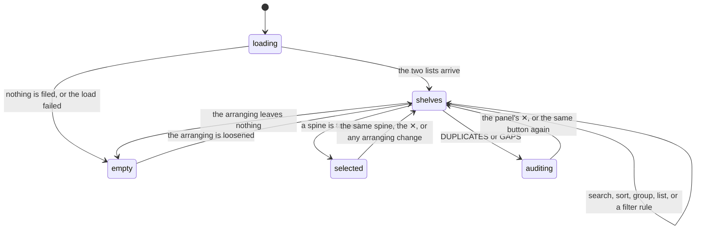

# The library shelf

## Summary

The library at `/library` is the whole collection on one screen: every [record](../glossary.md) the user has filed, in either [list](../glossary.md), drawn as [spines](../glossary.md) on wooden shelves fourteen to a row. It is the only place in Crate that shows everything rather than a selection, and the only place with a search box, a sort order, and a grouping.

Everything on the screen except the records themselves is arranging: search narrows, the LIST buttons pick one of the two lists, SORT reorders, GROUP splits the shelves into labelled sections, and ADVANCED FILTERS applies the same [filter rules](../glossary.md) a [crate](../glossary.md) uses. None of it is saved. All of it is thrown away on a reload and none of it is in the address bar, so a particular view of the library cannot be linked to, bookmarked, or returned to.

Four things reach off this screen: the round orange search button goes to the [add screen](../add/search-and-add.md), the profile button opens the same two-item menu the [crate wall](../crates/the-crate-wall.md) has, DUPLICATES and GAPS swap the shelves for [an audit panel](duplicates-and-gaps.md), and SAVE AS CRATE turns the current filter rules into [a new crate](saving-a-crate-from-the-library.md).

This document owns the screen's load, its arranging controls, and the shelves. The panel that opens under a tapped spine belongs to [the album detail panel](the-album-detail-panel.md); what a filter rule means belongs to [the selection engine](../foundations/selection-engine.md).

## The simple case

The user taps LIBRARY in the bottom navigation. Three grey shelf skeletons pulse for a moment, then the shelves fill: their whole collection, sorted by artist, fourteen narrow spines to a row with their titles running vertically up them in green.

They want to find one album, so they type "kind of blue" into the search box. The shelves rebuild as they type; by the fourth character one shelf is left, holding one wide spine that reads KIND OF BLUE / MILES DAVIS horizontally. They tap it. The spine lifts, turns orange, and the panel opens under the shelf with the sleeve and the track list.

They press ✕ to clear the search. The whole collection comes back, and the album they were just looking at is still selected — the shelf it is on has scrolled somewhere off screen.

## The interaction, event by event

### Arrive

The library is reached from the bottom navigation, or by loading `/library` directly. It fetches **one thing**: the two lists, in two parallel requests. It does not fetch the [crate](../glossary.md) definitions, the [pick](../glossary.md) history, or anything from Spotify.

Not fetching the pick history matters, because the library displays it: PLAYS, RECENT, and the panel's stats all read from it. The [session cache](../foundations/navigation-and-loading.md) holds the log only if the crate wall has been visited this session, so **a user who lands on `/library` first sees every play count as blank and every sort by PLAYS or RECENT do nothing** — the numbers behind them are all zero. Nothing says so.

Not fetching the crate definitions matters more, and is described under [saving a crate](saving-a-crate-from-the-library.md) and [the audit panels](duplicates-and-gaps.md), because both features read them.

The arranging controls always arrive in the same state, whatever the user did last time: search empty, SORT on ARTIST ascending, LIST on ALL, GROUP on NONE, no filter rules, ADVANCED FILTERS collapsed, no spine selected, neither audit panel open.

While the two lists are in flight, three shelf-shaped skeletons pulse. They appear on the first arrival of the session only; coming back to the library later draws the shelves immediately from the cache.

### Leave untouched

Arriving and leaving changes nothing the user can see — but it can write. On the **first visit to the library in a browser tab**, if any record is missing its release date or its track count, Crate quietly asks Spotify for all of them, twenty at a time, and writes what comes back into those records. If anything was updated the two lists are re-fetched and the shelves redraw, so a user who waits a few seconds on a freshly imported library sees release years and track counts appear in the panel and year filter rules start working, with nothing to explain it.

This is one of only two places in Crate where looking at a screen writes something; the other is the [crate seeding](../foundations/account-and-session.md) on a new account's first crate-wall load. It runs at most once per browser tab — a reload does not run it again — whether it succeeded or not, and it fills in only the release date and the track count — never genres, which nothing in Crate backfills. A record imported in bulk therefore stays genre-less however many times this runs. See [the data model](../foundations/data-model.md).

Nothing else is written by arriving, and none of the arranging is remembered.

> Technical note: the gate is set in `sessionStorage` *before* the request is made, so a backfill that fails is not retried until a new tab is opened. `sessionStorage` is per tab and survives a reload, which is why this is the one thing in Crate that a reload does not reset. A record Spotify has no release date for is asked about again in every new tab, forever.

### First change

Every control on this screen changes only what is displayed, so "the first change" commits the user to nothing. There is no dirty state and nothing to discard.

Three of them clear the selected spine as a side effect — the LIST buttons, the GROUP menu, and any change to the filter rules — because the panel is attached to a shelf row that may no longer exist. The search box and the SORT buttons do **not** clear it, so a search that filters the selected album away closes the panel silently and clearing the search brings it back.

The two audit buttons are different in kind: they replace the shelves entirely rather than narrowing them, and each closes the other.

### While working

The shelves are rebuilt on every keystroke and every button press, in this order: the LIST buttons choose which records are in play, the search box narrows them by title or artist, the filter rules narrow them again, SORT orders what is left, and GROUP cuts it into sections. The count between GROUP and DUPLICATES — `184 ALBUMS`, or `1 ALBUM` — is the number after all of that.

The search is a plain case-insensitive substring match against the album title and the artist credit, run in the browser with no debounce and no request. It is not the [Spotify search](../add/search-and-add.md) and it never leaves the library.

SORT has five keys and a direction. Pressing a new key selects it; pressing the selected key flips the direction, shown as ↑ or ↓ beside the label. The default is ARTIST ↑. The arrow is not consistent between keys: ↑ on TITLE and ARTIST means A to Z, but ↑ on PLAYS means most-played first, ↑ on RECENT means most-recently-played first, and ↑ on ADDED means newest first. Three of the five columns therefore start descending while showing an up arrow.

GROUP by ARTIST makes one labelled shelf section per artist credit, so an album credited to two artists gets its own section rather than appearing under each. GROUP by GENRE uses only a record's **first** genre and files everything with no genres under UNKNOWN — which is every record that was imported in bulk rather than added one at a time. Each section shows its name in orange and its count on the right, and the sections are ordered alphabetically, with UNKNOWN among them rather than last.

Removing or promoting a record from the panel updates the shelves immediately, before the server has answered: the spine disappears or moves from the recommendations to the favorites. See [the album detail panel](the-album-detail-panel.md) for what is actually written and what happens when the write fails.

### Commit

Nothing on this screen is committed. Every arranging control is display-only and lives for the life of the page.

The writes that can happen here belong to other documents: the background release-date backfill above, the panel's remove and promote, the audit panels' bulk delete, and SAVE AS CRATE.

## Modifiers

| Modifier | Set on arrival | Changed while working |
| --- | --- | --- |
| Spotify account state | No effect on the shelves — the two lists come from Crate's own records. The one thing that needs Spotify is the background backfill, and that uses Crate's own credentials, so it works on an account that is not linked. | Cannot change without signing in again. |
| Playback state | The bottom padding grows to clear the player bar when Crate's own player is playing, so the last shelf is not hidden behind it. See [playback](../foundations/playback.md). | The padding appears and disappears as the bar does, which nudges the shelves up and down. |
| Library state | Decides everything. An empty library shows a vinyl disc and one of four lines: "no albums yet — add some records" on ALL, "no favorites yet — add some records" on ★ FAV, "no recommendations yet" on ◈ REC, and "no albums match" whenever the search box has anything in it — the search message wins over the others. A library of a few hundred records draws a few dozen shelves in one long scroll; there is no paging and no virtual scrolling. | Removing the last record on the screen switches straight to the matching empty state. |
| Viewport | The number of spines per row is fixed at fourteen whatever the width, so a narrow phone divides the same row width fourteen ways and the spines are very thin. A row that measures 600 px or more draws taller spines (212 px rather than 170 px). Below 90 px per spine the title is rotated to run vertically; at or above it the spine shows the title and the artist horizontally. | The rows are measured continuously, so resizing the window reflows the spines and can flip a row between the vertical and horizontal treatments as it crosses 90 px. |
| Crate and config settings | No effect on the shelves. The crate definitions are read only by GAPS and SAVE AS CRATE. | Saving a crate from here does not change the shelves. |

## Cancel and interrupt

| Event | Before the first change | While working |
| --- | --- | --- |
| Escape, Cancel, Close, or a tap on the backdrop | Escape does nothing anywhere on this screen. The profile menu closes on a tap anywhere outside it. The audit panels have their own ✕. | Escape still does nothing — a selected spine cannot be dismissed with the keyboard, only by tapping it again or its ✕. The search box has a ✕; the filter rules and the sort have no reset. |
| Navigating inside the app: the bottom nav, another route, or a second panel or modal | Free, and the shelves are still in the cache on return. | **Every arranging choice is lost.** Leaving for the crate wall and coming straight back gives ARTIST ↑, ALL, NONE, no rules, no search, nothing selected. There is no warning, because nothing was unsaved — but a carefully built set of filter rules is gone. |
| Browser back or forward | Nothing to lose. The library has no in-app back button, so this is the browser's own. | The same total reset as above, because none of the arranging is in the address bar. Going back is not "undo": it lands on the previous route with its own cached state. |
| Reload, or the tab is closed | The two lists are fetched again. | The arranging is lost, and so is the once-per-tab backfill gate only if the tab is closed — a reload keeps it, so the backfill does not run again. |
| Network lost, or the request fails or times out | The skeleton clears and the screen shows "no albums yet — add some records", which is the same thing an empty library shows. The screen is left not loaded, so **coming back to it later retries**, but nothing retries while the user sits on it. See [failed requests and offline](../cross-cutting/failed-requests-and-offline.md). | The arranging controls keep working on whatever is already loaded. A failed backfill is silent and not retried this session. |
| The session expires, or Spotify rejects the token | The load fails as above and the screen looks empty. | Removing or promoting a record fails silently while the shelves already show it gone — see [the album detail panel](the-album-detail-panel.md). |
| The same account in a second tab, or the library changed elsewhere | The load is fresh, so it sees whatever the other tab did. | Nothing notices. A record added in another tab does not appear, and one removed there stays on the shelf until this screen is loaded again. See [stale data and second tabs](../cross-cutting/stale-data-and-second-tabs.md). |
| The album in hand is deleted, or Spotify no longer returns it | Not applicable. | A record removed from the panel is taken off the shelf at once. An album Spotify has withdrawn still has a spine, because the spine is drawn from Crate's own record; only the panel notices. |
| Playback moves to another device, or the tab is backgrounded | No effect. | The player bar disappears if Crate's own player stops, and the bottom padding shrinks with it, shifting the shelves. |

## Interactions with other systems

**Authentication and account state.** The library needs only a signed-in account. It is the largest screen in Crate that works entirely without a Spotify link — the shelves, the arranging, the counts, and the audit panels all come from Crate's own records. See [account and session](../foundations/account-and-session.md).

**The session cache and freshness.** The library is one of the four screens the [session cache](../foundations/navigation-and-loading.md) loads once. Its own edits are optimistic and local, so the cache and the server agree only because the requests behind them usually succeed. Nothing on this screen refreshes anything: there is no refresh control, and the shelves cannot be re-fetched without leaving and coming back after a failure, or reloading.

**Pick history.** PLAYS, RECENT, the spine statistic labels, the panel's LAST PLAYED and PLAYS, and the GAPS panel's "never played" reasoning all read the pick history — which this screen does not load. Arriving here without visiting the crate wall first means every one of them reads zero, and two of the five sort orders silently do nothing.

**Playback.** Nothing on the shelves plays. Playing happens in the panel, by the same four-route [chain](../foundations/playback.md) as everywhere else, and — unlike on the crate wall — playing from the library records **no pick**, because the library passes the panel no crate to attribute it to. A user who listens exclusively from the library builds no history at all, and their crates' cooldowns and play counts never move. See [picking a record](../crates/picking-a-record.md).

**Configuration and crate definitions.** Read by GAPS and written by SAVE AS CRATE, both of which are dangerous on this screen precisely because the definitions were never loaded. See [saving a crate from the library](saving-a-crate-from-the-library.md).

**Offline and failed requests.** The load failure is indistinguishable from an empty library, and the backfill failure is invisible. Neither is announced. See [failed requests and offline](../cross-cutting/failed-requests-and-offline.md).

**Multiple tabs and the Spotify app.** Two tabs on the library each hold their own copy of the two lists and their own arranging, and neither notices the other's edits. The Spotify app is irrelevant here except for playing from the panel.

**Toasts, badges, and empty states.** No toasts. The badges are the ◈ in a recommendation spine's corner, the orange bar and 24 px lift on the selected spine, and the statistic label at the foot of a spine when sorted by PLAYS, RECENT, or ADDED. The four empty-state lines are listed under Library state above; all four are the same small grey text under a vinyl disc, and all four advise adding records, which is wrong when the reason is a filter rule.

**Viewport and accessibility.** Spines are `div`s with click handlers: nothing on a shelf can be reached by keyboard or announced as a control, and the only text a screen reader is given for a spine is a "title — artist" tooltip. The sort, list, and audit controls are real buttons and the group control is a real `select`, so the header is keyboard-reachable while the content is not. The controls row wraps rather than scrolling, so on a narrow phone the header takes several lines and the shelves start well down the screen. Text sizes on this screen run from 8 px (the profile menu items) to 22 px (the title); most of the controls are 10 px.

## Edge cases

- **The last shelf row's spines are wider than the ones above it.** A row divides its width by the number of spines *in that row*, not by fourteen, so a group of three albums draws three very wide spines rather than three narrow ones with a gap. A collection of 100 draws seven full rows of fourteen and then a row of two half-width spines.
- **Grouping makes the spines wider too,** for the same reason: a genre with four albums gets four quarter-width spines. Grouping by artist on a library of singletons therefore draws one enormous spine per shelf.
- **GROUP by GENRE files every bulk-imported record under UNKNOWN,** because the import path never asks Spotify about the artists and nothing backfills genres afterwards. A library built entirely by importing has exactly one genre section.
- **UNKNOWN is sorted alphabetically among the real genres,** so it lands between "trip hop" and nothing rather than at the end.
- **The genre choices offered in ADVANCED FILTERS are drawn from the records currently in play,** so they narrow as the user filters and are empty altogether on a bulk-imported library.
- **Two of the five sort orders do nothing on a fresh visit to `/library`,** because the pick history is only loaded by the crate wall.
- **The up arrow means the opposite thing on three of the five columns.** ARTIST ↑ is A to Z; PLAYS ↑ is most first.
- **Playing an album from the library records no pick.** The same album played from a crate does. Nothing indicates the difference.
- **The album count counts the filter rules but the empty state does not explain them.** A rule that matches nothing shows `0 ALBUMS` and "no albums yet — add some records", advice that will not help.
- **The search box's message wins over every other empty state,** so searching within ★ FAV on an empty favorites list says "no albums match" rather than "no favorites yet".
- **The profile menu is positioned 52 px from the top of the header,** which is right on the crate wall's short header and wrong here: on the library it opens over the search box and the controls rather than below them.
- **Nothing on this screen is in the address bar.** A filtered, sorted, grouped view cannot be linked to or restored, and the browser's back button resets it.
- **There is no virtual scrolling.** Every record in the library is drawn, so a very large collection makes a very long page and every keystroke in the search box rebuilds all of it.
- **A record whose metadata arrives as a string rather than an object counts as missing,** so it triggers the backfill on every new browser session even though its release date is there.

## Open questions and verification

- How large a library has to be before the search box feels slow has not been measured. Every keystroke re-filters, re-sorts, re-groups, and re-renders every spine, with no debounce.
- The exact spine widths at common phone widths have not been measured against the 90 px threshold. A 390 px-wide phone divided fourteen ways is far below it, so every full row should be vertical; the threshold should only be crossed on partial rows and small groups.
- Whether the release-date backfill is fast enough to be seen finishing, or whether it usually completes before the shelves are read, has not been observed.
- The claim that the backfill's `sessionStorage` gate survives a reload but not a new tab is read from the code and not confirmed.
- Whether `ResizeObserver` reflows the rows smoothly on a window drag, or whether the spines jump, has not been watched.
- Whether the profile menu's misplacement is actually noticeable at the library's header height is a visual judgement not yet made.
- Nothing has been checked about what a very long artist name or a 40-character album title does to a wide spine; both are truncated with an ellipsis in the code, but the vertical treatment truncates against the spine's height, which may cut short titles unexpectedly.

Verified against Crate commit `8301127`.
