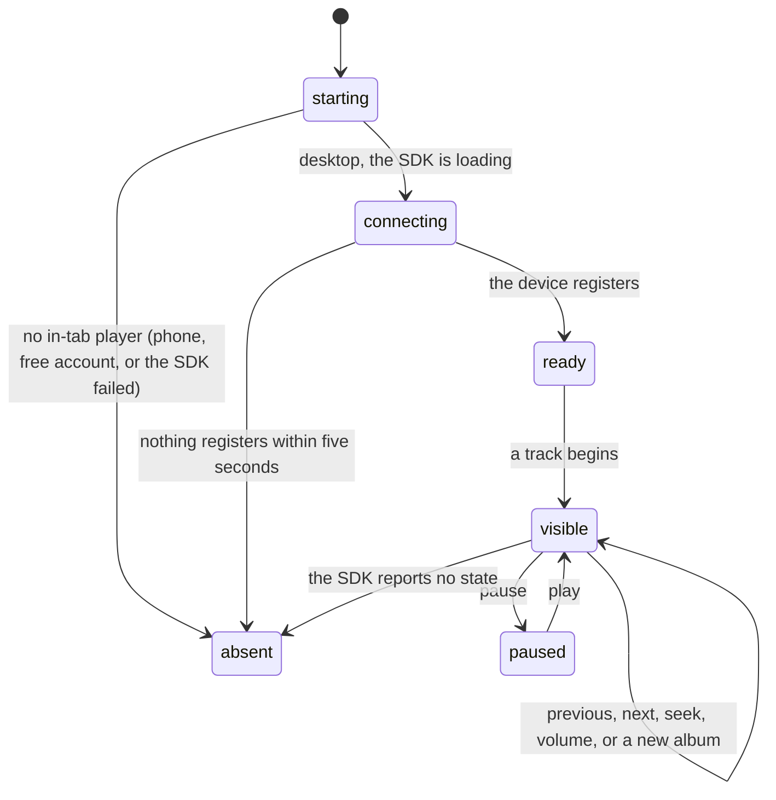

# The player bar

## Summary

When Crate plays an album in the browser tab itself, a bar appears across the bottom of the screen above [the bottom navigation](../foundations/navigation-and-loading.md): the track's sleeve, its title and artist, a volume slider, previous / play-pause / next, and a seek bar with the elapsed and total time. It stays there through every screen, because it lives outside the router.

It is the product's only playback surface, and it is conditional in a way nothing on screen explains. The bar exists **only** when Crate's own in-tab player is running, which needs a desktop browser, a [linked Spotify account](../foundations/account-and-session.md), and Spotify Premium. On a phone, or on a free account, playback is handed to the Spotify app or the Spotify web page instead and **no bar ever appears** — the music plays somewhere Crate cannot see, with no controls anywhere in the product. [Playback](../foundations/playback.md) owns that fork; this document owns the bar.

Two consequences worth stating up front. The bar is the only thing that tells a user which of the two playback paths they got, and it does so only by its presence. And because it appears and disappears with the track rather than with the app, the layout under it shifts by 80 px each way.

## The simple case

The user is on the crate wall on a laptop. They open an album and tap a track. A second or two later a bar slides in at the bottom: a small sleeve, `Pharoah's Dance`, `Miles Davis`, a volume slider, three transport buttons, and under them `0:04`, a seek bar, `20:05`.

They drag the seek bar to the middle; the time jumps to `10:12` and the music follows. They press pause, the button becomes a play triangle, and the elapsed time stops. They navigate to the library; the bar is still there, still playing. They press next and the bar's sleeve, title, and times change to the following track.

## The interaction, event by event

`absent` is not an error state and shows nothing at all. The user never sees `connecting` — the bar simply is not there yet.

### Arrive

The bar has no arrival of its own. It is mounted once, above every screen, for the whole session, and renders nothing until two things are true at the same time: the in-tab player has registered a device, and it has a current track.

The in-tab player is set up once when the app loads, and only on a desktop browser — the decision is made by looking at the browser's own user-agent string for an iPhone, iPad, or Android. On a phone, nothing is loaded, nothing is attempted, and the bar can never appear.

On a desktop, Crate loads Spotify's player script, hands it a fresh Spotify access token from Crate's own server, and connects. Registering the device takes a second or two after the page loads. Failures split in two:

- **A genuine failure** — the script cannot initialize, or the account is not Premium — switches the in-tab player off for the rest of the session. Every later play falls back, silently.
- **A spurious permission complaint** from the script is deliberately ignored, because the device registers and plays perfectly afterwards. Treating it as fatal used to force every play into a new browser tab.

> Technical note: a play requested before the device has registered does not fail. It waits, checking every tenth of a second for up to five seconds, and only then gives up and falls back. So the first play after a page load can take a noticeable moment with nothing on screen to say why.

### Leave untouched

There is nothing to leave. The bar holds no draft state, writes nothing, and remembers nothing between sessions: not the volume, not the position, not what was playing. Reloading the page takes the bar away, and it does not come back until something is played again — even though the music itself may still be going, because Spotify keeps playing on the device it was handed.

Navigating between screens does not disturb it. It is rendered outside the routes, so it survives every navigation with its position, its volume, and its track intact.

### First change

Every control on the bar acts immediately; there is no commit step and nothing to confirm.

| Control | What it does |
| --- | --- |
| **Previous** | Skips back within whatever Spotify is playing. Spotify's own rule applies: early in a track it restarts it, later it goes to the previous one. |
| **Play / pause** | Toggles. The icon follows the player's reported state, not the tap, so it flips when the player agrees. |
| **Next** | Skips forward. At the end of the album, Spotify decides what happens next, and Crate does not know or say. |
| **Seek bar** | Jumps to the dragged position, in one-second steps. |
| **Volume** | Sets the in-tab player's volume only. Hidden below 640 px wide. |

None of these records a [pick](../glossary.md), and neither does starting an album. The [listening log](../history/the-listening-log.md) is fed by tapping a record on the crate wall, not by playing one.

### While working

The bar's two numbers move: the elapsed time counts up and the seek bar's handle travels with it, updated twice a second by the browser's own clock and re-synchronised whenever the player reports a new state. So the counter keeps moving smoothly between the player's occasional updates, and corrects itself if it has drifted.

The title, artist, and sleeve change on every track change, whether Crate caused it or the Spotify app did. The bar is a mirror of the in-tab player, so anything done to that player from another Spotify client shows up here.

Both text lines truncate to one line each. The sleeve is 44 px. Nothing on the bar is a link — the sleeve does not open the album, and there is no way from the bar to the record it is playing.

### Commit

Nothing on the bar commits anything. It writes no records, no picks, and no settings, and none of its state outlives the page.

The one thing that persists across a reload is invisible: Spotify itself remembers that the browser tab's device is active, and a reload creates a **new** device with the same name. The old one lingers in Spotify's own device list until it times out.

## Modifiers

| Modifier | Set on arrival | Changed while working |
| --- | --- | --- |
| Spotify account state | Decides whether the bar can exist. A [linked account](../foundations/account-and-session.md) is required, and Premium beyond that: a free account's player reports an account error, which switches the in-tab player off for the session, so the bar never appears and every play opens Spotify instead. An email-only account can never play anything from Crate at all. Nothing on screen states any of this. | Cannot change without signing in again. A Spotify link revoked from Spotify's side stops the token requests and the device stops working, with nothing said. |
| Playback state | This *is* the playback state, and it is the only place it is shown. No bar means either nothing is playing or something is playing outside Crate's sight — the two look identical. | Every change is reflected: track changes, pauses, and seeks made from the Spotify app on another device all move the bar, because the bar mirrors the player rather than Crate's own intentions. |
| Library state | No effect. The bar knows the track Spotify reports and nothing about Crate's records — so it can be playing an album that is not in the library, or one that was deleted a minute ago, and looks the same. | No effect. Deleting the record that is playing does not stop the music or change the bar. |
| Viewport | Desktop only, by the user-agent check, so the bar is never seen on a phone even though its layout is built for a narrow screen. The volume slider is hidden below 640 px. A desktop window narrowed to phone width keeps the bar — the check is on the browser, not the window. | Narrowing past 640 px hides the volume slider and leaves the volume where it was, with no way to change it. |
| Crate and config settings | No effect. Nothing on the bar reads a crate definition or a setting. | No effect. |

## Cancel and interrupt

| Event | Before the first change | While working |
| --- | --- | --- |
| Escape, Cancel, Close, or a tap on the backdrop | The bar has no modal, no backdrop, and **no close button** — it cannot be dismissed. **Escape does nothing.** The only way to make it go away is to stop the music from Spotify, or to reload. | The same. A seek or a volume drag cannot be cancelled once released; there is no undo and no previous value shown. |
| Navigating inside the app: the bottom nav, another route, or a second panel or modal | Unaffected. The bar lives outside the router and every screen leaves room for it. | Unaffected, and this is the point of it. A modal or panel opened over a screen covers the bar with its backdrop, so playback cannot be controlled while one is open — including the album panel that started it. |
| Browser back or forward | Unaffected within Crate. | Unaffected within Crate. Leaving Crate entirely destroys the bar and the in-tab device, and the music stops with it — unlike the fallback path, where the music is on another device and keeps going. |
| Reload, or the tab is closed | Nothing to lose. | The bar disappears and **the music stops**, because the device it was playing on was the tab. Nothing warns. The volume and the position are not remembered, and a reload registers a fresh device rather than reclaiming the old one. |
| Network lost, or the request fails or times out | The player script cannot load offline, so the in-tab player never starts and the bar never appears; every play falls back and also fails. | The player's own connection is Spotify's problem and Crate shows nothing about it: a dropped network stops the music with no message, and the bar stays on screen with its counter still advancing, because the counter runs on the browser's clock. A failed token request is logged to the console and nothing else. See [failed requests and offline](../cross-cutting/failed-requests-and-offline.md). |
| The session expires, or Spotify rejects the token | The token request fails, the device never registers, and the bar never appears — indistinguishable from a free account or a phone. | The player asks Crate for a fresh token whenever it needs one, and Crate's server refreshes the Spotify token by itself, so an expiring token normally costs nothing. A refresh that cannot succeed stops the music with no message and leaves the bar in place. |
| The same account in a second tab, or the library changed elsewhere | Two Crate tabs on a desktop register **two** devices with the same name, and only the one that was played to has a bar. | The second tab's bar stays empty and shows nothing about the first tab's playback, so a user with two tabs sees music playing in one and silence in the other. Playing from the second tab moves Spotify's playback to its own device and leaves the first tab's bar frozen mid-track, still counting up. See [stale data and second tabs](../cross-cutting/stale-data-and-second-tabs.md). |
| The album in hand is deleted, or Spotify no longer returns it | Not applicable. | The bar is indifferent. Deleting the record does not stop the music and changes nothing on the bar; the bar has no link back to the record anyway. |
| Playback moves to another device, or the tab is backgrounded | Not applicable. | Handing playback to a phone from the Spotify app takes it away from the tab: the player reports no state, the bar disappears, and the layout shifts by 80 px. Crate says nothing and offers nothing to take it back. A backgrounded tab keeps playing and keeps its bar; the local counter may be throttled by the browser and then jumps back into place at the next state report. |

## Interactions with other systems

**Authentication and account state.** The bar needs a linked Premium account, and it is the only feature in Crate that needs Premium. Nothing anywhere says so — not the sign-in screen, not the connect prompt, not the play buttons. The player fetches its access tokens from Crate's own server rather than holding one, so the [account and session](../foundations/account-and-session.md) refresh machinery keeps it alive without the user ever seeing a token.

**The session cache and freshness.** Not involved. The bar reads no Crate data at all — everything it shows comes from Spotify's player.

**Pick history.** Nothing the bar does is recorded. Playing an album for an hour from the bar leaves no trace in the [listening log](../history/the-listening-log.md), and the [selection engine](../foundations/selection-engine.md)'s cooldown does not move, so an album played this way can be drawn again the same day.

**Playback.** [Playback](../foundations/playback.md) owns the three-step fallback that every play button walks: the in-tab player first, then Spotify's own active device, then opening the album in a new tab. Only the first of the three produces a bar. The middle step is what shows the message about opening Spotify first — a message the fallback code discards, so the user sees a new tab open instead of being told what happened.

**Configuration and crate definitions.** Untouched.

**Offline and failed requests.** The bar has no error state of any kind. Every failure in the chain behind it — the script, the token, the device, the connection — is either logged to the console or silently absorbed, and what the user sees is a bar that does not appear or a bar that stops making sound.

**Multiple tabs and the Spotify app.** The bar is a window onto the same playback the Spotify app controls, one-way in the sense that Crate cannot list or choose devices, and two-way in the sense that anything the app does to this device shows here. Every Crate tab is its own device.

**Toasts, badges, and empty states.** No toasts, no badges, no empty state. Absence *is* the empty state, and it carries no explanation.

**Viewport and accessibility.** Every control is a real button or a real range input with a label — Volume, Seek, Previous, Play or Pause, Next — so the bar is fully keyboard-operable and the sliders respond to arrow keys, which makes it the most accessible surface in the product. The elapsed and total times are plain text, unlabelled, and the seek slider reports a raw millisecond number rather than a time. The track title and artist are not announced when they change.

## Edge cases

- **On a phone, the bar can never appear.** Playback leaves for the Spotify app and Crate has no controls, no indication of what is playing, and no way back. The decision is made from the browser's user-agent string, so a desktop browser pretending to be a phone loses the player too.
- **The bar's presence is the only signal of which playback path was taken,** and its absence covers three different situations: nothing is playing, playback went to another device, or the in-tab player failed.
- **Premium is required and never mentioned.** A free account's player reports an account error, which disables the in-tab player for the rest of the session; every subsequent play opens a Spotify tab, with no explanation.
- **The layout shifts by 80 px** each time the bar appears or disappears, and it can disappear on its own when playback moves to another device.
- **A reload stops the music,** because the tab was the device. There is no warning and no way to resume from where it stopped.
- **Two Crate tabs register two devices with the same name,** and only one has a bar. The other shows nothing.
- **A dropped network stops the music but the counter keeps advancing,** because the elapsed time is computed from the browser's clock between the player's reports.
- **A modal or panel covers the bar,** so the album panel that started playback cannot be used to pause it.
- **The bar has no close button and cannot be dismissed.**
- **Nothing on the bar links to the album.** The sleeve is not clickable, and there is no way to get from what is playing to the record in the library.
- **Volume is not remembered** across a reload, and the slider is hidden entirely below 640 px, so a narrow desktop window has no volume control.
- **The first play after a page load can wait up to five seconds** while the device registers, with nothing on screen to say so.
- **Nothing the bar does is recorded,** so listening does not extend the listening log or move the selection cooldown.
- **The bar does not know what album it is playing** in Crate's terms, so it happily continues playing a record that has been deleted.
- **There is no shuffle, no repeat, no queue, and no device picker.** What happens after the last track is Spotify's decision and Crate does not show it.

## Open questions and verification

- Whether the spurious permission complaint from Spotify's script is still spurious on the current version of the SDK is worth re-checking; the source comment records that it was investigated and that the device registers regardless.
- The five-second wait before falling back has not been timed against a real cold load, and it is not known how often the first play actually falls back because the device was slow.
- Whether a free (non-Premium) account really produces the account error, rather than registering a device that then refuses to play, has not been observed.
- Whether the counter really keeps advancing after the network drops is read from the interval's arithmetic and has not been watched.
- What happens at the end of an album — whether Spotify continues into its own radio, and whether the bar follows it — has not been observed and would change what the bar can be trusted to be showing.
- How the two devices behave when two Crate tabs are open, and whether Spotify's device list becomes cluttered after several reloads, has not been checked.
- Whether the seek slider's one-second step and its raw millisecond value cause any trouble for a screen reader has not been tested.
- Whether the volume seeded from the player on startup matches what Spotify was last set to, or always reads full, has not been observed.

Verified against Crate commit `8301127`.
